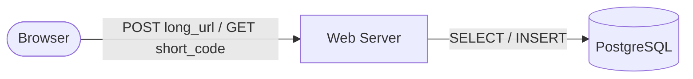
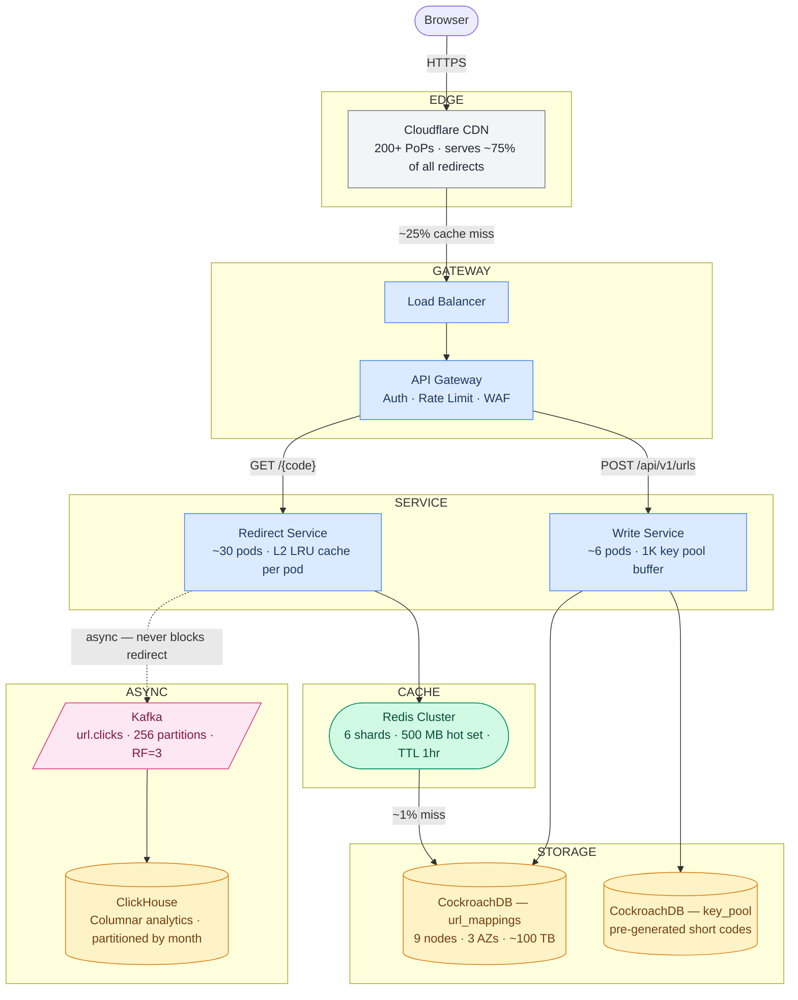
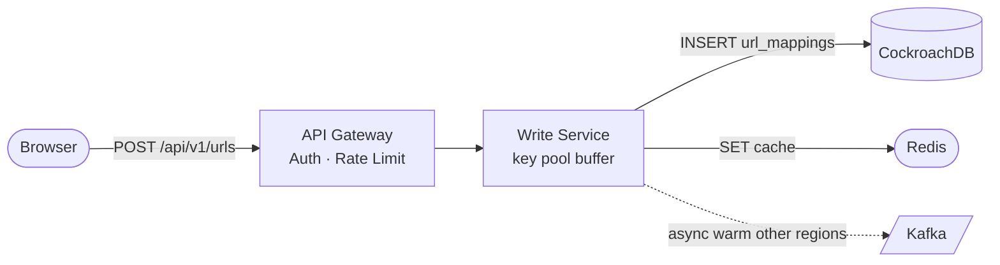

# TinyURL — System Design Study Guide

---

## 0. What Is This System?

A URL shortener takes a long web address and gives you a short one. When someone visits the short link, they get silently redirected to the original. The system has two jobs: **create** short links, and **redirect** visitors — and it must do the second one extremely fast, billions of times a day.

---

## 1. What Makes It Hard?

Most systems are hard because of write complexity. TinyURL is hard because of **read scale** and **ID uniqueness** — a rare combination.

### Hard Problem #1 — Giving every URL a unique short code without a bottleneck

In plain English: millions of people are creating short links simultaneously. Every link needs a unique 7-character code. How do you hand out unique codes that fast without every server waiting in line for the same counter?

**Technical consequence:** Any single global counter — whether in a database or Redis — becomes a chokepoint. At 6,000 link creations per second, a centralized counter limits your entire system's throughput to whatever that one node can handle.

**What beginners get wrong:** `SELECT MAX(id) + 1` or `Redis INCR` — both work fine on one server, but a single Redis node maxes out around 100,000 operations/second and is a single point of failure. If it goes down, nobody can create links.

---

### Hard Problem #2 — Redirecting billions of times a day in under 50ms

In plain English: when someone tweets a short link and it goes viral, millions of people click it within minutes. Every click needs to find the original URL and redirect the browser — in under 50ms. You cannot look it up in a database on every single click.

**Technical consequence:** At peak, this system handles over 1 million redirects per second. A typical database can handle maybe 10,000–50,000 reads per second. That's a 20–100x gap. You need multiple layers of caching between the user and the database.

**What beginners get wrong:** `SELECT long_url FROM urls WHERE short_code = 'xK3p9Qa'` on every redirect. This works at 100 users. It collapses at 100,000.

---

## 2. Requirements

### Functional Requirements

| Feature | In Scope | Notes |
|---|---|---|
| Shorten a URL | ✅ | Returns a 7-character short code |
| Redirect short → original URL | ✅ | The hot path — must be very fast |
| Custom alias (e.g. `/my-brand`) | ✅ | User-chosen code instead of random |
| Link expiry (TTL) | ✅ | e.g. "this link expires in 30 days" |
| Delete a link | ✅ | Soft delete — code is retired, not reused |
| Click analytics | ✅ | Count clicks, country, referrer — but async |
| Custom domains (`brand.com/abc`) | ❌ | V2 |
| URL preview / screenshots | ❌ | V2 |
| Real-time analytics dashboard | ❌ | V2 |

### Non-Functional Requirements

| Requirement | Target | What it means |
|---|---|---|
| Redirect latency (p99) | < 50ms | 99% of all redirects complete in under 50ms |
| Availability | 99.99% | Less than 52 minutes of downtime per year |
| Durability | 100% | A created link is never lost |
| Consistency | Eventual | A new link may not be visible globally for ~1 second — acceptable |
| Write throughput | 6,000/sec peak | Peak link creation rate |
| Read throughput | 1,160,000/sec peak | Peak redirect rate during viral events |

> **p99 latency** means: if you took all your requests and sorted them by how long they took, the 99th percentile is the slowest 1%. Keeping p99 < 50ms means even your slowest requests are fast.

---

## 3. Scale Estimation

Work through the numbers step by step:

**Link creation (writes)**
```
100 million new links per day
÷ 86,400 seconds per day
= 1,157 link creations per second (average)
× 5 (peak traffic burst)
= ~6,000 per second at peak

→ This means we need to hand out unique codes at 6,000/sec
  without any single server becoming a bottleneck.
```

**Redirects (reads)**
```
100:1 read-to-write ratio (every link gets clicked ~100 times)
= 10 billion redirects per day
÷ 86,400 seconds
= 115,741 per second (average)
× 10 (viral burst — one link goes viral)
= ~1,160,000 per second at peak

→ This means we cannot touch a database on most redirects.
  We need caching at multiple levels.
```

**Storage**
```
Each link record ≈ 500 bytes (URL + metadata)
100M links/day × 365 days × 5 years = 182 billion records
× 500 bytes = ~91 TB over 5 years

→ This means a single database server isn't enough.
  We need to split (shard) the data across many servers.
```

**Hot cache size**
```
Top 1% of links receive ~80% of all traffic (power law)
1% of 100M total links = 1 million "hot" links
1M × 500 bytes = 500 MB

→ 500 MB fits easily in memory (Redis nodes are typically 64 GB).
  If we cache just the top 1% of links, we serve 80% of traffic
  without ever touching the database.
```

### Server Count Estimation

```
Redirect Service servers:
  1 server handles ~10,000 redirects/sec (mostly cache lookups + HTTP)
  Peak: 1,160,000/sec  →  116 servers
  After CDN absorbs 75%: 290,000/sec hit origin  →  ~30 servers

Write Service servers:
  1 server handles ~1,000 creates/sec (DB write + Redis write)
  Peak: 6,000/sec  →  ~6 servers

Redis nodes:
  Hot set: 500 MB. Standard node: 64 GB
  →  1 node covers everything, use 3 for redundancy (primary + 2 replicas)

Database nodes:
  100 TB over 5 years, ~5 TB per node
  →  ~9 nodes (3 per availability zone for fault tolerance)
```

### The 5 Numbers That Drive Every Design Decision

| Number | Value | Design decision forced |
|---|---|---|
| Peak redirects | 1,160,000/sec | CDN + multi-layer cache is mandatory |
| Hot set size | 500 MB | Single Redis cluster covers everything; >95% hit rate |
| DB reads after cache | ~5,800/sec | Read replicas handle this comfortably |
| 5-year storage | ~100 TB | Must shard across ~9 DB nodes |
| Server count at peak | ~30 redirect + 6 write | Stateless services; scale horizontally |

---

## 4. Architecture

### Start Simple: The MVP

The simplest design that works:



1. User POSTs a long URL → server generates a code, saves to DB, returns short URL
2. User GETs `/xK3p9Qa` → server looks up DB → redirects

**This breaks at ~5,000 redirects/second** because the database can't keep up with every single lookup.

---

### Add Caching: First Fix


Now 95% of redirects are answered by Redis (~1ms) instead of the database (~15ms). Database load drops 20x.

**This breaks at ~100,000 redirects/second** — a single web server and single Redis node are now the limits.

---

### Production Architecture



**What each layer does:**

| Layer | Shape colour | Components | Responsibility |
|---|---|---|---|
| Edge | grey | CDN | Serves 75% of redirects globally in <5ms — no origin hit |
| Gateway | blue | Load Balancer + API Gateway | Distributes load; enforces auth and rate limits |
| Service | blue | Redirect Svc + Write Svc | Separated so a write outage never affects redirects |
| Cache | green | Redis Cluster (stadium shape) | Serves hot links in ~1ms; eliminates 99% of DB reads |
| Storage | yellow | CockroachDB (cylinder shape) | Source of truth; only hit on genuine cache misses |
| Async | pink | Kafka + ClickHouse | Click analytics fully decoupled — never blocks a redirect |

---

### Read Path — How a Redirect Works


Step by step:

| Step | Where | What happens | Latency | % of traffic |
|---|---|---|---|---|
| 1 | CDN Edge | Cache hit → return 302 immediately | ~5ms | 75% — done here |
| 2 | Redirect Svc (L2) | Pod's local memory hit → return 302 | ~2ms | ~4% of remaining |
| 3 | Redis | Cache hit → return 302, warm L2 | ~3ms | ~20% of remaining |
| 4 | Database | Read replica lookup → return 302, warm Redis | ~15ms | ~1% of remaining |
| 5 | Kafka (parallel) | Click event published — never blocks step 1–4 | async | 100% |

**The database is involved in less than 1% of all redirects.**

---

### Write Path — How a Link Gets Created



Step by step:

1. **API Gateway** checks JWT auth and rate limit (reject here if over limit)
2. **Write Service** checks `Idempotency-Key` in Redis — if seen before, return cached response
3. Write Service pops a pre-fetched short code from its local buffer (no DB call)
4. **Database transaction**: INSERT into `url_mappings` + INSERT into `idempotency_log` (atomic)
5. Write response to Redis (so the new link is immediately cacheable on first click)
6. Publish to Kafka `url.created` → other regions warm their caches async
7. Return 201 to client

---

## 5. API Design

### Two main endpoints

**Create a short link**
```
POST /api/v1/urls
Authorization: Bearer <token>
Idempotency-Key: <unique-id>    ← explained below

{
  "long_url":    "https://example.com/very/long/path",
  "custom_code": "my-brand",   // optional
  "ttl_seconds": 2592000       // optional — 30 days
}

Response 201:
{
  "short_url":  "https://tiny.url/xK3p9Qa",
  "short_code": "xK3p9Qa",
  "expires_at": "2026-06-01T10:00:00Z"
}
```

**Redirect**
```
GET /xK3p9Qa

Response:
HTTP 302 Found
Location: https://example.com/very/long/path
Cache-Control: max-age=3600, s-maxage=3600
```

### The non-obvious design decision: 301 vs 302

There are two ways to do a redirect:

| | 301 Permanent | 302 Temporary |
|---|---|---|
| Browser behaviour | Caches forever — future clicks skip our server | Re-requests every time |
| Analytics | Misses repeat clicks (browser never calls us again) | Captures every click |
| Can update destination? | No — browser cached it forever | Yes |
| Can delete the link? | No — browser ignores deletion | Yes |

**Decision: use 302.** The CDN (`s-maxage=3600`) absorbs the scale. We keep click analytics and the ability to delete links. Offer 301 as an opt-in for power users who want maximum speed and don't need analytics.

### The non-obvious design decision: Idempotency Key

What if a client sends a "create link" request, the server creates the link, but the network drops before the response arrives? The client retries — and now the link is created twice.

The fix: the client sends a unique `Idempotency-Key` header with every create request. The server stores this key for 24 hours. If it sees the same key again, it returns the original response instead of creating a duplicate.

---

## 6. Data Model

### Main table: `url_mappings`

| Column | Type | Notes |
|---|---|---|
| `short_code` | CHAR(7) | Primary key — the 7-character code |
| `long_url` | TEXT | The original URL (may contain sensitive query params) |
| `user_id` | BIGINT | Who created it (null for anonymous) |
| `created_at` | TIMESTAMP | When it was created |
| `expires_at` | TIMESTAMP | When it expires (null = never) |
| `is_deleted` | BOOLEAN | Soft delete — we keep the row to retire the code |
| `redirect_type` | SMALLINT | 301 or 302 |
| `metadata` | JSON | Tags, campaign name, etc. |

### Supporting table: `key_pool`

| Column | Type | Notes |
|---|---|---|
| `short_code` | CHAR(7) | Pre-generated code, not yet assigned to any URL |
| `created_at` | TIMESTAMP | When this code was generated (for pool age monitoring) |

### Supporting table: `idempotency_log`

| Column | Type | Notes |
|---|---|---|
| `idempotency_key` | VARCHAR(64) | The client-supplied unique request ID |
| `short_code` | CHAR(7) | The code that was assigned for this request |
| `response_body` | TEXT | The exact JSON response returned — replayed on duplicate |
| `created_at` | TIMESTAMP | TTL: rows expire after 24 hours |

---

### SQL vs NoSQL — why not the obvious choices?

Before explaining what we chose, here's why the obvious alternatives don't fit:

| Database | Type | Why it seems attractive | Why it doesn't fit |
|---|---|---|---|
| **DynamoDB** | Key-value / document | Massive scale, managed, fast key lookups | No support for `SELECT ... FOR UPDATE SKIP LOCKED` (key pool requires row-level locking); cross-item transactions are cumbersome; expensive at 100TB |
| **Cassandra** | Wide-column | Designed for high write throughput, multi-region | Eventual consistency only — can't enforce unique `short_code` across nodes; no transactions; collision risk is real |
| **MongoDB** | Document | Flexible schema, easy to operate | No row-level locking for the key pool pattern; multi-document transactions have significant overhead; not designed for 1M point-reads/sec |
| **Plain PostgreSQL** | Relational | Familiar SQL, strong consistency, great for the key pool pattern | Single-node by default: hits its ceiling at ~5TB on one machine. Horizontal sharding requires a proxy layer (Citus/pgBouncer) that adds operational complexity. Manual replication setup for multi-AZ. |
| **MySQL + Vitess** | Relational + sharding | Proven at YouTube/Slack scale | Vitess adds significant operational complexity; `FOR UPDATE SKIP LOCKED` behaviour across shards needs careful setup |
| **CockroachDB** | Distributed SQL | ✅ chosen — see below | — |

### Database choice: CockroachDB

**Why CockroachDB specifically:**

CockroachDB is PostgreSQL-compatible SQL on the outside, but a distributed key-value store on the inside. Three properties make it the right fit here:

1. **Automatic sharding with no application-level proxy.** CockroachDB splits tables into "ranges" (16MB chunks) and distributes them across nodes automatically. The application talks to any node; routing is internal. With plain PostgreSQL + Citus, your application must be aware of which shard to talk to.

2. **Raft consensus per range, not per cluster.** Each range has its own Raft group — a small committee of 3 nodes that vote on every write. A write is committed only when 2 of 3 agree (quorum). This means:
   - No single node can corrupt data — it needs agreement
   - If one node dies, the remaining 2 still have quorum and keep serving writes
   - A 3-node cluster across 3 availability zones means a full AZ outage still leaves 2 nodes in quorum

3. **REGIONAL BY ROW for geo-distribution.** CockroachDB can pin each row to a specific region based on a column. A UK user's links are stored and served from EU nodes; US user's links from US nodes. Redirect latency drops from ~80ms (cross-Atlantic DB call) to ~8ms (same-region call). Plain PostgreSQL has no concept of this.

```
   Raft consensus example — 3 nodes, 1 AZ down:

   AZ-1 [Node A] ──┐
   AZ-2 [Node B] ──┼── Quorum (2/3 agree) → write committed ✅
   AZ-3 [Node C] ✗ (down)
```

### Sharding key: `short_code`

> **Sharding** means splitting your database rows across multiple servers. You need a rule for which server stores which row.

We shard by `hash(short_code)`. This spreads rows evenly across all servers. Since every redirect is a lookup by `short_code`, each redirect hits exactly one server — fast and predictable.

We do **not** shard by `user_id`, even though it would make "list all my links" faster — because that would make every redirect hit two servers (look up user → look up code), doubling latency on the 1M/sec hot path.

---

## 7. Deep Dives

### Deep Dive 1: How do we generate unique short codes at 6,000/sec?

#### The options

**Option A: Hash the URL**
Take the long URL, run it through MD5, take the first 7 characters.

Problem: math. With 100 million links, the probability of two URLs getting the same 7-character code is essentially 100% (birthday paradox — the same reason two people in a group of 23 share a birthday more often than you'd expect). You'd need complex collision-handling logic on the critical write path.

**Option B: Global counter**
Keep a counter somewhere (database or Redis). Each new link gets the next number, encoded as Base62.

Problem: the counter is a single point of failure and a throughput limit. A single Redis node maxes out at ~100,000 operations per second and if it goes down, link creation stops entirely.

**Option C: Pre-generated key pool ← chosen**

Generate millions of random codes offline (background job, no rush). Store them in a `key_pool` table. When a link is created, claim one code from the pool atomically.

**Why this works:**
- Codes are generated offline with guaranteed uniqueness — no collision risk
- Claiming a code from the pool is a simple database delete — fast and reliable
- No single bottleneck: each Write Service server pre-fetches 1,000 codes from the pool into local memory at startup, eliminating database calls on the hot path

#### The exact mechanism — key pool claim

```sql
-- Claim 1,000 codes at once during server startup (or refill)
-- FOR UPDATE SKIP LOCKED is the key: if two servers run this
-- simultaneously, Postgres/CockroachDB hands them DIFFERENT rows —
-- no waiting, no duplicate claims, no contention
DELETE FROM key_pool
WHERE short_code IN (
  SELECT short_code FROM key_pool
  LIMIT 1000
  FOR UPDATE SKIP LOCKED
)
RETURNING short_code;
```

Each Write Service pod runs this query **once at startup** and holds 1,000 codes in local memory. When its local buffer drops below 100, it refills asynchronously in a background thread. In normal operation, link creation never touches `key_pool` at all — the pod just pops from its in-memory list.

**Monitoring:** Alert when pool size < 1,000,000 codes. Background generator runs continuously as a separate cron job:

```sql
-- Key generator job (runs every minute):
INSERT INTO key_pool (short_code, created_at)
SELECT
  -- generate random Base62 strings (a-z, A-Z, 0-9)
  substr(md5(random()::text), 1, 7),
  NOW()
FROM generate_series(1, 100000)   -- 100K codes per batch
ON CONFLICT DO NOTHING;            -- silently skip any accidental duplicate
```

---

#### End-to-end: what happens when a user creates a link

Here is the exact sequence from HTTP request to database row, with every step shown:

```
Client                   Write Service             CockroachDB           Redis
  │                           │                        │                    │
  │  POST /api/v1/urls        │                        │                    │
  │  Idempotency-Key: abc123  │                        │                    │
  │──────────────────────────>│                        │                    │
  │                           │                        │                    │
  │                           │ GET idempotency:abc123 │                    │
  │                           │────────────────────────────────────────────>│
  │                           │ (nil — first time)     │                    │
  │                           │<────────────────────────────────────────────│
  │                           │                        │                    │
  │                           │ pop 'xK3p9Qa'          │                    │
  │                           │ from local buffer      │                    │
  │                           │                        │                    │
  │                           │  BEGIN TRANSACTION     │                    │
  │                           │───────────────────────>│                    │
  │                           │                        │                    │
  │                           │  INSERT url_mappings   │                    │
  │                           │  (short_code, long_url,│                    │
  │                           │   user_id, expires_at) │                    │
  │                           │───────────────────────>│                    │
  │                           │                        │                    │
  │                           │  INSERT idempotency_log│                    │
  │                           │  (abc123, xK3p9Qa,     │                    │
  │                           │   response_json)       │                    │
  │                           │───────────────────────>│                    │
  │                           │                        │                    │
  │                           │  COMMIT                │                    │
  │                           │───────────────────────>│                    │
  │                           │  ← ok                  │                    │
  │                           │                        │                    │
  │                           │ SET url:xK3p9Qa <long_url> EX 3600          │
  │                           │────────────────────────────────────────────>│
  │                           │ ← ok                   │                    │
  │                           │                        │                    │
  │                           │ SET idempotency:abc123 <response> EX 86400  │
  │                           │────────────────────────────────────────────>│
  │                           │ ← ok                   │                    │
  │                           │                        │                    │
  │  HTTP 201                 │                        │                    │
  │  { "short_url": "tiny.url/xK3p9Qa" }              │                    │
  │<──────────────────────────│                        │                    │
```

**Step by step:**

| Step | What happens | Why |
|---|---|---|
| 1 | Validate request (URL format, user auth, rate limit) | Reject bad requests before touching any storage |
| 2 | Check Redis for `idempotency:abc123` | If found, return the cached response — the link was already created |
| 3 | Pop `xK3p9Qa` from the Write Service's in-memory buffer | No DB call — this is why key pool pre-fetch matters |
| 4 | `BEGIN` transaction on CockroachDB | Both inserts must succeed or both fail — no half-created links |
| 5 | `INSERT INTO url_mappings` with the code and URL | Creates the actual mapping |
| 6 | `INSERT INTO idempotency_log` with the response body | So if the client retries, we can return exactly the same response |
| 7 | `COMMIT` — the link is now durable | After this point, the link exists even if the server crashes |
| 8 | `SET url:xK3p9Qa <long_url> EX 3600` in Redis | Warm the cache so the first click doesn't miss |
| 9 | `SET idempotency:abc123 <response> EX 86400` in Redis | 24-hour idempotency window |
| 10 | Return 201 to client | Done |

**What the resulting database row looks like:**

```sql
SELECT * FROM url_mappings WHERE short_code = 'xK3p9Qa';

short_code  │ long_url                            │ user_id │ created_at           │ expires_at           │ is_deleted │ redirect_type
────────────┼─────────────────────────────────────┼─────────┼──────────────────────┼──────────────────────┼────────────┼──────────────
xK3p9Qa     │ https://example.com/very/long/path  │ 42      │ 2026-05-02 10:00:00  │ 2026-06-01 10:00:00  │ false      │ 302
```

---

#### How a redirect uses this row

When someone visits `tiny.url/xK3p9Qa`:

```
Redirect Service checks Redis:
  GET url:xK3p9Qa  →  "https://example.com/very/long/path"  (cache hit)

Builds and returns:
  HTTP 302 Found
  Location: https://example.com/very/long/path
  Cache-Control: max-age=3600, s-maxage=3600

(async, never blocking the redirect above)
  Kafka.publish("url.clicks", { short_code: "xK3p9Qa", ts: now, country: "US" })
```

On a cache miss (1% of redirects), the query is simply:

```sql
SELECT long_url, expires_at, is_deleted, redirect_type
FROM url_mappings
WHERE short_code = 'xK3p9Qa';
-- CockroachDB routes this to the single node that owns hash('xK3p9Qa')
-- Result comes back in ~5ms from a read replica
```

---

#### Custom aliases — how they differ from auto-generated codes

When a user requests `/my-brand` instead of a random code:

1. No code is claimed from `key_pool` — the user's alias is the code
2. Write Service does `INSERT INTO url_mappings (short_code='my-brand', ...)` with an explicit unique constraint check
3. If `my-brand` already exists: return **409 Conflict** — "this alias is already taken"
4. Custom codes are never placed back into `key_pool` — they stay in `url_mappings` forever (even after deletion, `is_deleted=true` prevents reuse)

**Risk:** a user could claim `xK3p9Qa` as a custom alias, matching a pre-generated pool code. The unique constraint on `url_mappings.short_code` catches this — the pool code's eventual INSERT would fail. The key generator handles this by generating codes, then checking they don't exist in `url_mappings` before adding to `key_pool`.

**Monitoring:** Alert when the pool drops below 1 million codes. The background generator runs continuously and keeps it topped up.

---

### Deep Dive 2: How do we serve 1.16M redirects/second in under 50ms?

The answer is **four layers of cache**, each serving a different slice of traffic. Think of it as a series of filters — each layer handles what it can, and only passes the rest deeper.

#### Layer 0: Browser cache (for 301 links)
If a user has clicked this link before and it's a 301 redirect, their browser cached it. Zero network request. Approximately 20–30% of repeat visitors.

#### Layer 1: CDN edge cache (~75% of remaining traffic)
Cloudflare has 200+ servers worldwide. When the first person in London clicks a link, Cloudflare's London server caches it. Every subsequent click from London is served from that same nearby server — no trip to our origin servers.

- TTL: 1 hour (`s-maxage=3600` in the response header)
- Response time: ~5ms (nearest PoP, not crossing the Atlantic)
- Capacity: effectively unlimited

#### Layer 2: In-process memory cache (~15% of CDN misses)
Each of our 20 Redirect Service servers keeps the 10,000 hottest links in its own local memory. This is the fastest possible lookup — no network, no serialization, just a hash map.

- Size: ~5MB per server
- TTL: 60 seconds
- Why it matters: a viral URL with 1M clicks/sec — if all 20 servers have it locally, Redis only sees ~20 requests/sec for that key

#### Layer 3: Redis (~95% of layer 2 misses)
Redis is an in-memory key-value store — much faster than a database because everything is in RAM, not on disk.

- Size: 500MB hot set fits comfortably (Redis nodes are 64GB)
- TTL: 1 hour per key (resets on each access)
- Response time: ~1ms
- Eviction: when memory is full, kick out the least-recently-used key

#### Layer 4: Database (~5% of Redis misses — ~5,800/sec)
Only reached when a URL is genuinely cold (not in any cache). At a 99%+ combined cache hit rate, the database sees less than 6,000 redirects/second — well within what read replicas can handle.

```
Total traffic:  1,160,000 / sec
After CDN:        290,000 / sec  (75% served at CDN)
After L2 memory:   246,500 / sec  (15% of CDN misses served from memory)
After Redis:        12,325 / sec  (95% of remainder served from Redis)
After DB replicas:   ~5,800 / sec  (source of truth — always the answer)
```

#### The cache stampede problem

Imagine a link's cache entry expires at exactly 12:00:00. In that split second, 10,000 concurrent users all get a cache miss simultaneously. All 10,000 try to query the database at once. The database is suddenly slammed.

**Fix: probabilistic early expiration.** Before a cache entry expires, start refreshing it in the background — with increasing probability as expiry approaches. At 60 seconds left, there's a tiny chance of refresh. At 1 second left, there's a near-certain refresh. This smooths out the expiry cliff.

```
# The closer to expiry, the more likely we refresh early
# This means the entry is almost always refreshed before
# thousands of users simultaneously hit a cold cache
```

**Fix 2: Redis lock.** The first request that gets a cache miss acquires a lock and queries the database. All other simultaneous requests wait briefly and then re-check the cache (which the first request just populated).

#### Cache invalidation on delete

When a user deletes a link, the database is updated immediately. But the CDN still has the old entry cached for up to 1 hour.

The fix: on delete, call the Cloudflare cache purge API to evict the entry from all edge nodes. This takes ~500ms to propagate globally. We also delete the Redis key immediately. There's a short window (~500ms) where a deleted link still redirects — acceptable for most use cases, and documented in the SLA.

---

## 8. Handling Failures

**Redis goes down**
- ~15% of redirects served from each server's local memory cache
- Remaining redirects fall through to the database directly
- Database read replicas see ~3x normal load — manageable
- Redis auto-recovers via replica promotion in ~30 seconds
- No link creation failures (Redis is not in the write path for new links)

**Database primary goes down**
- Reads: unaffected — all reads go to read replicas
- Writes (link creation): fail with 503 "Service Unavailable, retry in 10 seconds"
- CockroachDB automatically elects a new leader in under 5 seconds
- Clients retry with the same Idempotency-Key — no duplicate links created

**Kafka goes down**
- Click analytics events are silently dropped (fire-and-forget — we never wait for Kafka before sending the redirect)
- Redirects are completely unaffected
- Analytics may under-count by a few percent during the outage
- This is acceptable — analytics precision is not a correctness requirement

**One AWS availability zone goes down (e.g. power failure)**
- CockroachDB: 3 copies of each row across 3 zones. Losing 1 zone = still have 2 copies = still working
- Redis: same pattern — each shard's primary and replica are in different zones
- App servers: spread across zones, load balancer routes around the failed zone

---

## 9. Key Trade-offs

| Decision | What we chose | What we rejected | Why |
|---|---|---|---|
| Short code generation | Pre-generated key pool | Global counter (Redis INCR) | Counter = single point of failure; key pool has no bottleneck |
| Short code generation | Pre-generated key pool | Hash of the URL | Birthday paradox: near-certain collisions at 100M links |
| Redirect type | 302 (temporary) by default | 301 (permanent) | 301 breaks analytics and makes deletion impossible |
| Analytics writes | Async via Kafka | Synchronous DB write | Writing analytics inline would add ~10ms to every redirect |
| Cache | Redis | Memcached | Redis supports TTL per key and has better cluster support |
| Consistency | Eventual (new links visible in ~1s globally) | Strong (visible everywhere instantly) | Strong consistency would add ~150ms to every write — unacceptable |
| Shard key | `short_code` | `user_id` | Every redirect is a lookup by `short_code` — must be single-shard lookup |

---

## 10. Interview Playbook

### Minute-by-minute guide

| Time | What to do |
|---|---|
| 0–5 min | Ask clarifying questions. Confirm: are analytics needed? custom aliases? TTL? global users? Lock in the 301 vs 302 question — it signals depth. |
| 5–10 min | Estimate scale. Derive the two key numbers: **1.16M redirects/sec** and **500MB hot set**. State what they force: "these numbers mean CDN and Redis are non-negotiable." |
| 10–20 min | Draw the architecture. Start with MVP (server + DB). Show what breaks. Add CDN, Redis, then service split. Explain what each component does in one sentence. |
| 20–35 min | Go deep on the two hard problems. Key pool generation (why counter fails, how SKIP LOCKED works). Four-layer cache (what % each layer handles, why the ordering matters). |
| 35–45 min | Failure scenarios, trade-offs table, invite follow-up questions. |

### What separates an L6 answer from an L4 answer

1. **L6 frames the hard problems before drawing.** L4 starts drawing boxes immediately. Framing shows you understand what's genuinely difficult vs. what's routine.

2. **L6 explains 301 vs 302 with Cache-Control headers.** L4 picks one without reasoning. This trade-off (analytics accuracy vs. browser caching vs. mutability) is specific to this system.

3. **L6 has numbers that justify every decision.** "500MB hot set fits in Redis" isn't a guess — it's derived from Zipf distribution × record size. Numbers make decisions defensible.

### Three hard follow-up questions

**"A celebrity tweets your link. You go from 1,000 to 500,000 req/sec in 30 seconds. What happens?"**

Good answer: CDN serves 75% from edge cache (<5ms, no origin hit). Local memory cache on each server serves the next ~15%. Redis handles the remaining ~10%. At full viral scale, the database sees near-zero traffic for that specific URL. The only risk is the first 1–2 seconds before the CDN warms up — 200 PoPs × 1 miss each = 200 origin requests, totally manageable.

**"How would you implement a link that expires after 1,000 clicks?"**

Good answer: Don't increment a database counter on every redirect — that's 1M writes/sec on one row. Instead: store a click counter in Redis (`INCR clicks:xK3p9Qa`). Check against max_clicks in the same Redis call (Lua script for atomicity). Flush to the database every 1,000 increments. Accept that a few extra clicks may slip through in the flush window — precision isn't critical here.

**"How do you delete a user's data for GDPR compliance?"**

Good answer: it's not just one delete. Database: null out the `long_url` field (removes PII), keep the row so the code isn't reused. Redis: delete the key immediately. CDN: call Cloudflare's purge API (~500ms to propagate). ClickHouse (analytics): async delete job within 30 days. Backups: document that PII remains in backups until rotation (disaster recovery only). Track completion of each step in an audit table. Full erasure within 30 days as required by GDPR.

### If you're running short on time, skip these

- Multi-region deployment details (mention it exists, don't detail it)
- Observability / alerting specifics
- Deployment strategy (mention canary deploys, skip the rollback thresholds)
- Security details beyond "rate limiting and JWT auth"
