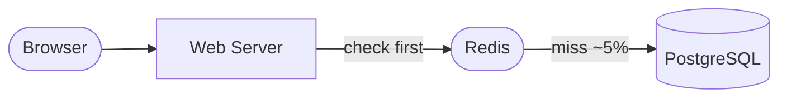
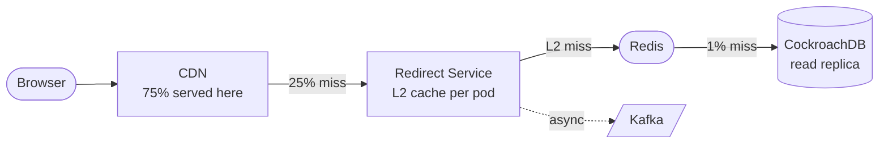

# TinyURL — System Design Study Guide

---

## 0. What Is This System?

A URL shortener takes a long web address and gives you a short one. When someone visits the short link, they get silently redirected to the original. The system has two jobs: **create** short links, and **redirect** visitors — and it must do the second one extremely fast, billions of times a day.

---

## 1. What Makes It Hard?

Most systems are hard because of write complexity. TinyURL is hard because of **read scale** and **ID uniqueness** — a rare combination.

### Hard Problem #1 — Giving every URL a unique short code without a bottleneck

In plain English: millions of people are creating short links simultaneously. Every link needs a unique 7-character code. How do you hand out unique codes that fast without every server waiting in line for the same counter?

**Technical consequence:** Any single global counter — whether in a database or Redis — becomes a chokepoint. At 6,000 link creations per second, a centralized counter limits your entire system's throughput to whatever that one node can handle.

**What beginners get wrong:** `SELECT MAX(id) + 1` or `Redis INCR` — both work fine on one server, but a single Redis node maxes out around 100,000 operations/second and is a single point of failure. If it goes down, nobody can create links.

---

### Hard Problem #2 — Redirecting billions of times a day in under 50ms

In plain English: when someone tweets a short link and it goes viral, millions of people click it within minutes. Every click needs to find the original URL and redirect the browser — in under 50ms. You cannot look it up in a database on every single click.

**Technical consequence:** At peak, this system handles over 1 million redirects per second. A typical database can handle maybe 10,000–50,000 reads per second. That's a 20–100x gap. You need multiple layers of caching between the user and the database.

**What beginners get wrong:** `SELECT long_url FROM urls WHERE short_code = 'xK3p9Qa'` on every redirect. This works at 100 users. It collapses at 100,000.

---

## 2. Requirements

### Functional Requirements

| Feature | In Scope | Notes |
|---|---|---|
| Shorten a URL | ✅ | Returns a 7-character short code |
| Redirect short → original URL | ✅ | The hot path — must be very fast |
| Custom alias (e.g. `/my-brand`) | ✅ | User-chosen code instead of random |
| Link expiry (TTL) | ✅ | e.g. "this link expires in 30 days" |
| Delete a link | ✅ | Soft delete — code is retired, not reused |
| Click analytics | ✅ | Count clicks, country, referrer — but async |
| Custom domains (`brand.com/abc`) | ❌ | V2 |
| URL preview / screenshots | ❌ | V2 |
| Real-time analytics dashboard | ❌ | V2 |

### Non-Functional Requirements

| Requirement | Target | What it means |
|---|---|---|
| Redirect latency (p99) | < 50ms | 99% of all redirects complete in under 50ms |
| Availability | 99.99% | Less than 52 minutes of downtime per year |
| Durability | 100% | A created link is never lost |
| Consistency | Eventual | A new link may not be visible globally for ~1 second — acceptable |
| Write throughput | 6,000/sec peak | Peak link creation rate |
| Read throughput | 1,160,000/sec peak | Peak redirect rate during viral events |

> **p99 latency** means: if you took all your requests and sorted them by how long they took, the 99th percentile is the slowest 1%. Keeping p99 < 50ms means even your slowest requests are fast.

---

## 3. Scale Estimation

Work through the numbers step by step:

**Link creation (writes)**
```
100 million new links per day
÷ 86,400 seconds per day
= 1,157 link creations per second (average)
× 5 (peak traffic burst)
= ~6,000 per second at peak

→ This means we need to hand out unique codes at 6,000/sec
  without any single server becoming a bottleneck.
```

**Redirects (reads)**
```
100:1 read-to-write ratio (every link gets clicked ~100 times)
= 10 billion redirects per day
÷ 86,400 seconds
= 115,741 per second (average)
× 10 (viral burst — one link goes viral)
= ~1,160,000 per second at peak

→ This means we cannot touch a database on most redirects.
  We need caching at multiple levels.
```

**Storage**
```
Each link record ≈ 500 bytes (URL + metadata)
100M links/day × 365 days × 5 years = 182 billion records
× 500 bytes = ~91 TB over 5 years

→ This means a single database server isn't enough.
  We need to split (shard) the data across many servers.
```

**Hot cache size**
```
Top 1% of links receive ~80% of all traffic (power law)
1% of 100M total links = 1 million "hot" links
1M × 500 bytes = 500 MB

→ 500 MB fits easily in memory (Redis nodes are typically 64 GB).
  If we cache just the top 1% of links, we serve 80% of traffic
  without ever touching the database.
```

### Server Count Estimation

```
Redirect Service servers:
  1 server handles ~10,000 redirects/sec (mostly cache lookups + HTTP)
  Peak: 1,160,000/sec  →  116 servers
  After CDN absorbs 75%: 290,000/sec hit origin  →  ~30 servers

Write Service servers:
  1 server handles ~1,000 creates/sec (DB write + Redis write)
  Peak: 6,000/sec  →  ~6 servers

Redis nodes:
  Hot set: 500 MB. Standard node: 64 GB
  →  1 node covers everything, use 3 for redundancy (primary + 2 replicas)

Database nodes:
  100 TB over 5 years, ~5 TB per node
  →  ~9 nodes (3 per availability zone for fault tolerance)
```

### The 5 Numbers That Drive Every Design Decision

| Number | Value | Design decision forced |
|---|---|---|
| Peak redirects | 1,160,000/sec | CDN + multi-layer cache is mandatory |
| Hot set size | 500 MB | Single Redis cluster covers everything; >95% hit rate |
| DB reads after cache | ~5,800/sec | Read replicas handle this comfortably |
| 5-year storage | ~100 TB | Must shard across ~9 DB nodes |
| Server count at peak | ~30 redirect + 6 write | Stateless services; scale horizontally |

---

## 4. Architecture

### Start Simple: The MVP

The simplest design that works:


1. User POSTs a long URL → server generates a code, saves to DB, returns short URL
2. User GETs `/xK3p9Qa` → server looks up DB → redirects

**This breaks at ~5,000 redirects/second** because the database can't keep up with every single lookup.

---

### Add Caching: First Fix



Now 95% of redirects are answered by Redis (~1ms) instead of the database (~15ms). Database load drops 20x.

**This breaks at ~100,000 redirects/second** — a single web server and single Redis node are now the limits.

---

### Production Architecture


**What each layer does:**

| Layer | Shape colour | Components | Responsibility |
|---|---|---|---|
| Edge | grey | CDN | Serves 75% of redirects globally in <5ms — no origin hit |
| Gateway | blue | Load Balancer + API Gateway | Distributes load; enforces auth and rate limits |
| Service | blue | Redirect Svc + Write Svc | Separated so a write outage never affects redirects |
| Cache | green | Redis Cluster (stadium shape) | Serves hot links in ~1ms; eliminates 99% of DB reads |
| Storage | yellow | CockroachDB (cylinder shape) | Source of truth; only hit on genuine cache misses |
| Async | pink | Kafka + ClickHouse | Click analytics fully decoupled — never blocks a redirect |

---

### Read Path — How a Redirect Works



Step by step:

| Step | Where | What happens | Latency | % of traffic |
|---|---|---|---|---|
| 1 | CDN Edge | Cache hit → return 302 immediately | ~5ms | 75% — done here |
| 2 | Redirect Svc (L2) | Pod's local memory hit → return 302 | ~2ms | ~4% of remaining |
| 3 | Redis | Cache hit → return 302, warm L2 | ~3ms | ~20% of remaining |
| 4 | Database | Read replica lookup → return 302, warm Redis | ~15ms | ~1% of remaining |
| 5 | Kafka (parallel) | Click event published — never blocks step 1–4 | async | 100% |

**The database is involved in less than 1% of all redirects.**

---

### Write Path — How a Link Gets Created


Step by step:

1. **API Gateway** checks JWT auth and rate limit (reject here if over limit)
2. **Write Service** checks `Idempotency-Key` in Redis — if seen before, return cached response
3. Write Service pops a pre-fetched short code from its local buffer (no DB call)
4. **Database transaction**: INSERT into `url_mappings` + INSERT into `idempotency_log` (atomic)
5. Write response to Redis (so the new link is immediately cacheable on first click)
6. Publish to Kafka `url.created` → other regions warm their caches async
7. Return 201 to client

---

## 5. API Design

### Two main endpoints

**Create a short link**
```
POST /api/v1/urls
Authorization: Bearer <token>
Idempotency-Key: <unique-id>    ← explained below

{
  "long_url":    "https://example.com/very/long/path",
  "custom_code": "my-brand",   // optional
  "ttl_seconds": 2592000       // optional — 30 days
}

Response 201:
{
  "short_url":  "https://tiny.url/xK3p9Qa",
  "short_code": "xK3p9Qa",
  "expires_at": "2026-06-01T10:00:00Z"
}
```

**Redirect**
```
GET /xK3p9Qa

Response:
HTTP 302 Found
Location: https://example.com/very/long/path
Cache-Control: max-age=3600, s-maxage=3600
```

### The non-obvious design decision: 301 vs 302

There are two ways to do a redirect:

| | 301 Permanent | 302 Temporary |
|---|---|---|
| Browser behaviour | Caches forever — future clicks skip our server | Re-requests every time |
| Analytics | Misses repeat clicks (browser never calls us again) | Captures every click |
| Can update destination? | No — browser cached it forever | Yes |
| Can delete the link? | No — browser ignores deletion | Yes |

**Decision: use 302.** The CDN (`s-maxage=3600`) absorbs the scale. We keep click analytics and the ability to delete links. Offer 301 as an opt-in for power users who want maximum speed and don't need analytics.

### The non-obvious design decision: Idempotency Key

What if a client sends a "create link" request, the server creates the link, but the network drops before the response arrives? The client retries — and now the link is created twice.

The fix: the client sends a unique `Idempotency-Key` header with every create request. The server stores this key for 24 hours. If it sees the same key again, it returns the original response instead of creating a duplicate.

---

## 6. Data Model

### Main table: `url_mappings`

| Column | Type | Notes |
|---|---|---|
| `short_code` | CHAR(7) | Primary key — the 7-character code |
| `long_url` | TEXT | The original URL (may contain sensitive query params) |
| `user_id` | BIGINT | Who created it (null for anonymous) |
| `created_at` | TIMESTAMP | When it was created |
| `expires_at` | TIMESTAMP | When it expires (null = never) |
| `is_deleted` | BOOLEAN | Soft delete — we keep the row to retire the code |
| `redirect_type` | SMALLINT | 301 or 302 |
| `metadata` | JSON | Tags, campaign name, etc. |

### Supporting table: `key_pool`

| Column | Type | Notes |
|---|---|---|
| `short_code` | CHAR(7) | Pre-generated code, not yet assigned to any URL |
| `created_at` | TIMESTAMP | When this code was generated (for pool age monitoring) |

### Supporting table: `idempotency_log`

| Column | Type | Notes |
|---|---|---|
| `idempotency_key` | VARCHAR(64) | The client-supplied unique request ID |
| `short_code` | CHAR(7) | The code that was assigned for this request |
| `response_body` | TEXT | The exact JSON response returned — replayed on duplicate |
| `created_at` | TIMESTAMP | TTL: rows expire after 24 hours |

---

### SQL vs NoSQL — why not the obvious choices?

Before explaining what we chose, here's why the obvious alternatives don't fit:

| Database | Type | Why it seems attractive | Why it doesn't fit |
|---|---|---|---|
| **DynamoDB** | Key-value / document | Massive scale, managed, fast key lookups | No support for `SELECT ... FOR UPDATE SKIP LOCKED` (key pool requires row-level locking); cross-item transactions are cumbersome; expensive at 100TB |
| **Cassandra** | Wide-column | Designed for high write throughput, multi-region | Eventual consistency only — can't enforce unique `short_code` across nodes; no transactions; collision risk is real |
| **MongoDB** | Document | Flexible schema, easy to operate | No row-level locking for the key pool pattern; multi-document transactions have significant overhead; not designed for 1M point-reads/sec |
| **Plain PostgreSQL** | Relational | Familiar SQL, strong consistency, great for the key pool pattern | Single-node by default: hits its ceiling at ~5TB on one machine. Horizontal sharding requires a proxy layer (Citus/pgBouncer) that adds operational complexity. Manual replication setup for multi-AZ. |
| **MySQL + Vitess** | Relational + sharding | Proven at YouTube/Slack scale | Vitess adds significant operational complexity; `FOR UPDATE SKIP LOCKED` behaviour across shards needs careful setup |
| **CockroachDB** | Distributed SQL | ✅ chosen — see below | — |

### Database choice: CockroachDB

**Why CockroachDB specifically:**

CockroachDB is PostgreSQL-compatible SQL on the outside, but a distributed key-value store on the inside. Three properties make it the right fit here:

1. **Automatic sharding with no application-level proxy.** CockroachDB splits tables into "ranges" (16MB chunks) and distributes them across nodes automatically. The application talks to any node; routing is internal. With plain PostgreSQL + Citus, your application must be aware of which shard to talk to.

2. **Raft consensus per range, not per cluster.** Each range has its own Raft group — a small committee of 3 nodes that vote on every write. A write is committed only when 2 of 3 agree (quorum). This means:
   - No single node can corrupt data — it needs agreement
   - If one node dies, the remaining 2 still have quorum and keep serving writes
   - A 3-node cluster across 3 availability zones means a full AZ outage still leaves 2 nodes in quorum

3. **REGIONAL BY ROW for geo-distribution.** CockroachDB can pin each row to a specific region based on a column. A UK user's links are stored and served from EU nodes; US user's links from US nodes. Redirect latency drops from ~80ms (cross-Atlantic DB call) to ~8ms (same-region call). Plain PostgreSQL has no concept of this.

```
   Raft consensus example — 3 nodes, 1 AZ down:

   AZ-1 [Node A] ──┐
   AZ-2 [Node B] ──┼── Quorum (2/3 agree) → write committed ✅
   AZ-3 [Node C] ✗ (down)
```

### Sharding key: `short_code`

> **Sharding** means splitting your database rows across multiple servers. You need a rule for which server stores which row.

We shard by `hash(short_code)`. This spreads rows evenly across all servers. Since every redirect is a lookup by `short_code`, each redirect hits exactly one server — fast and predictable.

We do **not** shard by `user_id`, even though it would make "list all my links" faster — because that would make every redirect hit two servers (look up user → look up code), doubling latency on the 1M/sec hot path.

---

## 7. Deep Dives

### Deep Dive 1: How do we generate unique short codes at 6,000/sec?

The core challenge: every short link needs a unique 7-character code. A 7-character Base62 code (a–z, A–Z, 0–9) has 62^7 = **3.5 trillion** possible values — plenty of room. The problem isn't the key space, it's handing out codes to 6,000 simultaneous requests per second without any server waiting on another.

---

#### Option A: Hash the URL

**How it works, step by step:**

1. User POSTs `https://example.com/very/long/path`
2. Server runs: `MD5("https://example.com/very/long/path")` → produces a 128-bit hex string like `a9993e364706816aba3e25717850c26c`
3. Take the first 7 characters: `a9993e3`
4. Convert those hex characters to Base62 (a–z, A–Z, 0–9) to make the code more compact
5. Try to `INSERT INTO url_mappings (short_code='a9993e3', long_url=...)` 
6. If it succeeds → return the code
7. If it fails (collision) → try the next 7 characters of the hash, retry the INSERT

```
"https://example.com/path"
         │
         ▼
    MD5 hash (128 bits)
    a9993e364706816aba3e25717850c26c
         │
         ▼  take first 7 chars
    a9993e3  ──── INSERT attempt ──→  success? return "a9993e3"
                                           │
                                      collision? try "9993e36"
                                           │
                                      collision? try "993e364"
                                           │ ... keep shifting
```

**The collision math (why this breaks):**

> The **birthday paradox**: if you put enough people in a room, two will share a birthday surprisingly quickly. Same logic applies to short codes.

Probability of at least one collision after `n` codes with keyspace `k`:

```
k = 62^7 = 3,521,614,606,208 possible codes
n = 100,000,000 links (100M)

P(collision) ≈ 1 - e^(-n²/2k)
             ≈ 1 - e^(-(10^16)/(7×10^12))
             ≈ 1 - e^(-1428)
             ≈ 100%
```

With 100 million links, collisions are **mathematically certain**. Around every 3.5 million links you insert, you should expect one collision.

**The real problem:** collision handling adds a retry on the write path — a second `SELECT` to check if the code exists, then a second `INSERT`. Under 6,000/sec, some requests will collide on the retry too (hash collision on a 7-char shifted window). You end up with cascading retries, unpredictable latency, and complex code on the hottest path in your system.

**Verdict: works at 10,000 links. Unreliable at 100 million.**

---

#### Option B: Global counter

**How it works, step by step:**

1. Every new link gets the next integer: 1, 2, 3, 4, ...
2. Convert that integer to Base62 — this is what makes it short:
   - Integer 1 → `"1"` (1 character)
   - Integer 1,000,000 → `"4c92"` (4 characters)
   - Integer 3,521,614,606,207 → `"zzzzzzzz"` (7 characters)
3. Store that Base62 string as the short code

```
Counter: 57,832,901
         │
         ▼
   Base62 encode
   57832901 ÷ 62 = 932788 r 25  → 'p'
   932788   ÷ 62 = 15044   r 40  → 'O'
   15044    ÷ 62 = 242     r 40  → 'O'
   242      ÷ 62 = 3       r 56  → '4'
   3        ÷ 62 = 0       r 3   → '3'
         │
         ▼
   short code: "34OOp"   ← guaranteed unique, no collision possible
```

**The single-node problem:**

The counter must be atomic — two servers can't both get "next = 57832901" at the same time or they'd produce duplicate codes. So the counter lives in one place:

```
Server A ──┐
Server B ──┼──► Redis INCR counter ──► "here's your unique number"
Server C ──┘
Server D ──┘
```

A single Redis node handles ~100,000 INCR operations per second. At 6,000 link creations/sec we're far under that limit — BUT:

- **Single point of failure**: Redis goes down → all link creation stops. Zero writes possible.
- **Predictable codes**: codes increment sequentially (`abc1`, `abc2`, `abc3`...). Anyone can enumerate all your links by just iterating the counter.
- **Hotspot**: all 6,000 writes/sec funnel through one node. Any operational issue (network blip, memory pressure, reboot) blocks everyone.

**Mitigation attempt: range allocation.** Instead of one global INCR, each Write Service server grabs a range from the counter (e.g. "you own 1,000,000 to 1,001,000"). Servers work through their range locally, grab the next range when done. This reduces counter contention by 1,000x — but the counter is still a single point of failure.

```
Write Service A gets range: 1,000,000 → 1,001,000  (works locally until exhausted)
Write Service B gets range: 1,001,000 → 1,002,000
Write Service C gets range: 1,002,000 → 1,003,000
         ...all still depend on one counter for range allocation
```

**Verdict: works at medium scale. Fragile; predictable codes are a security risk.**

---

#### Option C: Pre-generated key pool ← chosen

**Core idea:** decouple code generation from code assignment. Generate millions of random, guaranteed-unique codes in a background job (offline, no time pressure). Store them in a `key_pool` table. When a link is created, simply claim a code from the pool. No hashing, no collision risk, no centralized counter.

**How it works, step by step:**

**Phase 1 — background key generation (runs continuously, never on the request path):**

```
Background job (runs every minute):
  1. Generate 100,000 random 7-char Base62 strings
  2. INSERT them into key_pool
  3. ON CONFLICT DO NOTHING  ← handles the rare accidental duplicate
  4. Pool stays at ~10 million available codes at all times
```

```sql
INSERT INTO key_pool (short_code, created_at)
SELECT
  -- random Base62: take 7 chars from an md5 of a random number
  substr(md5(random()::text), 1, 7),
  NOW()
FROM generate_series(1, 100000)
ON CONFLICT DO NOTHING;
```

**Phase 2 — server startup (each Write Service pod, once):**

```sql
-- Claim 1,000 codes exclusively — SKIP LOCKED means two pods
-- running this simultaneously will get DIFFERENT rows, never the same one
DELETE FROM key_pool
WHERE short_code IN (
  SELECT short_code FROM key_pool
  LIMIT 1000
  FOR UPDATE SKIP LOCKED
)
RETURNING short_code;
-- → returns ['xK3p9Qa', 'mB7tR2n', 'pQ1zW4c', ...]
```

The pod stores these 1,000 codes in a local in-memory list. It never asks the database for a code again unless the buffer drops below 100 (at which point it refills asynchronously in a background thread).

**Phase 3 — link creation (the request path, no DB call for the code):**

```
User POSTs long URL
        │
        ▼
Write Service pops 'xK3p9Qa' from its in-memory list
        │
        ▼
INSERT INTO url_mappings (short_code='xK3p9Qa', long_url='https://...')
        │
        ▼
Return 'https://tiny.url/xK3p9Qa' to user
```

**Why `FOR UPDATE SKIP LOCKED` is the key:**

Without it, two pods requesting codes simultaneously would both lock the same rows and one would have to wait. `SKIP LOCKED` tells the database: "if a row is already locked by someone else, skip it and give me the next available one." The result: two pods run the same query simultaneously and get completely different sets of codes — zero contention, zero waiting.

```
Pod A: SELECT ... FOR UPDATE SKIP LOCKED  →  gets codes 1–1000
Pod B: SELECT ... FOR UPDATE SKIP LOCKED  →  gets codes 1001–2000  (skipped A's locked rows)
Pod C: SELECT ... FOR UPDATE SKIP LOCKED  →  gets codes 2001–3000
         No pod waits. All run concurrently.
```

**Comparison table:**

| Property | Hash the URL | Global counter | Pre-generated key pool |
|---|---|---|---|
| Collision risk | Certain at 100M links | None | None |
| Bottleneck | None (but retries add up) | Single counter node | None — codes live in pod memory |
| Failure mode | Cascading retries on hot path | Counter down = all writes stop | Pool runs dry = ~10min warning before writes stop |
| Code predictability | Deterministic (same URL = same code) | Sequential (enumerable) | Random (non-guessable) |
| Complexity | Collision retry logic needed | Simple, then range allocation | Background generator + pre-fetch |
| Works at 6K writes/sec | Unreliably | Yes, with range allocation | Yes, easily |

#### The exact mechanism — key pool claim

```sql
-- Claim 1,000 codes at once during server startup (or refill)
-- FOR UPDATE SKIP LOCKED is the key: if two servers run this
-- simultaneously, Postgres/CockroachDB hands them DIFFERENT rows —
-- no waiting, no duplicate claims, no contention
DELETE FROM key_pool
WHERE short_code IN (
  SELECT short_code FROM key_pool
  LIMIT 1000
  FOR UPDATE SKIP LOCKED
)
RETURNING short_code;
```

Each Write Service pod runs this query **once at startup** and holds 1,000 codes in local memory. When its local buffer drops below 100, it refills asynchronously in a background thread. In normal operation, link creation never touches `key_pool` at all — the pod just pops from its in-memory list.

**Monitoring:** Alert when pool size < 1,000,000 codes. Background generator runs continuously as a separate cron job:

```sql
-- Key generator job (runs every minute):
INSERT INTO key_pool (short_code, created_at)
SELECT
  -- generate random Base62 strings (a-z, A-Z, 0-9)
  substr(md5(random()::text), 1, 7),
  NOW()
FROM generate_series(1, 100000)   -- 100K codes per batch
ON CONFLICT DO NOTHING;            -- silently skip any accidental duplicate
```

---

#### End-to-end: what happens when a user creates a link

Here is the exact sequence from HTTP request to database row, with every step shown:

```
Client                   Write Service             CockroachDB           Redis
  │                           │                        │                    │
  │  POST /api/v1/urls        │                        │                    │
  │  Idempotency-Key: abc123  │                        │                    │
  │──────────────────────────>│                        │                    │
  │                           │                        │                    │
  │                           │ GET idempotency:abc123 │                    │
  │                           │────────────────────────────────────────────>│
  │                           │ (nil — first time)     │                    │
  │                           │<────────────────────────────────────────────│
  │                           │                        │                    │
  │                           │ pop 'xK3p9Qa'          │                    │
  │                           │ from local buffer      │                    │
  │                           │                        │                    │
  │                           │  BEGIN TRANSACTION     │                    │
  │                           │───────────────────────>│                    │
  │                           │                        │                    │
  │                           │  INSERT url_mappings   │                    │
  │                           │  (short_code, long_url,│                    │
  │                           │   user_id, expires_at) │                    │
  │                           │───────────────────────>│                    │
  │                           │                        │                    │
  │                           │  INSERT idempotency_log│                    │
  │                           │  (abc123, xK3p9Qa,     │                    │
  │                           │   response_json)       │                    │
  │                           │───────────────────────>│                    │
  │                           │                        │                    │
  │                           │  COMMIT                │                    │
  │                           │───────────────────────>│                    │
  │                           │  ← ok                  │                    │
  │                           │                        │                    │
  │                           │ SET url:xK3p9Qa <long_url> EX 3600          │
  │                           │────────────────────────────────────────────>│
  │                           │ ← ok                   │                    │
  │                           │                        │                    │
  │                           │ SET idempotency:abc123 <response> EX 86400  │
  │                           │────────────────────────────────────────────>│
  │                           │ ← ok                   │                    │
  │                           │                        │                    │
  │  HTTP 201                 │                        │                    │
  │  { "short_url": "tiny.url/xK3p9Qa" }              │                    │
  │<──────────────────────────│                        │                    │
```

**Step by step:**

| Step | What happens | Why |
|---|---|---|
| 1 | Validate request (URL format, user auth, rate limit) | Reject bad requests before touching any storage |
| 2 | Check Redis for `idempotency:abc123` | If found, return the cached response — the link was already created |
| 3 | Pop `xK3p9Qa` from the Write Service's in-memory buffer | No DB call — this is why key pool pre-fetch matters |
| 4 | `BEGIN` transaction on CockroachDB | Both inserts must succeed or both fail — no half-created links |
| 5 | `INSERT INTO url_mappings` with the code and URL | Creates the actual mapping |
| 6 | `INSERT INTO idempotency_log` with the response body | So if the client retries, we can return exactly the same response |
| 7 | `COMMIT` — the link is now durable | After this point, the link exists even if the server crashes |
| 8 | `SET url:xK3p9Qa <long_url> EX 3600` in Redis | Warm the cache so the first click doesn't miss |
| 9 | `SET idempotency:abc123 <response> EX 86400` in Redis | 24-hour idempotency window |
| 10 | Return 201 to client | Done |

**What the resulting database row looks like:**

```sql
SELECT * FROM url_mappings WHERE short_code = 'xK3p9Qa';

short_code  │ long_url                            │ user_id │ created_at           │ expires_at           │ is_deleted │ redirect_type
────────────┼─────────────────────────────────────┼─────────┼──────────────────────┼──────────────────────┼────────────┼──────────────
xK3p9Qa     │ https://example.com/very/long/path  │ 42      │ 2026-05-02 10:00:00  │ 2026-06-01 10:00:00  │ false      │ 302
```

---

#### How a redirect uses this row

When someone visits `tiny.url/xK3p9Qa`:

```
Redirect Service checks Redis:
  GET url:xK3p9Qa  →  "https://example.com/very/long/path"  (cache hit)

Builds and returns:
  HTTP 302 Found
  Location: https://example.com/very/long/path
  Cache-Control: max-age=3600, s-maxage=3600

(async, never blocking the redirect above)
  Kafka.publish("url.clicks", { short_code: "xK3p9Qa", ts: now, country: "US" })
```

On a cache miss (1% of redirects), the query is simply:

```sql
SELECT long_url, expires_at, is_deleted, redirect_type
FROM url_mappings
WHERE short_code = 'xK3p9Qa';
-- CockroachDB routes this to the single node that owns hash('xK3p9Qa')
-- Result comes back in ~5ms from a read replica
```

---

#### Custom aliases — how they differ from auto-generated codes

When a user requests `/my-brand` instead of a random code:

1. No code is claimed from `key_pool` — the user's alias is the code
2. Write Service does `INSERT INTO url_mappings (short_code='my-brand', ...)` with an explicit unique constraint check
3. If `my-brand` already exists: return **409 Conflict** — "this alias is already taken"
4. Custom codes are never placed back into `key_pool` — they stay in `url_mappings` forever (even after deletion, `is_deleted=true` prevents reuse)

**Risk:** a user could claim `xK3p9Qa` as a custom alias, matching a pre-generated pool code. The unique constraint on `url_mappings.short_code` catches this — the pool code's eventual INSERT would fail. The key generator handles this by generating codes, then checking they don't exist in `url_mappings` before adding to `key_pool`.

**Monitoring:** Alert when the pool drops below 1 million codes. The background generator runs continuously and keeps it topped up.

---

### Deep Dive 2: How do we serve 1.16M redirects/second in under 50ms?

The answer is **four layers of cache**, each serving a different slice of traffic. Think of it as a series of filters — each layer handles what it can, and only passes the rest deeper.

#### Layer 0: Browser cache (for 301 links)
If a user has clicked this link before and it's a 301 redirect, their browser cached it. Zero network request. Approximately 20–30% of repeat visitors.

#### Layer 1: CDN edge cache (~75% of remaining traffic)
Cloudflare has 200+ servers worldwide. When the first person in London clicks a link, Cloudflare's London server caches it. Every subsequent click from London is served from that same nearby server — no trip to our origin servers.

- TTL: 1 hour (`s-maxage=3600` in the response header)
- Response time: ~5ms (nearest PoP, not crossing the Atlantic)
- Capacity: effectively unlimited

#### Layer 2: In-process memory cache (~15% of CDN misses)
Each of our 20 Redirect Service servers keeps the 10,000 hottest links in its own local memory. This is the fastest possible lookup — no network, no serialization, just a hash map.

- Size: ~5MB per server
- TTL: 60 seconds
- Why it matters: a viral URL with 1M clicks/sec — if all 20 servers have it locally, Redis only sees ~20 requests/sec for that key

#### Layer 3: Redis (~95% of layer 2 misses)
Redis is an in-memory key-value store — much faster than a database because everything is in RAM, not on disk.

- Size: 500MB hot set fits comfortably (Redis nodes are 64GB)
- TTL: 1 hour per key (resets on each access)
- Response time: ~1ms
- Eviction: when memory is full, kick out the least-recently-used key

#### Layer 4: Database (~5% of Redis misses — ~5,800/sec)
Only reached when a URL is genuinely cold (not in any cache). At a 99%+ combined cache hit rate, the database sees less than 6,000 redirects/second — well within what read replicas can handle.

```
Total traffic:  1,160,000 / sec
After CDN:        290,000 / sec  (75% served at CDN)
After L2 memory:   246,500 / sec  (15% of CDN misses served from memory)
After Redis:        12,325 / sec  (95% of remainder served from Redis)
After DB replicas:   ~5,800 / sec  (source of truth — always the answer)
```

#### The cache stampede problem

Imagine a link's cache entry expires at exactly 12:00:00. In that split second, 10,000 concurrent users all get a cache miss simultaneously. All 10,000 try to query the database at once. The database is suddenly slammed.

**Fix: probabilistic early expiration.** Before a cache entry expires, start refreshing it in the background — with increasing probability as expiry approaches. At 60 seconds left, there's a tiny chance of refresh. At 1 second left, there's a near-certain refresh. This smooths out the expiry cliff.

```
# The closer to expiry, the more likely we refresh early
# This means the entry is almost always refreshed before
# thousands of users simultaneously hit a cold cache
```

**Fix 2: Redis lock.** The first request that gets a cache miss acquires a lock and queries the database. All other simultaneous requests wait briefly and then re-check the cache (which the first request just populated).

#### Cache invalidation on delete

When a user deletes a link, the database is updated immediately. But the CDN still has the old entry cached for up to 1 hour.

The fix: on delete, call the Cloudflare cache purge API to evict the entry from all edge nodes. This takes ~500ms to propagate globally. We also delete the Redis key immediately. There's a short window (~500ms) where a deleted link still redirects — acceptable for most use cases, and documented in the SLA.

---

## 8. Handling Failures

**Redis goes down**
- ~15% of redirects served from each server's local memory cache
- Remaining redirects fall through to the database directly
- Database read replicas see ~3x normal load — manageable
- Redis auto-recovers via replica promotion in ~30 seconds
- No link creation failures (Redis is not in the write path for new links)

**Database primary goes down**
- Reads: unaffected — all reads go to read replicas
- Writes (link creation): fail with 503 "Service Unavailable, retry in 10 seconds"
- CockroachDB automatically elects a new leader in under 5 seconds
- Clients retry with the same Idempotency-Key — no duplicate links created

**Kafka goes down**
- Click analytics events are silently dropped (fire-and-forget — we never wait for Kafka before sending the redirect)
- Redirects are completely unaffected
- Analytics may under-count by a few percent during the outage
- This is acceptable — analytics precision is not a correctness requirement

**One AWS availability zone goes down (e.g. power failure)**
- CockroachDB: 3 copies of each row across 3 zones. Losing 1 zone = still have 2 copies = still working
- Redis: same pattern — each shard's primary and replica are in different zones
- App servers: spread across zones, load balancer routes around the failed zone

---

## 9. Key Trade-offs

| Decision | What we chose | What we rejected | Why |
|---|---|---|---|
| Short code generation | Pre-generated key pool | Global counter (Redis INCR) | Counter = single point of failure; key pool has no bottleneck |
| Short code generation | Pre-generated key pool | Hash of the URL | Birthday paradox: near-certain collisions at 100M links |
| Redirect type | 302 (temporary) by default | 301 (permanent) | 301 breaks analytics and makes deletion impossible |
| Analytics writes | Async via Kafka | Synchronous DB write | Writing analytics inline would add ~10ms to every redirect |
| Cache | Redis | Memcached | Redis supports TTL per key and has better cluster support |
| Consistency | Eventual (new links visible in ~1s globally) | Strong (visible everywhere instantly) | Strong consistency would add ~150ms to every write — unacceptable |
| Shard key | `short_code` | `user_id` | Every redirect is a lookup by `short_code` — must be single-shard lookup |

---

## 10. Interview Playbook

### Minute-by-minute guide

| Time | What to do |
|---|---|
| 0–5 min | Ask clarifying questions. Confirm: are analytics needed? custom aliases? TTL? global users? Lock in the 301 vs 302 question — it signals depth. |
| 5–10 min | Estimate scale. Derive the two key numbers: **1.16M redirects/sec** and **500MB hot set**. State what they force: "these numbers mean CDN and Redis are non-negotiable." |
| 10–20 min | Draw the architecture. Start with MVP (server + DB). Show what breaks. Add CDN, Redis, then service split. Explain what each component does in one sentence. |
| 20–35 min | Go deep on the two hard problems. Key pool generation (why counter fails, how SKIP LOCKED works). Four-layer cache (what % each layer handles, why the ordering matters). |
| 35–45 min | Failure scenarios, trade-offs table, invite follow-up questions. |

### What separates an L6 answer from an L4 answer

1. **L6 frames the hard problems before drawing.** L4 starts drawing boxes immediately. Framing shows you understand what's genuinely difficult vs. what's routine.

2. **L6 explains 301 vs 302 with Cache-Control headers.** L4 picks one without reasoning. This trade-off (analytics accuracy vs. browser caching vs. mutability) is specific to this system.

3. **L6 has numbers that justify every decision.** "500MB hot set fits in Redis" isn't a guess — it's derived from Zipf distribution × record size. Numbers make decisions defensible.

### Three hard follow-up questions

**"A celebrity tweets your link. You go from 1,000 to 500,000 req/sec in 30 seconds. What happens?"**

Good answer: CDN serves 75% from edge cache (<5ms, no origin hit). Local memory cache on each server serves the next ~15%. Redis handles the remaining ~10%. At full viral scale, the database sees near-zero traffic for that specific URL. The only risk is the first 1–2 seconds before the CDN warms up — 200 PoPs × 1 miss each = 200 origin requests, totally manageable.

**"How would you implement a link that expires after 1,000 clicks?"**

Good answer: Don't increment a database counter on every redirect — that's 1M writes/sec on one row. Instead: store a click counter in Redis (`INCR clicks:xK3p9Qa`). Check against max_clicks in the same Redis call (Lua script for atomicity). Flush to the database every 1,000 increments. Accept that a few extra clicks may slip through in the flush window — precision isn't critical here.

**"How do you delete a user's data for GDPR compliance?"**

Good answer: it's not just one delete. Database: null out the `long_url` field (removes PII), keep the row so the code isn't reused. Redis: delete the key immediately. CDN: call Cloudflare's purge API (~500ms to propagate). ClickHouse (analytics): async delete job within 30 days. Backups: document that PII remains in backups until rotation (disaster recovery only). Track completion of each step in an audit table. Full erasure within 30 days as required by GDPR.

### If you're running short on time, skip these

- Multi-region deployment details (mention it exists, don't detail it)
- Observability / alerting specifics
- Deployment strategy (mention canary deploys, skip the rollback thresholds)
- Security details beyond "rate limiting and JWT auth"

---

## 11. Further Deep Dives

These come up in FAANG interviews as follow-up questions after you've covered the core design. Each one has a concrete problem, a naive approach that fails, and the production solution.

---

### Further Dive A: Viral spike — one link goes from 0 to 500K clicks/sec in 30 seconds

**The problem in plain English:** A celebrity posts your short link. Within 30 seconds, hundreds of thousands of people click it simultaneously. Your system has never seen this link before — no CDN cache, no Redis entry, nothing. What happens?

**What actually breaks — the first 30 seconds:**

```
t=0s:   link created, nobody has clicked it yet
t=0s:   celebrity posts it to 50M followers

t=1s:   500 people click simultaneously
         → all 500 miss CDN (not cached yet)
         → all 500 hit Redirect Service
         → all 500 miss Redis (not cached yet)
         → all 500 hit CockroachDB read replica

t=2s:   2,000 more clicks
         → CDN has cached it now (from t=1 misses)
         → CDN serves 75% = 1,500 from CDN
         → 500 still hit origin

t=30s:  500,000 clicks/sec
         → CDN serving ~375,000/sec (cache warm now)
         → 125,000/sec hitting origin
```

The window between t=0 and t=2 is the risk. Let's quantify:

```
500 simultaneous DB hits (t=1s): read replica handles ~50,000 reads/sec → fine
2,000 simultaneous DB hits (t=2s): still fine
Peak origin load (125,000/sec): 30 servers × 10,000/sec capacity = 300,000/sec capacity → fine
```

For TinyURL-scale, the math works out — the CDN warms fast enough. But the scenario gets genuinely dangerous in one edge case: the **thundering herd on cache miss**.

**The thundering herd:**

Imagine the CDN cache for `xK3p9Qa` expires at exactly 12:00:00. Ten thousand people click it at 12:00:00.001. All 10,000 get a CDN miss. Cloudflare collapses them using "request coalescing" — only 1 request per PoP (200 PoPs) goes to origin. So origin sees 200 requests, not 10,000. That's fine.

But what if 200 PoPs all miss Redis simultaneously? 200 DB reads at once. Still fine.

The problem is **Redis hot shard**. Redis cluster divides keys across 6 shards using consistent hashing. `hash('xK3p9Qa')` routes to exactly one shard. If that link is getting 100,000 Redis hits/sec, all 100,000 go to one Redis shard. A Redis node handles ~100,000 ops/sec — you've just maxed it out with a single key.

**The fix: local in-process cache as primary for hot keys**

Each Redirect Service pod already keeps a 10,000-entry local LRU cache (§7 Deep Dive 2, Layer 2). When a link is hot, every pod has it locally after the first hit. Redis sees at most `num_pods` requests for that key (30 pods × 1 miss each = 30 Redis requests), not 100,000.

```
100,000 redirects/sec for 'xK3p9Qa'
Across 30 pods = ~3,333 redirects/sec per pod
Each pod caches locally after first hit
→ Redis sees 30 requests (one miss per pod), then zero
→ DB sees near zero
```

**FAANG interview angle:** At Google/Meta scale with 10,000 pods, even one miss per pod = 10,000 Redis requests. The fix is to detect "this key is hot" and actively push it to all pods' in-process caches via pub/sub, rather than waiting for each pod to discover it organically.

---

### Further Dive B: Link expiry — how do you delete 100M expired links efficiently?

**The problem in plain English:** Links have expiry times. Every day, millions of links expire. When someone clicks an expired link, they should get a "this link has expired" page, not a redirect. How do you handle this efficiently?

**Naive approach — check on every redirect:**

```sql
SELECT long_url, expires_at FROM url_mappings WHERE short_code = 'xK3p9Qa';
-- Then in application code:
if (expires_at < NOW()) return 410 Gone;
```

This works but means every redirect checks `expires_at`. Fine for the DB, but what about Redis? The Redis entry has no concept of "check if this URL is expired" — it just returns the cached `long_url`. So either:
- You store `expires_at` alongside `long_url` in Redis and check it on every cache hit (adds logic to the hot path)
- Or you don't cache expired links and rely on Redis TTL matching the link's TTL

**The clean solution: align Redis TTL with link expiry**

When you write to Redis, set the TTL to match the link's remaining lifetime:

```
Link expires_at = 2026-06-01 10:00:00
Current time   = 2026-05-02 10:00:00
Remaining TTL  = 2,592,000 seconds (30 days)

SET url:xK3p9Qa "https://example.com/..." EX 2592000
```

When the link expires, Redis automatically evicts it. The next click gets a cache miss, hits the DB, finds `expires_at < NOW()`, returns 410. Simple, no extra logic on the hot path.

**The hard part — garbage collecting the DB rows:**

You have 182 billion rows over 5 years. Every day, ~100M expire. If you run `DELETE FROM url_mappings WHERE expires_at < NOW()` it will:
- Lock a massive portion of the table
- Generate a huge write amplification (CockroachDB must tombstone each row, then compact)
- Run for hours

**The production approach: time-partitioned table + drop partition**

Instead of deleting rows, partition the `url_mappings` table by month of `created_at`. When an entire month's partition is past its maximum possible expiry date, drop the entire partition:

```sql
-- Instead of DELETE, create table with partitions:
CREATE TABLE url_mappings_2026_01 PARTITION OF url_mappings
  FOR VALUES FROM ('2026-01-01') TO ('2026-02-01');

-- When all links from Jan 2026 are guaranteed expired (e.g., max TTL is 1 year):
DROP TABLE url_mappings_2026_01;  -- instant — no row-by-row deletion
```

Dropping a partition is O(1) — a metadata operation, not a row scan. This is orders of magnitude faster than `DELETE WHERE expires_at < ...`.

**For rows within a live partition that expire early:**

A small background job runs nightly:
```sql
DELETE FROM url_mappings
WHERE expires_at < NOW() - INTERVAL '1 day'  -- 1 day buffer for cache alignment
  AND expires_at > created_at  -- only explicitly-set TTL rows
LIMIT 10000;  -- batch to avoid locking
-- Run this in a loop until 0 rows affected
```

The `LIMIT 10000` is critical — it prevents one massive transaction, keeps lock duration short, and lets the DB breathe between batches.

---

### Further Dive C: Click analytics pipeline — how does Kafka → ClickHouse actually work?

**The problem in plain English:** Every redirect generates a click event: which link, when, from which country, from which referrer. We want to be able to answer "how many clicks did link X get this week, by country?" without that analytics work ever slowing down a redirect.

**Why Kafka is in the middle:**

The Redirect Service publishes events to Kafka instead of writing directly to ClickHouse because:
- Redirects must be fast (~1ms). Writing to ClickHouse inline could add 5–50ms.
- ClickHouse prefers large batch inserts (thousands of rows at once). One-row inserts are very inefficient for columnar stores.
- Kafka acts as a buffer: 1,160,000 events/sec flow in, ClickHouse reads them in batches of 100,000 at a time.

**The flow:**

```
Redirect Service
      │
      │  fire-and-forget (acks=0, never blocks the redirect)
      ▼
Kafka topic: "url.clicks"
  - 256 partitions (parallelism)
  - replication factor 3
  - retention: 7 days (replay window if ClickHouse falls behind)
      │
      │  ClickHouse Kafka table engine reads in batches
      ▼
ClickHouse "clicks" table
  - columnar storage — reads a single column (e.g. country) without touching others
  - partitioned by month (PARTITION BY toYYYYMM(ts))
  - sorted by (short_code, ts) — makes time-range queries per link extremely fast
```

**The ClickHouse schema:**

```sql
CREATE TABLE clicks (
    short_code  String,
    ts          DateTime,
    country     LowCardinality(String),  -- LowCardinality = dictionary encoding, much smaller
    referrer    String,
    user_agent  String
)
ENGINE = MergeTree()
PARTITION BY toYYYYMM(ts)
ORDER BY (short_code, ts);   -- queries like "clicks for xK3p9Qa last 7 days" are instant
```

**How a query runs:**

```sql
-- "How many clicks did xK3p9Qa get per country this week?"
SELECT country, count() AS clicks
FROM clicks
WHERE short_code = 'xK3p9Qa'
  AND ts >= now() - INTERVAL 7 DAY
GROUP BY country
ORDER BY clicks DESC;

-- ClickHouse:
-- 1. Jumps to the partition containing the last 7 days (skips all older data)
-- 2. Reads only the short_code, ts, and country columns (skips referrer, user_agent)
-- 3. Returns in ~50ms even over billions of rows
```

**Why ClickHouse and not PostgreSQL for analytics?**

PostgreSQL stores rows: `[short_code, ts, country, referrer, user_agent]` all together. Reading `country` for 1 billion rows means reading all 5 columns. ClickHouse stores columns: all `country` values together, all `ts` values together. Reading `country` for 1 billion rows reads only that one column — 5–10x less I/O.

---

### Further Dive D: GDPR erasure — deleting a user's data across 5 systems

**The problem in plain English:** A user says "delete all my data." Under GDPR, you have 30 days to comply. But the user's URLs are stored in 5 different places: the main database, Redis, the CDN, Kafka (event stream), and ClickHouse (analytics). You must remove PII from all of them.

**Where PII lives:**

| System | What's stored | PII risk |
|---|---|---|
| CockroachDB `url_mappings` | `long_url` (may contain tokens/personal info), `user_id` | High |
| Redis | `url:xK3p9Qa → long_url` | High (same URL) |
| CDN (Cloudflare) | Cached `Location: https://...` header | High |
| Kafka `url.clicks` | `short_code`, `country`, `user_agent` | Low-medium (no URL, but linkable to user) |
| ClickHouse `clicks` | Same as Kafka events | Low-medium |

**The erasure sequence:**

```
User triggers deletion
        │
        ▼
1. CockroachDB: UPDATE url_mappings
   SET long_url = NULL, user_id = NULL
   WHERE user_id = 42;
   -- Keep the row! The short_code must stay so the code isn't reused.
   -- Nulling long_url means future clicks get a 410 Gone response.
        │
        ▼
2. Redis: DEL url:xK3p9Qa (for each of user 42's links)
   -- Immediate. Next click misses cache, hits DB, gets NULL long_url → 410.
        │
        ▼
3. CDN: POST https://api.cloudflare.com/zones/{id}/purge_cache
   { "files": ["https://tiny.url/xK3p9Qa", ...] }
   -- Takes ~500ms to propagate globally.
   -- Any click in that window gets the cached old redirect.
   -- Document this 500ms window in your privacy policy.
        │
        ▼
4. ClickHouse: ALTER TABLE clicks DELETE WHERE short_code IN ('xK3p9Qa', ...)
   -- Async mutation — ClickHouse marks rows for deletion, physically removes during next merge.
   -- Takes minutes to hours. Acceptable — GDPR allows 30 days.
        │
        ▼
5. Kafka: events already published cannot be deleted from the stream.
   -- Solution: set a 7-day retention on the topic. After 7 days, old events are gone automatically.
   -- OR: use Kafka's "delete by key" compaction (tombstone record) for event sourcing setups.
        │
        ▼
6. Backups: document that PII may remain in encrypted backups for up to 90 days
   (backup rotation period). These are inaccessible except for disaster recovery.
   This is explicitly permitted by GDPR recital 65.
        │
        ▼
7. Audit log: INSERT INTO gdpr_erasure_log (user_id, requested_at, completed_at, steps_completed)
   -- Proof of compliance for regulators.
```

**Tracking completion — the erasure job:**

```sql
CREATE TABLE gdpr_erasure_log (
    user_id          BIGINT,
    requested_at     TIMESTAMP,
    db_erased_at     TIMESTAMP,
    redis_erased_at  TIMESTAMP,
    cdn_purged_at    TIMESTAMP,
    clickhouse_at    TIMESTAMP,
    completed_at     TIMESTAMP   -- NULL until all steps done
);
```

A background job monitors this table and retries any step that hasn't completed within its SLA:
- DB: must complete in < 1 minute
- Redis: must complete in < 1 minute
- CDN: must complete in < 5 minutes
- ClickHouse: must complete in < 24 hours
- All steps: must complete within 30 days (GDPR deadline)

---

### Further Dive E: Rate limiting — stopping abuse without blocking real users

**The problem in plain English:** Without rate limiting, a single user (or bot) could create millions of links per second, exhaust the key pool, fill the database, and take down the service for everyone. You need to limit how fast any one user or IP can make requests.

**What to rate limit and where:**

| What | Limit | Why |
|---|---|---|
| Link creation per authenticated user | 1,000/day, 10/sec burst | Prevent key pool exhaustion |
| Link creation per IP (unauthenticated) | 10/hour | Stop anonymous abuse |
| Redirects per IP | 1,000/sec | Stop redirect-based DDoS |
| API key calls | Custom per customer | Enterprise clients have higher limits |

Rate limiting must happen at the **API Gateway**, before the request reaches the Write Service — reject bad requests at the edge, before they touch any storage.

**The algorithm: sliding window counter in Redis**

A fixed window (e.g. "reset counter at midnight") is easily gamed — send 999 requests at 11:59pm and 999 more at 12:00am. A sliding window counts requests in the last N seconds regardless of clock boundaries.

```
For user_id=42, limit=10 requests per second:

Key:  rate:{user_id}:{floor(ts/1000)}   (current 1-second bucket)
Key:  rate:{user_id}:{floor(ts/1000)-1}  (previous 1-second bucket)

Count = (prev_bucket_count × overlap_fraction) + current_bucket_count

Where overlap_fraction = how much of the previous second is still in our window
```

In Redis (atomic Lua script, so read+write is one operation with no race condition):

```lua
-- Sliding window rate limit check
local key_current = "rate:" .. user_id .. ":" .. math.floor(ts / 1000)
local key_prev    = "rate:" .. user_id .. ":" .. (math.floor(ts / 1000) - 1)

local current = tonumber(redis.call("GET", key_current) or 0)
local prev    = tonumber(redis.call("GET", key_prev) or 0)

-- How far into the current second are we? (0.0 to 1.0)
local overlap = 1.0 - ((ts % 1000) / 1000)

-- Weighted count across the sliding window
local count = prev * overlap + current

if count >= limit then
    return 0  -- rejected
end

-- Increment current bucket, expire after 2 seconds
redis.call("INCR", key_current)
redis.call("EXPIRE", key_current, 2)
return 1  -- allowed
```

**Response to the client when rate-limited:**

```
HTTP 429 Too Many Requests
Retry-After: 1
X-RateLimit-Limit: 10
X-RateLimit-Remaining: 0
X-RateLimit-Reset: 1746350401
```

**FAANG interview angle:** The interviewer will ask: "What if a user has 10,000 servers all making requests simultaneously — your per-IP limit doesn't help." The answer: rate limit by API key (authenticated), not just IP. For DDoS at the IP level, use the CDN/WAF (Cloudflare blocks it before it reaches your origin). Your Redis rate limiter is for per-user fairness, not volumetric DDoS protection.

---

### Further Dive F: Sharding, consistent hashing, and replication

These topics come up in almost every FAANG system design interview. Interviewers ask about them because they reveal whether you understand *why* distributed systems are hard — not just *what* they do.

---

#### Why we need sharding at all

A single PostgreSQL node can hold ~5TB of data comfortably. Our system needs 100TB. So we need at least 20 servers, each holding a slice of the data. **Sharding** is the strategy for deciding which server holds which row.

```
Without sharding:
  All 100TB on one DB node → node maxes out storage and I/O

With sharding (20 nodes):
  Node 1: short codes starting hash 0–5%
  Node 2: short codes starting hash 5–10%
  ...
  Node 20: short codes starting hash 95–100%
```

---

#### Hash sharding — the naive approach and its problem

The simplest rule: `server_number = hash(short_code) % num_shards`

```
hash('xK3p9Qa') = 2,847,291,034
2,847,291,034 % 20 = 14   →  send this row to server 14
```

Every redirect: compute hash, send request to the right server. Fast, even distribution.

**The problem: resharding.** When you add a 21st server, every code's server number changes (`% 21` gives different results than `% 20`). You have to move almost all your data to different servers. During this migration, the system either goes down or serves stale data.

```
Before (20 shards): 'xK3p9Qa' → server 14
After  (21 shards): 'xK3p9Qa' → server 3   ← it moved!
```

With 100TB of data, that migration takes hours or days.

---

#### Consistent hashing — the production solution

Instead of `hash(key) % N`, consistent hashing places both servers and keys on a virtual ring (values 0 to 2^32). A key is owned by the nearest server clockwise on the ring.

```
          Server A (position 100)
               │
        ───────┼──────────────────────
       /        \
  Key 'abc'      Key 'xyz' (position 450)
  (position 80)      │
      \         ─────┼────────────────
       \             Server B (position 500)
        \
         Server C (position 700)
```

When you add a new server, only the keys between the new server and its predecessor move — roughly `1/N` of total data instead of almost all of it.

```
Add Server D at position 300:
  Only keys from position 100 to 300 (previously owned by Server B) move to D.
  Everything else stays put.
  
  Before: ~0% of data moves
  After:  ~1/N of data moves (where N = number of servers)
```

**Virtual nodes** make distribution even more uniform. Instead of each physical server having one position on the ring, it has 150 positions. This prevents one physical server from accidentally owning a disproportionately large slice.

CockroachDB implements consistent hashing internally (it calls them "ranges") — this is handled automatically. You don't implement it yourself; you just pick the right shard key.

---

#### Hot shard — when one code gets all the traffic

With hash sharding, `hash('xK3p9Qa')` always maps to the same shard. If a viral link gets 500K clicks/sec, all 500K hits go to one shard. That shard becomes a bottleneck regardless of how many total shards you have.

**Why it's less of a problem here than you'd think:**

The four-layer cache (§7 Deep Dive 2) absorbs viral traffic before it ever reaches the DB. At 500K clicks/sec on one link:
- 375K/sec served by CDN
- 50K/sec served by pod local memory (30 pods × ~1,667/sec)
- 74K/sec served by Redis
- ~600/sec hit the DB

600 reads/sec on one shard is trivial. The shard is only hot at the *cache* level — and the hot-key Redis fix (push to all pod memory via pub/sub) solves that.

**When hot shard is a real problem:** write-heavy keys. If you had a counter that increments on every redirect (e.g. click count), all those writes would land on one shard. The fix: shard the counter across multiple keys (`clicks:xK3p9Qa:0`, `clicks:xK3p9Qa:1`, ...) and sum them on read.

---

#### Replication — why data lives on multiple nodes

**Replication** means keeping identical copies of data on multiple servers. Two reasons:
1. **Durability**: if one server's disk fails, the copies survive
2. **Read scaling**: read requests can be spread across all copies

**Synchronous vs asynchronous replication:**

```
SYNCHRONOUS:
  Client writes → Primary → sends to Replica 1 → Replica 1 acknowledges
                          → sends to Replica 2 → Replica 2 acknowledges
                          → Primary commits → tells client "done"

  ✅ Zero data loss: all copies are up-to-date before client gets confirmation
  ❌ Higher latency: write waits for slowest replica
  ❌ Write unavailable if a replica is down (or: you skip it and lose the guarantee)


ASYNCHRONOUS:
  Client writes → Primary → commits locally → tells client "done"
                          → (background) replicates to replicas

  ✅ Lower latency: client doesn't wait for replicas
  ❌ Data loss window: if primary crashes before replication completes, that write is lost
  ❌ Replicas may be slightly behind (replica lag)
```

**What CockroachDB does: Raft quorum (semi-synchronous)**

CockroachDB doesn't do fully synchronous (wait for all replicas) or fully asynchronous (don't wait for any). It uses **Raft consensus** — a write is committed once a *majority* (quorum) of replicas acknowledge it.

```
3 replicas: quorum = 2
  Primary writes → Replica 1 acks → commit (Replica 2 catches up later)
  
  ✅ No data loss: at least 2 of 3 always have the write before commit
  ✅ Tolerates 1 replica down: 2 remaining = still quorum
  ✅ Reasonable latency: only wait for the fastest replica to respond

3 replicas across 3 AZs:
  AZ-1 [Primary] ──────────────────────────────────┐
  AZ-2 [Replica 1] — acks write — quorum reached ──┘ commit happens here
  AZ-3 [Replica 2] — catches up asynchronously
  
  If AZ-3 goes down entirely: AZ-1 + AZ-2 = still quorum → no downtime, no data loss
  If AZ-1 (primary) goes down: Raft elects new leader from AZ-2 or AZ-3 in ~5 seconds
```

**Why 3 replicas specifically?**

With 2 replicas, losing 1 = only 1 left = no quorum = writes stop. With 3, losing 1 leaves 2 = quorum maintained. With 5, losing 2 leaves 3 = quorum maintained. The general rule: `(N-1)/2` failures tolerated for N replicas.

In practice: 3 replicas across 3 AZs handles any single AZ failure. 5 replicas for systems that must survive 2 simultaneous AZ failures.

---

#### Read replicas and replica lag

In CockroachDB (and PostgreSQL), you can configure some replicas as **read replicas** — they receive writes from the primary but only serve reads to application code. This spreads read load across multiple nodes.

**The lag problem:** async replication means read replicas may be 10–200ms behind the primary. A user creates a link, then immediately tries to click it — if the redirect goes to a read replica that hasn't received the write yet, they get a 404.

**How this system handles it:**

1. **Write path caches immediately in Redis.** After INSERT succeeds, the Write Service puts the new link in Redis with EX 3600. The redirect path checks Redis first. So the first redirect hits Redis (fresh), not the DB replica.

2. **Eventual consistency is documented as acceptable.** In the non-functional requirements: "A new link may not be visible globally for ~1 second." That 1 second covers both replica lag and cross-region propagation.

3. **For the 1% of redirects that miss Redis and hit the DB:** if the read replica hasn't caught up, the redirect gets a 404. The user refreshes. By then, the replica has caught up. This is a real edge case — the 200ms lag window — but acceptable for a URL shortener.

---

#### Partitioning vs sharding — the distinction

These terms are often used interchangeably but mean slightly different things:

| | Partitioning | Sharding |
|---|---|---|
| Where | Within a single DB server | Across multiple DB servers |
| Purpose | Faster queries (pruning), manageability | Horizontal scale beyond one server |
| Example | Table split into monthly partitions on one server | Table split across 20 servers by hash of short_code |
| Can combine? | Yes — CockroachDB shards across servers AND partitions within ranges |

In this system we use both:
- **Sharding** by `hash(short_code)` across 9 CockroachDB nodes (horizontal scale)
- **Partitioning** by `created_at` month within each node (for efficient expiry cleanup — see Further Dive B)

---

### Further Dive G: Other topics routinely probed but often missed

**Connection pooling:**
Your 30 Redirect Service pods each need to talk to CockroachDB. If each pod opens 100 connections, that's 3,000 simultaneous DB connections. PostgreSQL/CockroachDB struggles above ~1,000 connections (each has overhead). Fix: PgBouncer or CockroachDB's built-in connection pool sits between app and DB, multiplexing 3,000 app connections onto 100 actual DB connections.

**Index design:**
`url_mappings` primary key is `short_code` — lookup by short_code is O(log n) via B-tree index automatically. We do NOT need a secondary index on `user_id` for the redirect path. We would add one only if "list all links for a user" is a product requirement — and then it's a separate query with different SLA (500ms acceptable, not 50ms).

```sql
-- Only add this if you need "list my links":
CREATE INDEX idx_url_mappings_user_id ON url_mappings(user_id, created_at DESC);
-- Composite: user_id first (equality filter), created_at second (sort for pagination)
```

**Circuit breakers:**
When CockroachDB is slow (not down, just slow — high latency), the Redirect Service waits for each query. 1,000 concurrent requests × 2s timeout each = 2,000 threads blocked. The service runs out of threads and stops responding entirely. Circuit breaker pattern: after 10 consecutive failures or >50% error rate in a 10-second window, "open" the circuit — fail immediately without trying the DB for 30 seconds. During this time, serve only cached responses (from Redis and local memory). Re-try after 30 seconds ("half-open" state).

**Timeout budget (per hop):**
```
Total p99 budget: 50ms
  CDN overhead:        ~5ms
  Load balancer:       ~1ms
  API Gateway:         ~2ms
  Redis lookup:        ~2ms
  DB lookup (if miss): ~10ms
  Response building:   ~2ms
  Network return:      ~5ms
  Buffer:              ~23ms
  ─────────────────────────
  Total:               ~50ms
```
Each hop needs a timeout smaller than its budget. If Redis takes >5ms, abort and fall through to DB rather than waiting 30 seconds.

**Observability (the 4 golden signals):**
Every service should alert on: latency (p50, p99), traffic (requests/sec), errors (5xx rate), saturation (CPU, memory, connection pool usage). For TinyURL, the most important dashboards: redirect p99 latency by layer (CDN vs Redis vs DB), cache hit rate per layer, key pool remaining count, Kafka consumer lag (if this grows, analytics is falling behind).

---

### What these topics signal in a FAANG interview

At L4, you're expected to cover the core design (§1–§9).

At L5, you're expected to handle follow-up questions on at least 2–3 of these deeper topics when the interviewer probes.

At L6, you **proactively bring up** 1–2 of these as "here's what I'd also want to make sure we handle" without being asked — and you have concrete solutions, not vague gestures. The specific ones most likely to impress:

| Topic | Why it signals seniority |
|---|---|
| Viral spike + Redis hot shard | Shows you think about failure modes at the data layer, not just the service layer |
| GDPR erasure cascade | Shows you think about operational and legal correctness, not just correctness at p0 |
| Rate limiting with sliding window | Shows you know the difference between a naive fixed-window and a production-grade algorithm |
| Partition-drop for expiry | Shows you know DB internals — most candidates suggest a cron DELETE and don't know why that's dangerous |
