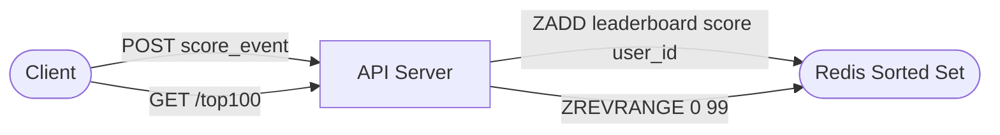
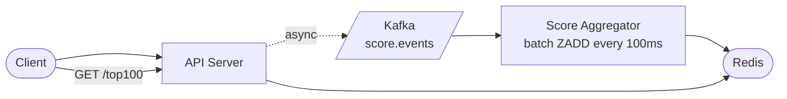
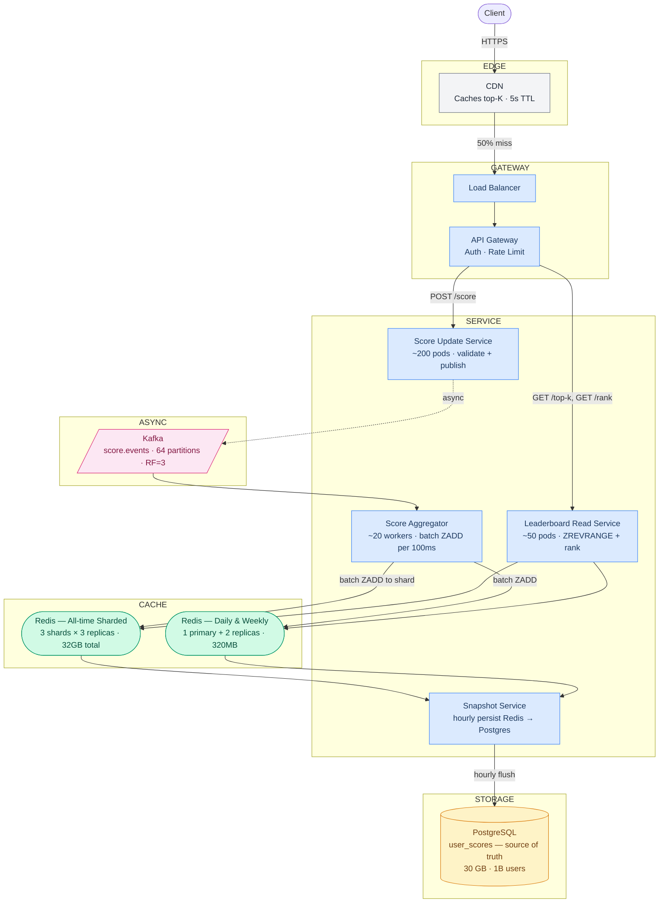
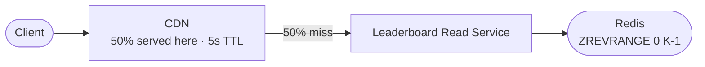
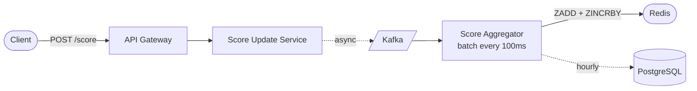

# Top-K Leaderboard — System Design Study Guide

---

## 0. What Is This System?

A leaderboard continuously ranks millions of users by score and lets any user instantly see the top K players globally, their own current rank, and nearby competitors. It is used in gaming (top players by XP), social platforms (top creators by followers), and e-commerce (top sellers by revenue). The one thing it must do perfectly: **return the correct global top-K list and a user's exact rank in under 10ms**, even as scores change thousands of times per second.

---

## 1. What Makes It Hard?

### Hard Problem #1 — Maintaining a globally sorted ranking in real-time as millions of scores update every second

In plain English: imagine a game with 10 million active players. Every kill, every level-up, every action changes someone's score. How do you keep a perfectly sorted list of 10 million players up-to-date — in milliseconds — when scores are changing thousands of times per second?

**Technical consequence:** A traditional database `ORDER BY score DESC` runs a full sort on every read. At 1M users, even with a B-tree index, a rank query is O(log N) per lookup plus a scan. At 10M reads/sec (everyone checking their rank), this saturates any single database.

**What beginners get wrong:** `SELECT user_id, score FROM users ORDER BY score DESC LIMIT 100`. This works for 1,000 users. At 10M users, even with an index on `score`, each rank query requires traversing a B-tree and counting all nodes above the target — O(log N) for the query, but O(1) for inserts is impossible in a B-tree when you need to maintain rank counts.

---

### Hard Problem #2 — Computing the global top-K correctly when the leaderboard must be sharded across multiple nodes

In plain English: if your leaderboard has 1 billion users and you have to split it across 20 machines, each machine only knows about its slice of users. How do you find the global top 100 players without querying all 20 machines every time and assembling a correct answer?

**Technical consequence:** Getting global top K from N shards requires fetching top K from each shard (N×K candidates), then merge-sorting them. This is O(NK log NK) per read and adds N network round-trips. At 10M reads/sec, N=20 shards, K=100, this becomes 200 round-trips per read — latency multiplies 20×.

**What beginners get wrong:** Sharding the sorted set by user_id (hash partition) and then naively querying all shards. This is correct but doesn't scale — top-K reads become proportionally more expensive with every shard added.

**Assumptions:**
- Gaming leaderboard context: high write rate, approximate scores acceptable for display
- 10M active players, 1B total registered users
- Score is always additive (increment-only — no decrements)
- Multiple time windows: all-time, weekly, daily
- Top K ≤ 1,000 (typical: top 100)
- A user's rank needs to be exact (not approximate)

---

## 2. Requirements

### Functional Requirements

| Feature | In Scope | Notes |
|---|---|---|
| Update a user's score | ✅ | Increment-only (additive events) |
| Get top K users with scores | ✅ | K ≤ 1,000, returned in rank order |
| Get a specific user's rank | ✅ | Exact rank among all users |
| Get users near a given rank (rank ±N) | ✅ | "You are #4,821, here are ranks 4,816–4,826" |
| Time-windowed leaderboards | ✅ | All-time, weekly, daily |
| Per-region leaderboards | ✅ | Top K in US, EU, etc. |
| Historical snapshots | ❌ | V2 — who was #1 last Tuesday? |
| Leaderboard for friends only | ❌ | V2 |

### Non-Functional Requirements

| Requirement | Target | What it means |
|---|---|---|
| Read latency (top K) | p99 < 10ms | 99% of leaderboard reads return in under 10ms |
| Read latency (user rank) | p99 < 10ms | Your own rank appears instantly |
| Write latency (score update) | p99 < 50ms | Score update confirmed in under 50ms |
| Availability | 99.99% | Less than 52 minutes of downtime per year |
| Score consistency | Eventual (< 1s) | Rank may lag true score by up to 1 second |
| Write throughput | 500K score events/sec peak | Burst during game events |
| Read throughput | 10M rank queries/sec peak | All players checking their rank at once |

> **p99 latency:** if you sorted every request by how long it took, p99 is the 99th percentile — the slowest 1%. Keeping p99 < 10ms means even your slowest requests are fast.

---

## 3. Scale Estimation

**Score updates (writes)**
```
10M active players × 1 score event / 5 seconds (average action rate)
= 2,000,000 score events/sec average
× 5 (burst during in-game events, tournaments)
= ~10,000,000 events/sec peak

This means we cannot write directly to a single sorted set —
at 10M/sec, a single Redis node (500K ZADD/sec) is saturated 20×.
We need write buffering or sharding.
```

**Rank reads**
```
10M active players × 1 rank check / 10 seconds
= 1,000,000 reads/sec average
× 10 (burst — tournament end, all players check simultaneously)
= ~10,000,000 reads/sec peak

This means rank reads must be served from Redis in-memory — no DB on the read path.
```

**Storage (leaderboard in Redis)**
```
Per-user entry in Redis sorted set:
  score (8 bytes float64) + user_id string (~12 bytes UUID) + overhead (~12 bytes)
  = ~32 bytes per user

All-time leaderboard (1B registered users):
  1,000,000,000 × 32 bytes = 32 GB

Daily leaderboard (10M active players only):
  10,000,000 × 32 bytes = 320 MB

→ All-time at 1B users doesn't fit on a single Redis node (typical 64 GB limit).
  Daily and weekly fit comfortably on one node.
  All-time requires sharding across 2-3 nodes.
```

**Storage (persistent scores in PostgreSQL)**
```
Per user: user_id (8) + score (8) + updated_at (8) + region (4) = ~30 bytes
1B users × 30 bytes = 30 GB
→ Fits on a single PostgreSQL instance with room to spare.
```

**Hot set**
```
Top 10,000 users receive 90% of leaderboard reads (people check top players)
10,000 × 32 bytes = 320 KB
→ Fits in Redis L1 cache equivalent — top-K reads are essentially free.
```

**Server count**
```
Score Update Service:
  Each server: ~50K score events/sec (lightweight: validate + publish to Kafka)
  Peak: 10M/sec → 200 servers

Score Aggregator (Kafka → Redis):
  Batch writes to Redis every 100ms
  Each worker: ~500K ZADD/sec
  Peak: 10M/sec → 20 workers

Leaderboard Read Service:
  Each server: ~100K reads/sec (Redis ZREVRANGE + HTTP)
  After CDN absorbs 50%: 5M/sec → ~50 servers

Redis nodes:
  Daily leaderboard: 320 MB → 1 node (3 with replicas)
  All-time leaderboard: 32 GB → 3 shards × 3 replicas = 9 nodes
```

### The 5 Numbers That Drive Every Design Decision

| Number | Value | Design decision forced |
|---|---|---|
| Peak score writes | 10M events/sec | Kafka buffer is mandatory — single Redis can't take 10M ZADD/sec |
| All-time leaderboard size | 32 GB | Must shard across 2–3 Redis nodes for all-time; daily fits on one |
| Peak rank reads | 10M/sec | Redis in-memory is mandatory; no DB on read path |
| Top K range | ≤ 1,000 | ZREVRANGE is O(log N + K) — even at N=1B, this is fast |
| Score event burst (tournament) | 5× spike | Kafka absorbs burst; Score Aggregator drains at steady rate |

---

## 4. Architecture

### Start Simple: The MVP



Client updates score → server does `ZADD leaderboard {score} {user_id}` → reads use `ZREVRANGE leaderboard 0 99`.

**This breaks at ~500K score updates/sec** — a single Redis node's ZADD throughput ceiling.

---

### Add write buffering: First Fix



Kafka absorbs bursts. Aggregator batches events into bulk `ZADD` commands every 100ms — Redis sees 10K writes/sec instead of 10M.

**This breaks at all-time leaderboard scale** — 1B users × 32 bytes = 32 GB doesn't fit on one Redis node.

---

### Production Architecture



**What each layer does:**

| Layer | Colour | Components | Responsibility |
|---|---|---|---|
| Edge | grey | CDN | Caches top-K response for 5 seconds — absorbs 50% of all leaderboard reads globally |
| Gateway | blue | LB + API Gateway | Distributes load; enforces auth and rate limits at the edge |
| Service | blue | Score Update + Leaderboard Read + Aggregator + Snapshot | Write and read paths are completely separate services |
| Cache | green | Redis Daily/Weekly + Redis All-time Sharded | All rank computations happen in Redis; DB is never on the read path |
| Async | pink | Kafka | Decouples bursty score writes from Redis; Aggregator drains at steady rate |
| Storage | yellow | PostgreSQL | Hourly durability snapshot — Redis is rebuilt from here after failure |

---

### Read Path — How a User Gets the Leaderboard



| Step | Where | What happens | Latency | % of traffic |
|---|---|---|---|---|
| 1 | CDN | Cached top-K response → return immediately | ~5ms | 50% — done here |
| 2 | Leaderboard Read Svc + Redis | `ZREVRANGE leaderboard:all-time 0 99 WITHSCORES` → O(log N + K) | ~1ms | ~49% |
| 3 | PostgreSQL | Never hit for reads — only used for durability and rebuild | — | 0% |

**The database is never involved in serving leaderboard reads.**

---

### Write Path — How a Score Update Is Recorded



Step by step:

1. **Client** sends `POST /api/v1/scores` with `{user_id, score_delta, event_type}`
2. **API Gateway** validates auth, checks rate limit (reject at edge)
3. **Score Update Service** validates the event (not negative, not impossibly large), publishes to Kafka, returns **200 immediately** — user never waits for Redis
4. **Kafka** stores the event durably (RF=3)
5. **Score Aggregator** reads events in 100ms micro-batches, groups by `user_id`:
   - For each user with events: `total_delta = sum(all deltas for user in window)`
   - Executes: `ZINCRBY leaderboard:all-time {total_delta} {user_id}` (one command per user per 100ms)
   - Also updates `leaderboard:daily:{YYYY-MM-DD}` and `leaderboard:weekly:{YYYY-WW}`
6. **Snapshot Service** runs hourly: reads all scores from Redis sorted set, writes to PostgreSQL `user_scores` for durability

---

## 5. API Design

**Submit a score event**
```
POST /api/v1/scores
Authorization: Bearer <token>

{
  "user_id":    "user_42",
  "score_delta": 150,
  "event_type": "enemy_killed",
  "timestamp":  1746350400
}

Response 202:
{ "accepted": true }
```
Non-obvious decision: return **202 Accepted** (not 201 Created). The score isn't in Redis yet — it's in Kafka. 202 means "received and will be processed." Using 201 would imply immediate persistence, which is misleading.

**Get top K**
```
GET /api/v1/leaderboards/{period}/top?k=100&region=global

Response 200:
{
  "period": "all-time",
  "generated_at": "2026-05-04T10:00:00Z",
  "entries": [
    { "rank": 1, "user_id": "user_9", "score": 4291847, "display_name": "NightOwl" },
    { "rank": 2, "user_id": "user_77", "score": 4189203, "display_name": "BlazeFire" }
  ]
}
```
Non-obvious decision: include `generated_at` so clients know cache age. A stale leaderboard from 4 seconds ago is very different from one from 4 minutes ago.

**Get a user's rank**
```
GET /api/v1/leaderboards/{period}/users/{user_id}/rank

Response 200:
{
  "user_id":      "user_42",
  "rank":         4821,
  "score":        187340,
  "nearby": [
    { "rank": 4819, "user_id": "user_1003", "score": 188200 },
    { "rank": 4820, "user_id": "user_7741", "score": 187900 },
    { "rank": 4821, "user_id": "user_42",   "score": 187340 },
    { "rank": 4822, "user_id": "user_556",  "score": 186800 }
  ]
}
```
Non-obvious decision: always return the `nearby` slice around the user's rank. This is the feature users care most about ("who am I competing with?") and costs no extra Redis round-trip — `ZREVRANGE leaderboard rank-2 rank+2` is one command.

**The key API trade-off — exact rank vs. approximate rank:**

`ZREVRANK` in Redis is O(log N). At N=1B users, log₂(1B) ≈ 30 operations — very fast. But this only works on a single sorted set. If the all-time leaderboard is sharded, we cannot get exact rank without querying all shards. The design accepts **exact rank for daily/weekly** (single Redis node) and **approximate rank for all-time at 1B users** (merge estimate from shards). This trade-off is documented in the API response schema: `"rank_type": "exact"` or `"rank_type": "approximate"`.

---

## 6. Data Model

### Redis Sorted Set (primary leaderboard store)

Redis sorted sets are not traditional DB tables — they are native data structures with O(log N) operations:

```
Key pattern:   leaderboard:{period}:{scope}
               leaderboard:all-time:global
               leaderboard:daily:2026-05-04:global
               leaderboard:weekly:2026-W18:EU

Value format:  { score: float64, member: string (user_id) }
               Sorted by score descending, deduplicated by user_id
               
Commands:
  ZINCRBY leaderboard:all-time:global 150 "user_42"  → adds 150 to user_42's score
  ZREVRANK leaderboard:all-time:global "user_42"      → returns rank (0-indexed)
  ZREVRANGE leaderboard:all-time:global 0 99 WITHSCORES → returns top 100 with scores
  ZREVRANGEBYSCORE leaderboard:all-time:global +inf 4000000 LIMIT 0 10 → users with score ≥ 4M
```

### `user_scores` (PostgreSQL — durability and rebuild source)

| Column | Type | Notes |
|---|---|---|
| `user_id` | BIGINT | Primary key |
| `all_time_score` | BIGINT | Total accumulated score |
| `region` | VARCHAR(8) | For regional leaderboards |
| `last_updated` | TIMESTAMP | When score was last written from Redis |
| `display_name` | VARCHAR(64) | Denormalized here for leaderboard response — avoids join |

> `display_name` is denormalized: stored in `user_scores` even though it also lives in a `users` table. This means leaderboard responses never need a join — one table read (or Redis + one lookup) satisfies the full response.

### `score_events` (Kafka schema — not a DB table)

| Field | Type | Notes |
|---|---|---|
| `user_id` | STRING | Partition key |
| `score_delta` | INT | Always positive (increment-only) |
| `event_type` | STRING | What caused the score (for analytics) |
| `ts` | TIMESTAMP | Event time |
| `region` | STRING | User's region at time of event |

---

### SQL vs NoSQL — why not the obvious choices?

| Database | Type | Why it seems attractive | Why it doesn't fit |
|---|---|---|---|
| **PostgreSQL** | RDBMS | Familiar, ACID, easy `ORDER BY score DESC LIMIT K` | Full sort or index scan for rank queries. `RANK() OVER (ORDER BY score DESC)` requires scanning all rows above the target user — O(rank) per query. At rank 4,821 with 1M users, still fast; at rank 500,000 with 1B users, scans 500M index entries. |
| **MySQL** | RDBMS | Same as PostgreSQL | Same rank-scan problem. No native sorted set with O(log N) rank queries. |
| **DynamoDB** | Key-value | Fast point reads by user_id | No native sorted set. Leaderboard queries require a GSI on `score`, but GSI updates are eventually consistent and partition-limited. Top-K requires a scatter-gather across all GSI partitions. |
| **MongoDB** | Document | Flexible schema, `sort({score: -1}).limit(K)` looks simple | Sort requires a full index scan for rank queries. Like PostgreSQL, O(rank) to find a user's position. No native rank() operation. |
| **Redis Sorted Set** | In-memory sorted set | ✅ chosen — see below | — |

### Database choice: Redis Sorted Set

Redis sorted sets are not a database replacement — they are the only standard data structure that provides **O(log N) insert, O(log N) rank lookup, and O(log N + K) top-K retrieval simultaneously**. This is achieved by maintaining two internal data structures in parallel: a hash table (for O(1) score lookup by member) and a skip list (for O(log N) ordered traversal). No SQL engine maintains a continuously-sorted structure in this way — they sort on read.

The critical non-obvious property: `ZREVRANK` doesn't count members by scanning — the skip list tracks node counts at each level, so rank is computed in O(log N) without scanning any data. This is what makes "what's user_42's rank among 1 billion users?" answerable in under 1ms.

The operational trade-off: Redis is in-memory. If the Redis cluster loses power without persistence configured, all scores are lost. Mitigation: hourly snapshots to PostgreSQL + Redis AOF (append-only file) for sub-minute durability. On failure, Redis is rebuilt from PostgreSQL snapshot + Kafka replay.

### Shard/partition key for Kafka: `user_id`

Score events are partitioned by `user_id` in Kafka. This guarantees all events for one user are processed in order by one Aggregator worker — preventing a race where two workers simultaneously apply deltas for the same user and one overwrites the other. We do not partition by `event_type` because that would scatter one user's events across multiple workers.

---

## 7. Deep Dives

### Deep Dive 1: What data structure keeps 1 billion users sorted in real-time?

The problem framed concretely: imagine a tournament where 10 million players are all scoring simultaneously. Every 100ms, you need to answer: "what are the top 100 players?" and "what is player_42's exact rank?" Both queries must return in under 10ms.

---

#### Option A: PostgreSQL with sorted index

**How it works, step by step:**

1. Score event arrives: `UPDATE user_scores SET score = score + 150 WHERE user_id = 42`
2. PostgreSQL updates the row and the B-tree index on `(score DESC)`
3. Read top K: `SELECT user_id, score FROM user_scores ORDER BY score DESC LIMIT 100`
4. Read rank: `SELECT COUNT(*) FROM user_scores WHERE score > (SELECT score FROM user_scores WHERE user_id = 42)`

Step 3 uses the index — it walks the B-tree from the top, fetching 100 rows. Fast: O(K) index scans.

Step 4 is the problem. It counts all users with a higher score than user_42. This is O(rank) — it scans every index node above user_42:

```
user_42 is rank 500,000 out of 1B users
"COUNT(*) WHERE score > user_42.score" must scan 500,000 B-tree nodes
At 1ms per 10,000 nodes: 50ms per rank query

At 10M rank queries/sec: 500,000 rows × 10M = 5 × 10^12 operations/sec
That's impossible with any number of read replicas
```

**Write path bottleneck:** `UPDATE user_scores SET score = score + delta` with a B-tree index on `score` requires:
- A row lock for the duration of the update
- Deleting the old index entry and inserting a new one
- At 10M updates/sec on 1B rows: index write amplification destroys throughput

**Verdict: top-K read is fast (O(K)), rank query is catastrophically slow (O(rank)), write throughput collapses at scale.**

---

#### Option B: Redis Sorted Set — single node

**How it works, step by step:**

Redis Sorted Set maintains two internal structures:
1. A **hash table**: `user_id → score` for O(1) score lookup
2. A **skip list**: ordered by score, with "level pointers" that skip ahead exponentially

The skip list looks like this conceptually:
```
Level 3: ──────────────────────────────────────────► (skips large chunks)
Level 2: ──────────────────► ──────────────────────►
Level 1: ────────► ────────► ────────► ────────────►
Level 0: → [user_9:4.29M] → [user_77:4.18M] → [user_42:187K] → [user_556:186K]
```

Each node in the skip list also stores a **span count** — how many nodes this pointer jumps over. This enables rank computation without scanning:

```
ZREVRANK leaderboard "user_42":
  Walk the skip list from the top-left corner
  At each level, sum the spans of pointers you traverse
  Total span = rank

  For 1B users, max skip list depth ≈ log₁.₅(1B) ≈ 51 levels
  → At most 51 pointer traversals to find any rank
  → O(log N) regardless of N
```

**Commands:**
```
ZINCRBY leaderboard 150 "user_42"  → O(log N): update hash table + reposition in skip list
ZREVRANK leaderboard "user_42"     → O(log N): span-counting walk
ZREVRANGE leaderboard 0 99         → O(log N + K): navigate to position 0, read K entries
```

**Where it breaks:**

A single Redis node handles ~500K ZADD/sec (each ZADD is O(log N) and involves a skip list reposition). At 10M score events/sec:

```
10M events/sec ÷ 500K ops/sec = 20× over capacity
Single Redis node CPU: maxed out at ~500K ZADD/sec
→ Writes queue up, latency climbs from <1ms to seconds
```

Also: all-time leaderboard with 1B users = 32 GB. A standard Redis node is 64 GB — it fits, but leaves little room for other data and no room for growth.

**Verdict: correct data structure, correct O(log N) operations — bottleneck is write throughput at extreme scale.**

---

#### Option C: Kafka batch aggregation + Redis Sorted Set ← chosen

**The key insight:** at 10M score events/sec, each event is a small delta (e.g., +150 points). Instead of writing each event directly to Redis (10M ZADD/sec), batch them for each user over 100ms and apply one combined delta per user:

```
Without batching: 10M ZADD/sec against Redis
With batching:    Each of 10M players fires ~1 event/5s average
                  In 100ms, a player fires ~0.02 events on average
                  Total unique users with events in 100ms:
                    10M events/sec × 0.1s = 1M events per 100ms batch
                    But many are from same user → ~500K unique users per batch
                  500K ZINCRBY/100ms = 5M ZINCRBY/sec... still too high for one node

  BUT: combined delta per user dramatically reduces per-key operations:
    Without batching: user_42 might fire 20 events in 100ms → 20 ZINCRBY calls
    With batching:    sum all 20 deltas → 1 ZINCRBY call
    → Write volume to Redis: 10M/sec → ~500K unique users/sec = 20× reduction
```

**Phase 1 — Score event ingestion (non-blocking):**

```
Player action
      │
      ▼
Score Update Service:
  Validate event (score_delta > 0, event_type valid)
  kafka.publish("score.events", {
      user_id:     "user_42",
      score_delta:  150,
      event_type:  "enemy_killed",
      ts:          1746350400
  }, partition_key = user_id)   ← ensures ordered processing per user

Return 202 Accepted immediately
```

**Phase 2 — Score Aggregator (100ms micro-batches):**

```python
# Aggregator reads 100ms worth of events from Kafka
events = kafka.poll(max_ms=100)

# Group by user_id and sum deltas
deltas = defaultdict(int)
for event in events:
    deltas[event.user_id] += event.score_delta

# Write to Redis with a single pipeline (one round-trip for all users)
pipe = redis.pipeline()
for user_id, total_delta in deltas.items():
    pipe.zincrby("leaderboard:all-time:global",   total_delta, user_id)
    pipe.zincrby("leaderboard:daily:2026-05-04",   total_delta, user_id)
    pipe.zincrby("leaderboard:weekly:2026-W18",    total_delta, user_id)
pipe.execute()  # sends all commands in one TCP round-trip

# Commit Kafka offset only after successful Redis write
kafka.commit()
```

`pipe.execute()` sends all ZINCRBY commands in a single TCP round-trip to Redis. At 500K unique users/batch: 500K ZINCRBY commands pipelined in one call — Redis processes these at ~1M ops/sec, clearing the batch in ~500ms... still too slow.

**The remaining problem: write throughput still exceeds one Redis node**

500K unique users per 100ms batch = 5M ZINCRBY/sec. Solution: **multiple Aggregator workers**, each handling a disjoint subset of Kafka partitions. With 20 workers, each handles 64/20 = ~3 Kafka partitions:

```
20 Aggregator workers, each:
  500K events / 20 workers = 25K unique users per 100ms per worker
  → 250K ZINCRBY/sec per worker
  → 1 Redis node handles up to 500K/sec → 2 workers per Redis node
  → 10 Redis nodes total for write throughput at peak

All 10 Redis nodes write to the SAME sorted set? No — that's the next problem.
→ Each worker writes to a DIFFERENT Redis sorted set shard (by user_id hash)
→ Global top-K requires merging shards (see Deep Dive 2)
```

**End-to-end sequence diagram:**

```
Client       Score Update Svc    Kafka        Aggregator       Redis            PostgreSQL
   │                │              │               │               │                  │
   │ POST /score    │              │               │               │                  │
   │ {delta: 150}   │              │               │               │                  │
   │───────────────>│              │               │               │                  │
   │                │ validate     │               │               │                  │
   │                │ publish      │               │               │                  │
   │                │─────────────>│               │               │                  │
   │                │ ack          │               │               │                  │
   │                │<─────────────│               │               │                  │
   │  202 Accepted  │              │               │               │                  │
   │<───────────────│              │               │               │                  │
   │                │              │               │               │                  │
   │                │        (100ms later)         │               │                  │
   │                │              │──────────────>│               │                  │
   │                │              │  batch poll   │               │                  │
   │                │              │               │ PIPELINE      │                  │
   │                │              │               │ ZINCRBY × N   │                  │
   │                │              │               │──────────────>│                  │
   │                │              │               │ ok            │                  │
   │                │              │               │<──────────────│                  │
   │                │              │               │ commit offset │                  │
   │                │              │<──────────────│               │                  │
   │                │              │               │               │                  │
   │                │              │               │         (hourly)                 │
   │                │              │               │               │ snapshot         │
   │                │              │               │               │─────────────────>│
```

**What the resulting Redis state looks like (querying the sorted set):**

```
ZREVRANGE leaderboard:all-time:global 0 4 WITHSCORES

1) "user_9"   → score: "4291847"
2) "user_77"  → score: "4189203"
3) "user_14"  → score: "4012890"
4) "user_203" → score: "3998411"
5) "user_42"  → score: "187340"

ZREVRANK leaderboard:all-time:global "user_42"
→ (integer) 4820   (0-indexed → rank #4821)
```

**Comparison table:**

| Property | Option A (PostgreSQL) | Option B (Redis single) | Option C (Kafka + Redis sharded) |
|---|---|---|---|
| Top-K query | O(K) via index | O(log N + K) | O(log N + K) per shard + merge |
| Rank query | O(rank) — scans all above | O(log N) | Exact on one shard, approximate across shards |
| Max write throughput | ~10K/sec (index updates) | ~500K ZINCRBY/sec | ~10M+/sec (sharded + batched) |
| Data loss risk | None (ACID) | Yes — Redis volatile | Kafka durable; Redis rebuilt on failure |
| Read latency | 10–500ms (rank query) | <1ms | <1ms per shard |
| Operational complexity | Low | Low | Medium (Kafka + Aggregator + sharding) |

---

### Deep Dive 2: How do we compute global top-K when the leaderboard is sharded?

**The problem concretely:** the all-time leaderboard at 1B users = 32 GB, requiring 3 Redis shards. Users are distributed across shards by `hash(user_id) % 3`. Shard 1 has users {user_1, user_4, user_7...}, shard 2 has {user_2, user_5, user_8...}, etc.

No single shard knows the global ranking. How do you get the global top 100?

---

#### Option A: Query all shards, merge results in application

**How it works:**

```
GET /top100
        │
        ▼
Leaderboard Read Service:
  results_1 = ZREVRANGE shard_1 0 99 WITHSCORES   (top 100 from shard 1)
  results_2 = ZREVRANGE shard_2 0 99 WITHSCORES   (top 100 from shard 2)
  results_3 = ZREVRANGE shard_3 0 99 WITHSCORES   (top 100 from shard 3)
  
  merged = merge_sort(results_1 + results_2 + results_3)
  return merged[:100]
```

3 network round-trips (or 1 if done in parallel), then a merge of 300 items in-memory. The merge-sort on 300 items is negligible — O(300 log 300).

**Why this works perfectly for top-K:**

If the global #1 player is on shard 2, they'll be at the top of shard 2's results. By fetching the top 100 from each shard, we are guaranteed to have all global top-100 candidates in our result set. **Fetching top K from each of N shards always captures all global top K correctly.**

Proof: assume the global 100th-ranked player has score X. Every player in the global top 100 has score ≥ X. On their respective shard, each of these players is in the top K of that shard (since each shard contains 1B/3 ≈ 333M users, and at most 100 can have score ≥ X... unless the shard happens to have more than 100 players with score ≥ X, which means the global top 100 might not have any players from other shards at all — but we still get them).

Wait, more precisely: to be safe, fetch top K from each shard. After merging, the global top K is definitely within the merged result.

**Where it breaks:**

Not read correctness — this approach is always correct. The problem is **rank queries**:

```
GET /rank/user_42

user_42 is on shard 1.
user_42's rank on shard 1: 1,247 (out of 333M users on shard 1)
user_42's global rank: unknown — we need to know how many users on shards 2 and 3
  have a higher score than user_42

To find global rank:
  score_42 = ZSCORE shard_1 "user_42"           (1 command)
  count_above_on_shard_2 = ZCOUNT shard_2 score_42 +inf   (1 command)
  count_above_on_shard_3 = ZCOUNT shard_3 score_42 +inf   (1 command)
  
  global_rank = rank_on_shard_1 + count_above_on_shard_2 + count_above_on_shard_3
```

This requires 4 Redis commands across 3 shards — but they can all run in parallel:

```
latency = max(latency_shard_1, latency_shard_2, latency_shard_3) ≈ 1ms
```

This is fine for 3 shards. It scales linearly with shard count — at 20 shards, still ~1ms (parallel).

**Verdict: correct for top-K, works for rank with parallel queries across shards. Scales with shard count.**

---

#### Option B: Pre-computed global leaderboard cache

**How it works:**

A background job runs every 5 seconds:
1. Fetch top K×N candidates from all shards (K=100, N=3 shards → 300 candidates)
2. Merge-sort → global top 100
3. Write result to a dedicated Redis key: `SET leaderboard:top100:snapshot <json>`
4. Leaderboard reads return this snapshot instantly (`GET leaderboard:top100:snapshot` → O(1))

```
Read path: GET /top100 → redis.get("leaderboard:top100:snapshot") → return JSON
Write path: background job refreshes snapshot every 5 seconds
```

**Where it breaks:**

Snapshot is stale by up to 5 seconds. Acceptable for casual leaderboards. Unacceptable for competitive tournaments where rank can change second-by-second.

Also: the snapshot is computed by one job. If that job falls behind (slow merge due to large K or many shards), the snapshot becomes increasingly stale.

**Verdict: simpler read path, but staleness is fixed at the refresh interval. Cannot serve real-time rank queries.**

---

#### Option C: Hybrid — snapshot for top-K + live shard queries for rank ← chosen

**How it works:**

Different queries have different staleness requirements:
- **Top-K leaderboard page**: 5 seconds stale is fine (cosmetic display)
- **User's own rank**: should be as fresh as possible (users notice when their rank is wrong)

Use both approaches for their respective use cases:

```
GET /top100:
  → Return cached snapshot (refreshed every 5s by background job)
  → Latency: O(1) Redis GET ~0.1ms
  → Staleness: up to 5s

GET /rank/user_42:
  → Query user_42's shard for their score and within-shard rank
  → In parallel, ZCOUNT all other shards for users with score > user_42.score
  → Sum = global rank
  → Latency: 1 parallel Redis round-trip ~1ms
  → Staleness: reflects latest ZINCRBY (100ms max lag from Aggregator)
```

**The snapshot refresh job:**

```python
def refresh_top_k_snapshot():
    # Run every 5 seconds
    candidates = []
    
    # Fetch top K from each shard in parallel (3 round-trips simultaneously)
    with ThreadPoolExecutor() as pool:
        results = list(pool.map(
            lambda shard: redis_shard(shard).zrevrange(
                "leaderboard:all-time:global", 0, 99, withscores=True
            ),
            range(NUM_SHARDS)
        ))
    
    # Flatten and merge-sort all candidates
    for shard_results in results:
        candidates.extend(shard_results)
    candidates.sort(key=lambda x: x[1], reverse=True)
    
    # Write top 100 to snapshot key
    top_100 = candidates[:100]
    redis_cache.setex(
        "leaderboard:top100:snapshot",
        60,             # TTL: 60 seconds (in case refresh job dies)
        json.dumps(top_100)
    )
```

**Handling the "my rank just changed" problem:**

When a user scores a big kill and jumps 1,000 ranks, they want to see the change immediately. Since rank queries go to the live shards (not the snapshot), they see their new rank within ~100ms (next Aggregator batch). The top-K page may still show old data for up to 5 seconds — but the user's own rank display is always live.

**Comparison table:**

| Property | Option A (shard scatter-gather) | Option B (pre-computed snapshot) | Option C (hybrid) |
|---|---|---|---|
| Top-K read latency | ~1ms (N parallel queries) | ~0.1ms (one GET) | ~0.1ms (snapshot) |
| Rank query latency | ~1ms (N parallel ZCOUNT) | Not possible (snapshot has no rank) | ~1ms (live shard query) |
| Staleness (top-K) | Real-time | Up to 5s | Up to 5s |
| Staleness (rank) | Real-time | N/A | ~100ms |
| Correctness | Always exact | Approximate (snapshot can be stale) | Top-K approximate, rank near-exact |
| Complexity | Medium | Low | Medium |

---

## 8. Handling Failures

**Redis cluster loses a shard**

The Leaderboard Read Service detects the shard failure (connection timeout after 50ms). For top-K reads: return the cached CDN response or the pre-computed snapshot from another Redis shard if available. For rank reads: return an approximate rank based on other shards with a `"rank_approximate": true` flag in the response. Score Aggregator buffers unprocessable events in memory (bounded by 10 seconds of capacity). When the shard recovers or a replica is promoted (~30 seconds), the Aggregator flushes the buffered events. No score events are permanently lost — Kafka retains 7 days.

**Kafka cluster loses a broker**

Score Update Service acknowledges writes with `acks=all` (RF=3). Events published before the failure are on 2 remaining brokers — not lost. Aggregator workers pause on affected partitions, then resume from the last committed offset after Kafka re-elects leaders (~2 minutes). During this window, Redis scores stop updating — leaderboard reads return the last-known state. Scores accumulate in Kafka and are processed in order after recovery. No score events are lost; rank updates are delayed by up to 2 minutes.

**Score Aggregator crashes**

Kafka retains events for 7 days. On restart, the Aggregator replays from its last committed checkpoint. It processes events in order per user (Kafka partitioned by `user_id`). Replay at 2× real-time rate — a 30-second outage (15M missed events at 500K/sec) replays in ~15 seconds. During replay, some users' scores in Redis are temporarily lower than actual — rank may be slightly understated. Ranks self-correct within 15 seconds of recovery.

**PostgreSQL goes down**

No impact on reads or writes — PostgreSQL is only written to by the hourly Snapshot Service. The Snapshot Service logs the failure and retries next hour. Redis is the live source of truth. If Redis also fails, the system rebuilds from the last successful PostgreSQL snapshot plus Kafka replay. Maximum data loss: 1 hour of scores (from snapshot), minus Kafka replay (which recovers everything up to 7 days). In practice: full recovery with zero data loss.

---

## 9. Key Trade-offs

| Decision | What we chose | What we rejected | Why rejected |
|---|---|---|---|
| Score write path | Kafka → 100ms batch aggregation → Redis | Direct ZADD on every event | Direct ZADD: 10M/sec saturates Redis 20×. Batching reduces Redis writes to ~500K/sec by summing deltas per user per window. |
| Global top-K for sharded leaderboard | Pre-computed snapshot (5s refresh) | Real-time scatter-gather on every read | Scatter-gather: 3 shards × 10M reads/sec = 30M shard queries/sec. Snapshot: one background job + O(1) GET per read. |
| Rank query for sharded leaderboard | Parallel ZCOUNT across shards | Approximate rank from snapshot | Snapshot can't give exact rank without a shard query. ZCOUNT is O(log N) per shard — still <1ms with 3 parallel queries. |
| Durability | Hourly PostgreSQL snapshot + Kafka replay | Redis AOF (append-only file) | AOF adds ~20% write overhead and complicates failover. PostgreSQL + Kafka replay gives point-in-time recovery with no write overhead on the hot path. |
| Score update confirmation | 202 Accepted (async) | 201 Created (synchronous write) | 201 would imply the score is immediately in Redis. It isn't — it's in Kafka. 202 is honest: "received, will be processed." |

---

## 10. Interview Playbook

### Minute-by-minute guide

| Time | What to do |
|---|---|
| 0–5 min | Clarify requirements: is rank exact or approximate OK? What K? Multiple time windows (daily/weekly/all-time)? Score increment-only or can it decrease? Global or per-region? Lock in: approximate top-K (5s stale) is acceptable; exact rank is required. |
| 5–10 min | Estimate scale. Key numbers: **10M writes/sec peak** and **1B all-time users = 32 GB Redis**. State what they force: "10M/sec saturates one Redis node 20×, so we need Kafka batching; 32 GB exceeds one node, so we need sharding." |
| 10–20 min | Draw the architecture. Start with MVP (ZADD + ZREVRANGE). Show what breaks. Add Kafka buffer, then Aggregator, then sharding. |
| 20–35 min | Deep dive the two hard problems. Redis sorted set mechanics (ZADD, ZREVRANK, skip list span-counting). Sharded top-K: scatter-gather vs snapshot, and why hybrid serves different query types differently. |
| 35–45 min | Failures, time-windowed leaderboards, trade-offs, follow-up discussion. |

### What separates an L6 answer from an L4 answer

1. **L6 explains the skip list span-counting that makes ZREVRANK O(log N).** L4 says "Redis sorted sets are fast." L6 explains *why* — the skip list stores node span counts so rank is computed by accumulating spans, not by scanning. This is why rank queries are O(log N) regardless of N.

2. **L6 identifies the Kafka batching as a write volume reduction, not just decoupling.** It's not just "use Kafka for async." The key insight: batching 20 deltas for user_42 in 100ms into one `ZINCRBY +delta` reduces Redis write volume by 20×, pushing throughput from 500K/sec capacity to effectively 10M+ events/sec processed.

3. **L6 distinguishes top-K staleness from rank staleness.** Serving the top-K leaderboard page with 5-second staleness is fine (users don't notice). Serving a user's own rank with 5-second staleness is not fine (users notice when their hard-won rank jump isn't reflected). Treating these as different sub-problems — snapshot for top-K, live shard query for rank — shows system-level thinking.

### Three hard follow-up questions

**"A user wants to see the leaderboard for 'last 7 days' — a rolling window. How do you implement this?"**

Good answer: a rolling 7-day window is harder than a fixed daily window. You can't just expire a Redis key — the count that goes out of the window on day 8 needs to be subtracted from the score. Approach: store hourly bucket sorted sets (`leaderboard:hourly:2026-05-04:10:global`). The 7-day leaderboard is computed as: for each of the 168 hourly buckets in the window, `ZUNIONSTORE dest 168 keys AGGREGATE SUM`. The destination sorted set is the 7-day leaderboard. Schedule this `ZUNIONSTORE` every hour, replacing the previous result. `ZUNIONSTORE` on 168 keys of 10M users each: O(168 × 10M) = CPU-heavy. Run on a background worker, not inline.

**"During a tournament, 10 million players all finish at the same time. 10M score updates arrive in 10 seconds. How does your system handle this?"**

Good answer: Kafka absorbs the burst — Score Update Service publishes all 10M events in 10 seconds. Kafka doesn't drop events; it just fills up buffer. Aggregator workers drain Kafka at their steady rate (10M events/10s = 1M events/sec, vs Aggregator capacity of ~5M events/sec). Kafka backlog clears in ~2 seconds. Redis sees ~5M ZINCRBY commands in those 2 seconds across 10 Redis shards = 500K ZINCRBY/sec per shard — within capacity. The tournament leaderboard updates continuously throughout and is fully consistent within 2 seconds of the burst ending. No data is lost.

**"How do you handle score corrections — a bug awarded 10× too many points, need to rollback?"**

Good answer: This is the hardest operational scenario. Increment-only systems don't support rollback natively. Approach: the score events in Kafka are the immutable audit log. To rollback: (1) compute the correct score for each affected user by replaying Kafka events excluding the buggy ones; (2) overwrite Redis with the corrected scores using `ZADD leaderboard {correct_score} {user_id}` (ZADD overwrites rather than increments when the member already exists); (3) update PostgreSQL. This is a one-time bulk operation. During the rollback (~minutes), serve the snapshot while displaying a banner: "Leaderboard update in progress."

### If you're running short on time, skip these

- Time-windowed leaderboard implementation details
- Snapshot Service and PostgreSQL rebuild procedure
- Per-region leaderboard mechanics
- GDPR and data deletion specifics

---

## 11. Further Deep Dives

### Further Dive A: Tournament spike — 10M simultaneous score updates

**The scenario:** A game event ends at 18:00:00 exactly. At 18:00:01, all 10M active players submit their final scores. 10M events arrive in 1 second instead of the typical 2M/sec over 5 seconds.

```
t=17:59:59: normal rate — 2M events/sec
t=18:00:01: spike — 10M events/sec (5× normal)
t=18:00:10: back to normal
```

**What happens at each layer:**

```
Score Update Service (200 pods):
  Each pod handles 50K events/sec normally
  At 10M/sec: each pod sees 50K/sec × 5 = 250K/sec → 5× overload
  HTTP connections queue at the load balancer

Kafka:
  64 partitions × 300 MB/s max throughput = 19.2 GB/s capacity
  10M events/sec × 100 bytes = 1 GB/sec
  Kafka handles it comfortably — far below capacity

Aggregator (20 workers):
  Processes at steady rate: 10M events/sec / 20 workers = 500K events/sec/worker
  During 10M/sec burst: Kafka consumer lag grows by 10M - 10M = 0 events/sec
  (Aggregator capacity exactly matches burst capacity)
  If burst exceeds 10M/sec: Kafka lag grows, clears after burst ends
```

**The real bottleneck: Score Update Service HTTP layer.** 200 pods × 50K/sec capacity = 10M/sec total. At exactly 10M/sec we're at 100% capacity — any additional load causes queuing.

**Fixes:**
1. **Autoscale Score Update Service** to 400 pods when Kafka producer lag crosses a threshold
2. **Client-side jitter:** add random 0–2s delay before submitting tournament score. Spreads 10M events over 3 seconds instead of 1.
3. **Dedicated tournament endpoint** with relaxed validation (trust the game server, not the client). Game server aggregates and submits scores server-side, not client-side.

---

### Further Dive B: Time-windowed leaderboards and expiry

**Daily leaderboard:**

```
Key: leaderboard:daily:{YYYY-MM-DD}:{region}
TTL: 48 hours (keeps yesterday's leaderboard available for 24 hours after it closes)

At midnight:
  1. New key for the new day is created lazily (first ZINCRBY of the day creates it)
  2. Old key expires automatically via Redis TTL — no deletion job needed
  3. Users' daily scores start from 0 (fresh key)
```

**Weekly leaderboard (fixed week, resets Monday):**

```
Key: leaderboard:weekly:{YYYY-W##}:{region}
TTL: 14 days

Same pattern — key expires automatically after 2 weeks.
```

**Rolling 7-day leaderboard (harder):**

Rolling means "last 7 days exactly" — not "this week." A user's score is the sum of all events in the last 168 hours. This requires hourly buckets:

```
Architecture:
  Aggregator writes to both fixed windows AND hourly buckets:
    ZINCRBY leaderboard:hourly:2026-05-04-10 delta user_id
    (TTL on hourly keys: 8 days → automatically clean up)

  Background job (runs every hour):
    ZUNIONSTORE leaderboard:rolling7d dest_key
    WEIGHTS: 1 1 1 ... (168 ones)
    keys: [leaderboard:hourly:2026-05-04-10, ..., leaderboard:hourly:2026-04-27-11]
    
  Reads: serve leaderboard:rolling7d (refreshed hourly)
```

**ZUNIONSTORE cost:** O(N × K) where N=168 hourly keys, K=users per key. At 10M users: 168 × 10M = 1.68 billion operations. Even at 100M ops/sec, this takes ~17 seconds. Run on a dedicated Redis replica, not the primary, to avoid blocking the write path.

---

### Further Dive C: Kafka → analytics pipeline

Score events in Kafka feed not just the leaderboard but also a game analytics store for understanding player behavior.

**Kafka topic configuration:**
```
Topic:              score.events
Partitions:         64   (parallelism for Aggregator workers)
Replication factor: 3
Partition key:      user_id  (ordered processing per user)
Retention:          7 days   (replay window for Aggregator restart)
```

**ClickHouse schema for game analytics:**
```sql
CREATE TABLE score_events (
    user_id       UInt64,
    score_delta   UInt32,
    event_type    LowCardinality(String),
    ts            DateTime,
    region        LowCardinality(String)
)
ENGINE = MergeTree()
PARTITION BY toYYYYMMDD(ts)
ORDER BY (user_id, ts);
```

**Sample analytics queries:**
```sql
-- What event types generate the most score?
SELECT event_type, sum(score_delta) AS total, count() AS events
FROM score_events
WHERE ts >= now() - INTERVAL 7 DAY
GROUP BY event_type
ORDER BY total DESC;

-- Hour-by-hour score activity (detect anomalies/bots)
SELECT toStartOfHour(ts) AS hour, sum(score_delta) AS total_score
FROM score_events
WHERE user_id = 42 AND ts >= now() - INTERVAL 24 HOUR
GROUP BY hour ORDER BY hour;
```

---

### Further Dive D: GDPR erasure — removing a user from all leaderboards

**Where user data lives:**

| System | Data | Erasure method |
|---|---|---|
| Redis sorted sets (all-time, daily, weekly) | `{user_id: score}` in skip list | `ZREM leaderboard:* user_id` for each key |
| Redis snapshot cache | JSON with display_name | Delete and regenerate snapshot |
| Kafka `score.events` | `user_id, score_delta, event_type` | 7-day retention auto-deletes; tombstone for current window |
| PostgreSQL `user_scores` | `user_id, score, display_name` | `DELETE FROM user_scores WHERE user_id = ?` |
| ClickHouse `score_events` | `user_id, score_delta` | `ALTER TABLE DELETE WHERE user_id = ?` (async) |

**Erasure sequence:**

1. `ZREM leaderboard:all-time:global user_42` (and all other leaderboard keys)
2. Delete from PostgreSQL `user_scores`
3. Invalidate snapshot cache — next refresh will exclude the user
4. Publish tombstone to Kafka `score.events` with `{user_id: 42, type: "delete"}`
5. ClickHouse async deletion — completes within 24 hours

After `ZREM`, the user is immediately absent from all future leaderboard reads. The display_name may persist in cached CDN responses for up to 5 seconds (CDN TTL).

---

### Further Dive E: Rate limiting score submissions

**What to rate limit:**

| Limit | Value | Reason |
|---|---|---|
| Score events per user per second | 100 | Game generates at most 100 meaningful events/sec |
| Score delta per event | 10,000 | Prevents one event from awarding impossible points |
| Score events per IP per minute | 10,000 | Catches bots using many accounts |

**Sliding window rate limit (Redis Lua script):**

Same algorithm as other systems — atomic INCR + check over rolling window:
```lua
local key_cur  = "rl:score:" .. user_id .. ":" .. math.floor(ts)
local key_prev = "rl:score:" .. user_id .. ":" .. (math.floor(ts) - 1)
local cur  = tonumber(redis.call("GET", key_cur)  or 0)
local prev = tonumber(redis.call("GET", key_prev) or 0)
local overlap = 1.0 - (ts % 1)
if prev * overlap + cur >= 100 then return 0 end
redis.call("INCR", key_cur)
redis.call("EXPIRE", key_cur, 2)
return 1
```

**Anomaly detection (server-side validation):**

Beyond rate limiting, the Score Update Service validates events against the game server's event log:
- Score delta is never more than the maximum possible for the event type
- User's session must be active (cross-reference session service)
- Blatantly impossible sequences (score 10M in 5 minutes) trigger account hold + manual review

---

### Further Dive F: Sharding, consistent hashing, and replication for Redis

**Why Redis sharding is needed for the all-time leaderboard:**

1B users × 32 bytes = 32 GB. A single Redis node has 64 GB RAM — it fits today, but leaves no room for growth or replication overhead. More importantly: at 500K ZADD/sec per node, 3 shards gives 1.5M ZADD/sec capacity — enough headroom.

**Consistent hashing for Redis shards:**

Redis Cluster uses consistent hashing with 16,384 hash slots. `user_id` is hashed to a slot, which maps to a shard. When a new shard is added, only `1/N` of slots migrate. Resharding is online (no downtime), but during migration, some ZADD commands may fail with `MOVED` redirect — the Aggregator handles this transparently by retrying after following the redirect.

**Hot shard analysis:**

Can one user's score updates saturate one shard? One user: `ZINCRBY` every 100ms (Aggregator batch) = 10 ZINCRBY/sec per user. Even if 1,000 users on the same shard are all active simultaneously: 10,000 ZINCRBY/sec per shard. Shard capacity: 500K ZINCRBY/sec. No hot shard risk — each user contributes trivially to their shard's load.

The hot key risk is for **reads**: top-K queries for the global leaderboard always read the same top 100 entries from each shard. These keys get millions of reads/sec. Fix: CDN caches the entire top-K response for 5 seconds, eliminating Redis read pressure for top-K entirely.

**Replication:**

Each Redis shard: 1 primary + 2 replicas across 3 AZs. Replication is asynchronous — primary acknowledges ZADD without waiting for replicas. If primary fails, replica promotes in ~30 seconds. During those 30 seconds, that shard's users' scores cannot be updated — their events accumulate in Kafka and are replayed after promotion. No events lost.

**Quorum math:** 3-node cluster tolerates 1 failure. For scoring systems tied to real money (e.g., prize tournaments), use 5 nodes (tolerates 2 simultaneous failures) and synchronous replication with `WAIT 2 0` (wait until 2 replicas acknowledge before returning) for writes.

---

### Further Dive G: Other commonly probed topics

**Connection pooling for Redis:**

Score Aggregator: 20 workers × 50 Redis connections per worker = 1,000 connections total. Redis handles up to 10,000 connections before performance degrades. No pooling library needed — Aggregator maintains its own persistent connections.

Read Service: 50 pods × 20 Redis connections per pod = 1,000 connections. Each `ZREVRANGE` completes in ~0.1ms — connections are returned to pool quickly and rarely queue.

**Index design in PostgreSQL:**

`user_scores` is queried by: (1) `user_id` for point lookups — primary key, O(1). (2) `score DESC` for rank queries — but we don't do these at scale (Redis handles rank). Add index only if analytics need SQL rank queries.

Composite index for regional leaderboard reads from PostgreSQL (creator analytics, not real-time):
```sql
CREATE INDEX idx_user_scores_region_score
  ON user_scores (region, all_time_score DESC);
-- Supports: WHERE region = 'EU' ORDER BY all_time_score DESC LIMIT 100
```

**Circuit breaker for Redis:**

If Redis is slow (latency > 10ms), rank reads start timing out. Circuit breaker: after 10% of Redis calls take > 10ms in a 5-second window, open the circuit — return the last-known CDN-cached top-K snapshot instead of querying Redis. For rank queries: return `{ "rank": null, "message": "rank temporarily unavailable" }`. Close circuit after 30 seconds if probe succeeds.

**Timeout budget (read path p99):**

```
Total p99 budget for GET /top100: 10ms

  API Gateway auth check:    ~1ms
  CDN hit (50% of traffic):  ~5ms total → done
  Redis ZREVRANGE (K=100):   ~1ms
  JSON serialisation:        ~1ms
  Network:                   ~3ms
  Buffer:                    ~4ms
  ──────────────────────────────
  Total (origin path):       ~10ms
```

**4 golden signals:**

- **Latency**: p99 of GET /top100 and GET /rank/{user}. Alert if p99 > 20ms (2× target).
- **Traffic**: score events/sec into Kafka. Alert if drops >30% (possible game server bug or client error).
- **Errors**: Kafka consumer lag per Aggregator worker group — growing lag means Redis is receiving stale ranks. Alert if lag > 10 seconds.
- **Saturation**: Redis memory utilisation per shard (alert at 70%). Aggregator worker CPU (alert at 80% — increase batch interval if saturated).

---

### What these topics signal in a FAANG interview

| Topic | L4 answer | L5 answer | L6 answer |
|---|---|---|---|
| Data structure for leaderboard | "Use a database with ORDER BY" | "Use Redis sorted set" | "Redis skip list stores span counts — ZREVRANK is O(log N), not O(rank). This is why it scales to 1B users." |
| Write throughput at 10M/sec | "Use Redis" | "Kafka buffer + batch writes" | "Batching aggregates 20 deltas per user into 1 ZINCRBY, reducing Redis ops 20×. That's the write volume reduction, not just decoupling." |
| Sharded top-K | "Query all shards" | "Cache pre-computed top-K" | "Different staleness requirements: top-K page uses snapshot (5s stale, O(1) read); rank query uses live shards (100ms stale, parallel ZCOUNT)" |
| Time-windowed leaderboard | "Create a table per window" | "Separate Redis keys with TTL per window" | "Rolling 7-day requires hourly buckets + ZUNIONSTORE. ZUNIONSTORE is O(168 × N) — must run on a replica, not the primary." |
| Tournament spike | "System should handle it" | "Kafka absorbs the burst" | "Score Update Service is the HTTP bottleneck, not Kafka. Autoscale the HTTP layer; add client-side jitter to spread the submission spike." |