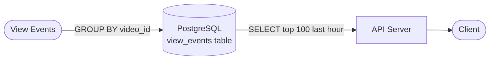
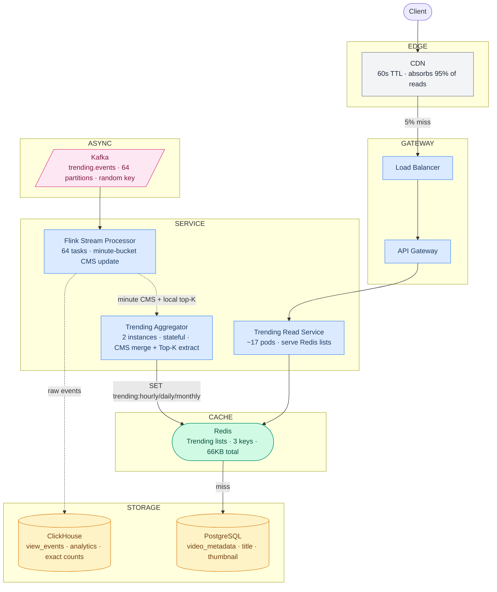
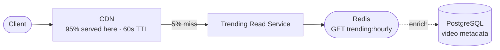
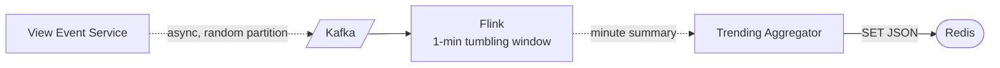

# Trending Videos (Hour / Day / Month) — System Design Study Guide

---

## 0. What Is This System?

A trending videos system continuously identifies which videos are gaining the most views across three sliding time windows — the last hour, last 24 hours, and last 30 days — and serves a ranked list to any user in under 50ms. It is used by YouTube, TikTok, Netflix, and Twitter to surface content that is rapidly gaining attention. The one thing it must do perfectly: **reflect reality within minutes — a video that exploded in the last hour must appear in the hourly trending list quickly, and a video whose moment has passed must fall off**.

---

## 1. What Makes It Hard?

### Hard Problem #1 — Counting views in a sliding time window across 800 million videos without storing every event

In plain English: "trending this hour" means views in the last 60 minutes — not 9:00–10:00, but literally the last 60 minutes from now. Every minute that window shifts: events from 61 minutes ago fall out, new events come in. You cannot re-read 5 billion daily view events every minute to recompute this.

**Technical consequence:** Storing raw events and querying `WHERE ts > NOW() - 1 HOUR GROUP BY video_id ORDER BY views DESC` over 5 billion rows is O(N) per query — at 58,000 events/sec, the hourly table grows by 3.5 million rows every minute. Even with partitioning, a full aggregation scan takes minutes, not seconds.

**What beginners get wrong:** They store all events in a time-series table and run a SQL aggregate. This works for 1M events. At 5B events/day with 1-minute refresh requirements, even a columnar store takes too long and the query cost is prohibitive.

---

### Hard Problem #2 — Finding the top K videos by view velocity from an open-ended stream without maintaining sorted counts for all 800M videos

In plain English: you have 800 million videos and at any moment some tiny fraction is trending. You can't maintain a sorted ranking of all 800 million — updating every video's rank on every view event is impossibly expensive. You need a way to find the K hottest videos from a stream, using bounded memory.

**Technical consequence:** A Redis sorted set of 800 million videos ≈ 25 GB per window (hourly + daily + monthly = 75 GB). Keeping 3 separate sorted sets, each receiving 58,000 `ZADD` calls per second = 174,000 Redis ops/sec just to maintain counts, and that's before reading. Worse: removing stale events from a sliding window sorted set requires knowing exactly which events to subtract — you'd need to store all events anyway.

**What beginners get wrong:** `ZADD hourly_trending {view_count} {video_id}` on every view event. At 800M videos, you can never subtract old events from the window cleanly, and the memory footprint is unbounded.

**Assumptions:**
- YouTube-scale: 800M videos, 5B views/day, 2B daily active users
- Trending is approximate — ±1% accuracy acceptable
- Trending is "most viewed" (view count velocity), not a weighted engagement score
- Rolling windows: "trending this hour" = last 60 minutes, not fixed 9–10am
- Three windows: last 60 minutes, last 24 hours, last 30 days
- Top K = 100 videos per window
- Global trending (not per-region for now — V2)

---

## 2. Requirements

### Functional Requirements

| Feature | In Scope | Notes |
|---|---|---|
| Top-100 trending videos per window | ✅ | Hour, day, month |
| Rolling (not fixed) time windows | ✅ | Last 60 min / 24 hr / 30 days from now |
| Trending list refreshed frequently | ✅ | Hourly list: every minute; daily: every 10 min; monthly: every hour |
| Video metadata in trending response | ✅ | Title, thumbnail — denormalized to avoid joins |
| Per-region trending | ❌ | V2 |
| Trending by category | ❌ | V2 |
| Weighted scoring (watch time, likes) | ❌ | V2 — use view count only |
| Historical trending archives | ❌ | V2 |

### Non-Functional Requirements

| Requirement | Target | What it means |
|---|---|---|
| Read latency (get trending list) | p99 < 50ms | Return trending list in under 50ms for 99% of reads |
| Trending freshness (hourly list) | ≤ 1 minute lag | Hourly trending reflects last 60 min within 1 min of computation |
| Trending freshness (daily list) | ≤ 10 minute lag | Daily trending updated every 10 min |
| Count accuracy | ±1% | Approximate counts acceptable |
| Availability | 99.99% | Read path must never be down |
| Write throughput | 580K view events/sec peak | Must handle viral bursts |

---

## 3. Scale Estimation

**View events (write ingestion)**
```
5 billion views/day ÷ 86,400 = 57,870/sec average
× 10 (viral burst) = ~580,000/sec peak

This means we must decouple event ingestion from trending computation —
a burst cannot stall the trending pipeline.
```

**Trending reads**
```
Assumption: every active user loads trending page once per 5 minutes
2B DAU × (1 request / 5 min) = ~6,700,000 reads/sec average
× 5 (peak hour) = ~33M reads/sec

This means trending lists must be pre-computed and cached —
never computed on-demand per request.
```

**Count-Min Sketch sizes**
```
One CMS sketch: d=5 hash functions, w=20,000 counters per row
Storage: 5 × 20,000 × 4 bytes = 400 KB per sketch
Error bound: ε = e/w ≈ 0.014% of total events in window

Sliding window buffer sizes:
  Hourly (60 minute buckets):  60 × 400 KB = 24 MB
  Daily  (24 hour  buckets):   24 × 400 KB = 9.6 MB
  Monthly (30 day  buckets):   30 × 400 KB = 12 MB
  Total CMS memory per node:   ~46 MB

This means the entire trending computation fits in RAM on a single machine.
```

**Trending list storage in Redis**
```
Per trending list: 100 videos × (video_id 8B + score 8B + metadata ~200B) = ~22 KB
3 windows × 22 KB = 66 KB total
Served via CDN — negligible storage, negligible bandwidth.

This means the read path is trivially cheap once the list is computed.
```

**Computation cost**
```
Minute-bucket aggregation (Flink):
  580K events/sec → emit per-video counts every minute
  At 1M unique videos per minute (estimate): 1M ZINCRBY → aggregated into CMS

Top-K refresh frequency:
  Hourly trending: every 1 minute
  Daily trending:  every 10 minutes (each refresh = merge 24 hour CMS + re-rank)
  Monthly trending: every 60 minutes (merge 30 day CMS + re-rank)

This means computation is batched — no per-event Top-K update.
```

**Server count**
```
Flink stream processors:
  64 Kafka partitions → 64 Flink task slots
  Each handles 580K/64 = ~9K events/sec — lightweight
  → 4 TaskManager nodes (16 slots each)

Trending Aggregator (single-threaded, stateful):
  3 windows × minute-level merges = trivial compute
  → 2 instances (active + standby)

Trending Read Service:
  33M reads/sec → CDN absorbs 95% → 1.65M/sec to origin
  Each server: 100K reads/sec
  → ~17 servers (mostly idle after CDN)
```

### The 5 Numbers That Drive Every Design Decision

| Number | Value | Design decision forced |
|---|---|---|
| View events peak | 580K/sec | Cannot compute trending synchronously — must use async pipeline |
| Unique videos | 800M | Cannot maintain per-video sorted count — must use approximate structure (CMS) |
| CMS memory per window | 46 MB total | Entire trending computation fits in one machine's RAM |
| Trending list size | 66 KB | Pre-compute and cache in Redis + CDN — never compute on read |
| Trending read traffic | 33M/sec | CDN must absorb 95%+; trending list is effectively static for 60s |

---

## 4. Architecture

### Start Simple: The MVP



Store every view event. Query with `SELECT video_id, COUNT(*) FROM view_events WHERE ts > NOW() - INTERVAL 1 HOUR GROUP BY video_id ORDER BY COUNT(*) DESC LIMIT 100`.

**This breaks at ~10M events** — the hourly table scan takes minutes and blocks writes.

---

### Production Architecture



**What each layer does:**

| Layer | Colour | Components | Responsibility |
|---|---|---|---|
| Edge | grey | CDN | Caches the trending list for 60s — eliminates 95% of all reads |
| Gateway | blue | LB + API Gateway | Routes and rate-limits read traffic |
| Service | blue | Trending Read + Aggregator + Flink | Read and compute paths fully separated |
| Cache | green | Redis | Holds the 3 pre-computed trending lists; read path ends here |
| Async | pink | Kafka | Decouples view event ingestion from trending computation |
| Storage | yellow | ClickHouse + PostgreSQL | Exact analytics + video metadata for enriching the trending response |

---

### Read Path — How a Client Gets the Trending List



| Step | Where | What happens | Latency | % of traffic |
|---|---|---|---|---|
| 1 | CDN | Cached trending list → return immediately | ~5ms | 95% — done here |
| 2 | Redis | `GET trending:hourly` → 66KB JSON blob | ~1ms | ~5% |
| 3 | PostgreSQL | Only if Redis misses (cold start) — fetch video titles + thumbnails | ~10ms | <0.1% |

**The trending list is never computed on the read path — it is always pre-built.**

---

### Write Path — How a View Event Updates Trending



Step by step:

1. **View Event Service** (from view count system) publishes view events to Kafka topic `trending.events`, partitioned **randomly** (not by `video_id` — explained in Deep Dive 1)
2. **Flink** reads events in 1-minute tumbling windows; for each window: counts views per `video_id` within the window, updates the local minute-bucket CMS sketch, extracts local top-K candidates
3. **Flink emits** a `MinuteSummary`: the minute's CMS sketch + the local top-K heap (not all 800M videos — just the candidates that appeared in this minute)
4. **Trending Aggregator** receives each minute summary and:
   - Slides the window: drops the oldest minute bucket, adds the new one
   - Recomputes the merged CMS incrementally (subtract old, add new)
   - Extracts global top-K from the union of candidate heaps (see Deep Dive 1)
   - Writes the new trending list to Redis: `SET trending:hourly <json> EX 120`
5. **Redis** holds the result; CDN fetches it on the next cache miss

---

## 5. API Design

**Get trending list**
```
GET /api/v1/trending?window=hourly&limit=50

Response 200:
{
  "window":        "hourly",
  "computed_at":   "2026-05-04T10:01:00Z",
  "valid_until":   "2026-05-04T10:02:00Z",
  "entries": [
    {
      "rank":        1,
      "video_id":    "dQw4w9WgXcQ",
      "title":       "Never Gonna Give You Up",
      "thumbnail":   "https://i.ytimg.com/vi/dQw4w9WgXcQ/hqdefault.jpg",
      "view_count":  4821934,
      "view_delta":  "+2.1M in last hour"
    }
  ]
}
```
Non-obvious decision: include `valid_until` — tells clients exactly when to refresh. Clients can set their own local cache timer rather than polling on a fixed interval.

**Get a video's trending rank**
```
GET /api/v1/trending/rank/{video_id}?window=hourly

Response 200:
{ "video_id": "abc123", "rank": 47, "window": "hourly", "approximate": true }
Response 404: { "ranked": false, "message": "not in top 100 for this window" }
```
Non-obvious decision: include `"approximate": true` in the response. CMS estimates can be off by ±1%. Surfacing this prevents creator support tickets about "why does my count look wrong?"

**Trigger a trending list refresh (internal)**
```
POST /internal/trending/refresh?window=hourly
Authorization: service-to-service token

Response 202: { "job_id": "refresh_20260504_1001" }
```
Non-obvious decision: this endpoint exists for on-demand refresh during incidents (e.g., Aggregator fell behind after a restart). It is internal only, rate-limited to 1 call per minute per window.

**The key API trade-off — staleness vs cost:**

The hourly trending list is refreshed every 1 minute but the CDN caches it for 60 seconds. This means a client may see a trending list up to 2 minutes old (1 min computation lag + 1 min CDN TTL). Reducing CDN TTL to 10 seconds would increase freshness but multiply origin traffic 6×. The 60-second CDN TTL is the right balance: users perceive trending as "roughly current," not second-accurate.

---

## 6. Data Model

### `trending_lists` (Redis — primary serving store)

```
Key:   trending:{window}          e.g. trending:hourly, trending:daily, trending:monthly
Type:  STRING (JSON)
TTL:   120 seconds (safety net — Aggregator refreshes every 60s)
Value: {
  "window": "hourly",
  "computed_at": "...",
  "entries": [
    { "rank": 1, "video_id": "...", "estimated_views": 4821934, "title": "...", "thumbnail": "..." }
  ]
}
Size: ~22 KB per list, 66 KB total for all three
```

### `minute_cms_buffer` (Trending Aggregator in-memory state)

Not a DB table — held in the Aggregator process's heap:

```
hourly_buffer:  RingBuffer[60]  of (CMS_sketch[5×20000], local_topK_heap[K])
daily_buffer:   RingBuffer[24]  of (CMS_sketch[5×20000], local_topK_heap[K])
monthly_buffer: RingBuffer[30]  of (CMS_sketch[5×20000], local_topK_heap[K])

merged_hourly_cms:  CMS_sketch[5×20000]  (incremental sum of hourly_buffer)
merged_daily_cms:   CMS_sketch[5×20000]
merged_monthly_cms: CMS_sketch[5×20000]
```

The Aggregator checkpoints this state to Redis every minute (see §8 Failures).

### `video_metadata` (PostgreSQL — enrichment only)

| Column | Type | Notes |
|---|---|---|
| `video_id` | VARCHAR(16) | Primary key |
| `title` | VARCHAR(255) | Denormalized into trending list response |
| `thumbnail_url` | TEXT | Pre-sized thumbnail URL |
| `creator_id` | BIGINT | For creator notifications when video trends |
| `category` | VARCHAR(32) | For future per-category trending |
| `published_at` | TIMESTAMP | For filtering (exclude videos < 2 hours old from trending) |

---

### SQL vs NoSQL — why not the obvious choices?

| Database | Type | Why it seems attractive | Why it doesn't fit |
|---|---|---|---|
| **PostgreSQL** | RDBMS | Familiar `GROUP BY + ORDER BY` for Top-K | Full scan of time-windowed events is O(N). At 5B events/day, even with partitioning, an hourly aggregate scan takes minutes. Cannot support 1-minute refresh cadence. |
| **ClickHouse** | Columnar OLAP | Aggregation queries over billions of rows in seconds | ClickHouse is excellent for analytics (we use it for that), but even it takes 10–30s for a full `GROUP BY video_id ORDER BY count DESC LIMIT 100` over 300M hourly events. Too slow for 1-minute refresh. |
| **Redis Sorted Set** | In-memory sorted set | Fast `ZADD` and `ZREVRANGE` | 800M videos × 32 bytes = 25.6 GB per window, × 3 windows = 76.8 GB. Plus: sliding window removal requires knowing exactly which events to subtract — you'd have to store all raw events. Hot `ZADD` at 580K/sec partitioned by `video_id` creates hot keys. |
| **Apache Flink + CMS** | Stream processor + probabilistic sketch | ✅ chosen — see below | — |
| **Spark Streaming** | Micro-batch stream processing | Familiar MapReduce model | Spark micro-batch latency (30s+) is too high for 1-minute trending freshness. Flink's event-time windows are better suited for sliding window semantics. |

### Chosen approach: Flink + Count-Min Sketch (in-memory, no traditional DB on write path)

The trending system does not use a traditional database as the write-path store. Instead, Flink maintains Count-Min Sketch data structures entirely in memory during processing, and the Trending Aggregator holds window state in process memory checkpointed to Redis. This is the right fit because: (1) the CMS provides O(1) updates and O(1) frequency queries with bounded memory (~46 MB for all three windows) regardless of the universe size (800M videos); (2) CMS sketches are additive — two sketches can be summed or subtracted element-wise, enabling efficient sliding window maintenance; (3) there is no hot write problem per video — a CMS update hashes a video_id to a few counter cells, distributing load across the sketch regardless of which video is viral. ClickHouse is used for analytics and exact counts, not for the trending computation itself.

### Shard/partition key: random (for Kafka), `video_id` (for ClickHouse)

Kafka `trending.events` is partitioned **randomly** (round-robin), not by `video_id`. This is the critical design decision that eliminates hot partitions — a viral video's 580K events/sec are spread across all 64 partitions instead of landing on one. Each Flink task gets a representative sample of all videos and updates a shared CMS sketch. The Aggregator merges the per-partition sketches to get the global count estimate.

---

## 7. Deep Dives

### Deep Dive 1: How do we compute Top-K trending over sliding time windows with bounded memory?

**The concrete scenario:** It is 14:37. A video posted by a creator with 50M subscribers just went viral at 14:15. In the last 22 minutes it has received 800,000 views. You need to surface it in the "trending this hour" list within the next 60 seconds. The previous hour's trending list is cached in Redis. How do you update it?

---

#### Option A: SQL aggregate over raw events

**How it works:**

```sql
-- Run every minute to refresh hourly trending
SELECT video_id, COUNT(*) AS views
FROM view_events
WHERE ts >= NOW() - INTERVAL 1 HOUR
GROUP BY video_id
ORDER BY views DESC
LIMIT 100;
```

Store every view event in a time-series table. Run this query every minute to refresh the trending list.

**Where it breaks:**

```
Events per hour: 58,000/sec × 3,600 sec = 208,800,000 rows
Table scan for GROUP BY: reads all 208M rows

ClickHouse (columnar, very fast): ~3-5 seconds per query
PostgreSQL: ~10-30 minutes per query

Refresh cadence required: every 1 minute
Query time: 3-5 seconds (ClickHouse)

→ ClickHouse barely makes it. But at peak:
  580K/sec × 3,600 = 2.08B rows scanned every minute
  Scan time at peak: ~30 seconds → trending is 30 seconds stale
  Multiple concurrent refreshes overlap and compound
```

Even with ClickHouse, at peak load the full table scan is too slow for 1-minute freshness. And the query reads 2 billion rows to compute 100 results — spectacularly wasteful.

**Verdict: correct output, completely unworkable performance at scale.**

---

#### Option B: Fixed time buckets with per-bucket sorted sets

**How it works:**

Divide time into 1-minute buckets. For each view event, increment a counter for `(video_id, minute_bucket)`:

```
view event for "dQw4w9WgXcQ" at 14:37:22
→ ZINCRBY bucket:2026-05-04-14:37 1 "dQw4w9WgXcQ"
```

To get hourly trending, sum the last 60 buckets for every video:

```
ZUNIONSTORE trending:hourly:temp 60
    bucket:14:37 bucket:14:36 ... bucket:13:38
    WEIGHTS 1 1 1 ... (60 ones)
    AGGREGATE SUM
ZREVRANGE trending:hourly:temp 0 99 WITHSCORES
```

**Where it breaks:**

`ZUNIONSTORE` over 60 sorted sets, each containing up to 800M members:

```
Operation cost: O(N × K) where N = members per set, K = number of sets
Worst case: 800M videos active × 60 sets = 48 billion operations per merge
Even if only 10M videos are active per minute:
  10M × 60 = 600M operations per ZUNIONSTORE
  At Redis 1M ops/sec: 600 seconds per merge → completely blocks Redis
```

Plus: 60 sorted sets × 10M active videos × 32 bytes = 19.2 GB of Redis memory just for the 60 hourly buckets.

**Verdict: correct, but ZUNIONSTORE at scale blocks Redis and memory footprint is unacceptable.**

---

#### Option C: Count-Min Sketch + sliding bucket window + candidate set extraction ← chosen

**How it works — three components working together:**

**Component 1: Count-Min Sketch (CMS) — what it is and how it works**

A CMS is a 2D array of `d` rows × `w` columns. Each row has its own independent hash function.

```
CMS sketch (d=5 rows, w=20,000 columns):

Row 0: [0][0][0][231][0][0]...[0][0]  ← h0("video_42") = 3, h0("video_99") = 3
Row 1: [0][0][0][0][0][119]...[0][0]  ← h1("video_42") = 5
Row 2: [0][0][231][0][0][0]...[0][0]  ← h2("video_42") = 2
Row 3: [0][0][0][0][231][0]...[0][0]  ← h3("video_42") = 4
Row 4: [0][231][0][0][0][0]...[0][0]  ← h4("video_42") = 1
```

**Update** (add k views for video_id):
```python
def update(video_id, k):
    for row in range(d):
        col = hash_fn[row](video_id) % w
        sketch[row][col] += k
```

**Query** (estimate views for video_id):
```python
def query(video_id):
    estimates = []
    for row in range(d):
        col = hash_fn[row](video_id) % w
        estimates.append(sketch[row][col])
    return min(estimates)   # minimum = most accurate estimate
    # Minimum because hash collisions only ADD to cells (overcount),
    # never subtract. The minimum across rows is the tightest upper bound.
```

Error guarantee: the query overestimates by at most `ε × total_events` with probability `1 - e^(-d)`. With d=5, w=20,000: error ≤ 0.014% of total hourly events, 99.3% of the time.

```
Example: 1 billion hourly events, 0.014% error = 140,000 counts maximum overestimate
A video with 1M real views might show as 1,140,000 — acceptable for trending
A video with 1,000 real views will NEVER show 1M (overestimate is per-video, not per-video-pair)
```

**Component 2: Time-bucketed sliding window**

Maintain a circular buffer of minute-level CMS sketches:

```
hourly_ring: [CMS_13:38, CMS_13:39, ..., CMS_14:36, CMS_14:37]
                                                          ↑ newest (just computed)
                                                 ↑ oldest (60 minutes ago)
```

**Key operation: CMS merging is additive.**

Two CMS sketches over the same hash functions can be summed element-wise:
```python
merged[row][col] = sum(bucket.sketch[row][col] for bucket in active_buckets)
```

This gives the merged CMS for the entire sliding window — equivalent to a single CMS built over all events in the window.

**Incremental maintenance** (much cheaper than full recomputation):
```python
# Every minute when new bucket arrives:
merged_hourly_cms += new_bucket_cms         # add new bucket (element-wise)
merged_hourly_cms -= expired_bucket_cms     # subtract expired bucket (element-wise)
# Cost: O(d × w) = O(5 × 20,000) = 100,000 operations — trivial
```

Compare: Option B's `ZUNIONSTORE` = O(800M) operations. Option C incremental update = O(100,000) operations. **8,000× faster.**

**Component 3: Top-K candidate extraction**

The CMS doesn't support "give me the top K" directly — it only answers frequency queries for specific video IDs. We need a way to identify which video IDs to query.

Each minute bucket also maintains a **local min-heap** of the top K videos seen in that bucket:

```python
def process_minute_window(events):
    bucket_cms = CountMinSketch(d=5, w=20000)
    bucket_heap = MinHeap(capacity=K)
    
    # Count events in this minute
    counts = defaultdict(int)
    for (video_id, count) in events:
        counts[video_id] += count
    
    # Update CMS and heap
    for video_id, count in counts.items():
        bucket_cms.update(video_id, count)
        estimated = bucket_cms.query(video_id)
        if len(bucket_heap) < K or estimated > bucket_heap.min():
            bucket_heap.push(video_id, estimated)
    
    return MinuteSummary(cms=bucket_cms, top_k=bucket_heap.items())
```

**Top-K extraction by the Aggregator (every 1 minute for hourly trending):**

```python
def refresh_hourly_trending():
    # 1. Collect all candidate video IDs from last 60 minute heaps
    #    Each heap has K=100 videos → at most 60×100 = 6,000 candidates
    candidates = set()
    for bucket in hourly_ring:
        candidates.update(bucket.top_k.video_ids())
    
    # 2. Re-score every candidate using the merged CMS
    #    (merged CMS has the accurate sliding-window count for each video)
    scored = []
    for video_id in candidates:
        estimated_views = merged_hourly_cms.query(video_id)
        scored.append((video_id, estimated_views))
    
    # 3. Sort candidates by score, take top K
    scored.sort(key=lambda x: x[1], reverse=True)
    trending_list = scored[:K]
    
    # 4. Enrich with metadata and write to Redis
    enriched = enrich_with_metadata(trending_list)
    redis.set("trending:hourly", json.dumps(enriched), ex=120)
```

**Why this is correct:**

If a video is globally trending (high view count in the window), it must have been among the top videos in at least one of the 60 minute buckets. Why? Because if a video has the highest total views over 60 minutes, it must have had non-trivial views in some minute — enough to appear in that minute's local top-K.

The edge case: a video that spread its views very evenly across all 60 minutes (e.g., exactly K+1 views per minute) could miss every bucket heap but still rank highly in the merged CMS. This is theoretically possible but extremely rare for truly trending content (viral videos spike, not drip). For the edge case, use K=200 per bucket instead of K=100 as a safety margin.

**The hot write analysis — all layers:**

| Layer | Write rate for viral video | Limit | Handled? |
|---|---|---|---|
| Kafka `trending.events` | Random partition → 580K/64 = 9K events/sec per partition | ~100MB/sec per partition | ✅ Random partitioning eliminates hot partition |
| Flink task | 9K events/sec × 100 bytes = 0.9 MB/sec per task | ~50 MB/sec per task | ✅ Far below limit |
| CMS update | O(d) = 5 counter increments per event | CPU-bound, ~50M ops/sec per core | ✅ 9K × 5 = 45K ops/sec per task, trivial |
| Redis write (trending list) | 1 SET per minute (66 KB total) | ~1M ops/sec | ✅ Completely trivial |

**Why random Kafka partitioning is the key design decision:**

The view count system partitions Kafka by `video_id` (because it needs per-video ordered processing for deduplication and exact counts). The trending system does NOT need per-video ordering or deduplication — it is intentionally approximate. By using a separate Kafka topic `trending.events` with random partitioning, every viral video's events are spread evenly across all 64 partitions. No hot partition, ever.

```
View count system:  trending.events partitioned by video_id
                    → viral video: all 580K/sec → 1 partition (hot!)

Trending system:    trending.events partitioned randomly
                    → viral video: 580K/sec → 64 partitions × 9K/sec each (fine)
```

**End-to-end sequence for the write path:**

```
View Event     Kafka          Flink (1-min)       Aggregator        Redis
  Service        │                │                    │               │
     │           │                │                    │               │
     │ publish   │                │                    │               │
     │ (random)  │                │                    │               │
     │──────────>│                │                    │               │
     │           │ poll events    │                    │               │
     │           │───────────────>│                    │               │
     │           │                │ count per video_id │               │
     │           │                │ update minute CMS  │               │
     │           │                │ update minute heap │               │
     │           │                │                    │               │
     │           │ (window closes at :00 each minute)  │               │
     │           │                │ emit MinuteSummary │               │
     │           │                │(cms + topK)        │               │
     │           │                │───────────────────>│               │
     │           │                │                    │ slide window  │
     │           │                │                    │ merge CMS     │
     │           │                │                    │ extract Top-K │
     │           │                │                    │ enrich meta   │
     │           │                │                    │               │
     │           │                │                    │ SET trending  │
     │           │                │                    │:hourly <json> │
     │           │                │                    │──────────────>│
```

**What the resulting Redis value looks like:**

```json
GET trending:hourly

{
  "window": "hourly",
  "computed_at": "2026-05-04T14:38:00Z",
  "valid_until":  "2026-05-04T14:39:00Z",
  "entries": [
    { "rank": 1, "video_id": "dQw4w9WgXcQ", "estimated_views": 4821934,
      "title": "...", "thumbnail": "https://..." },
    { "rank": 2, "video_id": "abc123xyz",   "estimated_views": 3901234, ... }
  ]
}
```

**Comparison table:**

| Property | Option A (SQL scan) | Option B (Redis ZUNIONSTORE) | Option C (CMS + buckets) |
|---|---|---|---|
| Memory per window | Disk (300M+ rows) | 19.2 GB (Redis) | 24 MB (CMS) |
| Refresh latency | 3–30s (full scan) | Blocked (ZUNIONSTORE takes minutes) | <100ms (incremental merge) |
| Accuracy | Exact | Exact | ±0.014% of total events |
| Top-K correctness | Exact | Exact | Approximate (1% edge case risk) |
| Hot write problem | Yes (heavy DB) | Yes (Redis ZADD per event) | No (random partition, no per-video state) |
| Scales to 800M videos | No | No (memory) | Yes |
| Sliding vs fixed window | Expensive re-scan | Bucket expiry works | Native (incremental subtract) |

---

### Deep Dive 2: How do daily and monthly trending differ from hourly?

The CMS + bucket approach is the same for all three windows. What changes is the **bucket granularity** and **refresh frequency**:

| Window | Bucket size | Buffer size | Merge cost | Refresh cadence |
|---|---|---|---|---|
| Hourly | 1 minute | 60 buckets × 400KB = 24 MB | O(d×w) per minute | Every 1 minute |
| Daily | 1 hour | 24 buckets × 400KB = 9.6 MB | O(d×w) per hour | Every 10 minutes |
| Monthly | 1 day | 30 buckets × 400KB = 12 MB | O(d×w) per day | Every 1 hour |

**Daily trending uses hourly buckets:**

Flink emits hourly summaries (by aggregating 60 minute summaries). The Aggregator's daily ring buffer holds the last 24 hourly CMS sketches. Merging is the same incremental subtract-and-add at hour boundaries.

**Monthly trending uses daily buckets:**

The daily ring buffer's aggregate (the merged 24-hour CMS) is snapshotted at midnight and becomes the daily bucket for the monthly ring buffer.

**Why coarser buckets for longer windows?**

For monthly trending, minute-level precision doesn't matter — a video that was #1 last Tuesday doesn't need its rank updated to the minute. Using day-level buckets for monthly trending:
- Reduces memory: 30 day-buckets vs 43,200 minute-buckets
- Still captures the signal: a video trending for a whole week dominates daily buckets consistently

**The cascading bucket refresh:**

```
Every minute:
  Flink emits MinuteSummary → Aggregator updates hourly ring buffer
  Aggregator recomputes hourly trending → writes to Redis

Every hour (at :00):
  Aggregator finalises current hourly CMS as an HourlySummary
  Updates daily ring buffer → recomputes daily trending → writes to Redis
  
Every day (at 00:00):
  Aggregator finalises current daily CMS as a DailySummary
  Updates monthly ring buffer → recomputes monthly trending → writes to Redis
```

All three updates share the same code path — just different ring buffer sizes and trigger schedules.

---

## 8. Handling Failures

**Flink stream processor crashes**

Kafka retains events for 7 days. Flink checkpoints its CMS state (the current in-progress minute bucket) every 30 seconds. On restart, it replays from the last checkpoint — at most 30 seconds of events to reprocess. During the outage, no new MinuteSummaries are emitted to the Aggregator. The Aggregator continues serving the last computed trending list from Redis (which has a 120-second TTL). If the outage lasts more than 2 minutes, the Redis key expires and the Read Service falls back to an empty/placeholder trending list. Trending freshness degrades but availability is maintained.

**Trending Aggregator crashes**

The Aggregator checkpoints its full state (all ring buffers + merged CMS sketches) to Redis as a serialized blob every minute. On restart, it reads the checkpoint from Redis and resumes from the last committed state. Recovery time: ~5 seconds (deserialize checkpoint + process buffered MinuteSummaries). Redis continues serving the last written trending list during recovery. The Aggregator runs as two instances (active + hot standby) — if primary crashes, standby takes over in <5 seconds without needing to read the checkpoint.

**Redis goes down**

Trending Read Service loses its backing store. All reads fall through to the next layer — but there is no next layer for the trending list (it's not in PostgreSQL). Fix: Read Service caches the last successful Redis response in local process memory (LRU, 300-second TTL). During Redis outage, clients receive a slightly stale trending list (up to 5 minutes old). When Redis recovers, the Aggregator immediately writes a fresh list. Local cache is invalidated.

**Kafka loses a broker**

RF=3 means two copies survive. The Flink tasks that were consuming from the affected broker's partitions pause, then resume from the last committed offset after broker recovery or re-election (~2 minutes). During this window, those partitions' events are not processed — the trending computation continues but misses a fraction of the total view events. After recovery, Flink replays the missed events and the Aggregator receives a backlog of MinuteSummaries. These are processed in order; trending catches up within a few minutes. No permanent data loss.

---

## 9. Key Trade-offs

| Decision | What we chose | What we rejected | Why rejected |
|---|---|---|---|
| Counting structure | Count-Min Sketch (approximate) | Redis Sorted Set (exact) | Exact sorted set for 800M videos = 25 GB per window. CMS = 400 KB. ±0.014% error is imperceptible for trending. |
| Kafka partition key | Random (round-robin) | By `video_id` | Partitioning by video_id routes all events for a viral video to one partition — saturates at 100MB/sec. Random partitioning spreads events evenly; trending computation doesn't need per-video ordering. |
| Sliding window implementation | Subtract-and-add CMS bucket | Full ZUNIONSTORE each minute | ZUNIONSTORE over 60 sets of 800M videos ≈ 48B ops per merge. CMS incremental subtract-and-add = 100K ops. 480,000× cheaper. |
| Top-K candidate extraction | Union of bucket heaps (bounded) | Maintain a global live heap | Live heap must be updated when buckets expire — requires re-scanning all videos to find what fell off. Bucket heap union is O(60×K) and recomputed from scratch each minute. |
| Trending freshness (hourly) | 1-minute lag | Real-time (sub-second) | Real-time requires event-by-event CMS update + heap maintenance after every event — adds latency to the write path and requires streaming top-K (complex). 1-minute batch is imperceptible to users and 100× simpler. |

---

## 10. Interview Playbook

### Minute-by-minute guide

| Time | What to do |
|---|---|
| 0–5 min | Clarify: rolling or fixed windows? Is approximate OK? Which K? Who queries trending — end users or internal? Lock in: rolling windows, approximate (±1%), K=100, global only. |
| 5–10 min | Estimate scale. Two key numbers: **800M videos makes exact per-video sorted counts unworkable** and **refresh every 1 minute requires sub-second computation**. State what they force: "we need an approximate, memory-efficient counting structure — Count-Min Sketch." |
| 10–20 min | Draw the architecture. Kafka → Flink (minute windows) → Aggregator → Redis → CDN. Emphasise that the read path is entirely pre-computed — trending is never computed on demand. |
| 20–35 min | Deep dive CMS. Explain how it works, why minimum gives the tightest estimate, the bucket sliding window, and the candidate heap extraction. Show why random Kafka partitioning eliminates hot partitions. |
| 35–45 min | Different window granularities (minute/hour/day buckets), failures, trade-offs, follow-ups. |

### What separates an L6 answer from an L4 answer

1. **L6 knows why random Kafka partitioning is the critical design decision.** Not "use Kafka" — but "trending doesn't need per-video ordering, so we can partition randomly, which distributes viral video events across all partitions and eliminates hot partition saturation." L4 says "partition by video_id" (correct for view counts, wrong for trending).

2. **L6 explains CMS candidate extraction — not just CMS.** CMS alone cannot answer "what are the top K?" — it only answers "how many views did X get?" L6 explains the bucket min-heap as the candidate source and the re-scoring step. L4 says "use Count-Min Sketch" without explaining how you get the Top-K out of it.

3. **L6 distinguishes the three windows by bucket granularity.** Not "same approach for all three" — but minute buckets for hourly (60 × 400KB), hour buckets for daily (24 × 400KB), day buckets for monthly (30 × 400KB). Different buckets = different memory, different merge cost, different refresh cadence. L4 treats all three windows identically.

### Three hard follow-up questions

**"How does a video that just went viral in the last 5 minutes appear in trending quickly?"**

Good answer: The Flink task processes the current minute's events in its tumbling window. When the window closes (at the next minute boundary), it emits a MinuteSummary with the viral video in its local top-K heap. The Aggregator merges this into the sliding window and recomputes the hourly trending list. The viral video appears in trending within 1–2 minutes of its spike beginning. The only delay is the Flink window duration (up to 1 minute) plus the Aggregator merge time (<1 second). Reducing the window to 10 seconds would shorten lag to 10–15 seconds at the cost of 6× more MinuteSummaries to process.

**"A video gets a huge spike and then immediately falls off. How does it drop out of hourly trending after the spike ends?"**

Good answer: The spike appeared in specific minute buckets. Those minute buckets are in the hourly ring buffer. As those buckets age past the 60-minute horizon, the Aggregator subtracts them from the merged CMS and drops them from the bucket heap union. After 60 minutes, the video has no contribution to the merged hourly CMS and falls out of the candidate set entirely. No explicit deletion is needed — the sliding window mechanism handles expiry naturally.

**"How do you prevent a creator from gaming the trending system by artificially inflating views?"**

Good answer: This is a product/fraud concern, not a trending computation concern. The trending system uses the same view event stream as the view count system. Bot detection runs on the view ingestion pipeline (async Flink bot-scoring model — same as YouTube view count design). Bot-flagged events are routed to `view.events.suspect` and do NOT enter `trending.events`. So the trending CMS only receives verified view events. Additionally: trending lists are reviewed by the Trust & Safety team before going live for breakout content (videos in top 10 that weren't there 10 minutes ago trigger a human review workflow).

### If you're running short on time, skip these

- Daily and monthly window implementation (mention same approach, different bucket granularity)
- Aggregator checkpoint/recovery details
- ClickHouse exact analytics pipeline
- Per-region trending design

---

## 11. Further Deep Dives

### Further Dive A: Viral spike — a video goes from 0 to 1M views in 60 seconds

**The scenario:** A celebrity retweets a link at 15:00:00. In 60 seconds, the linked video receives 1M views.

```
t=15:00:00: 0 views/sec
t=15:00:10: 100,000 views/sec (tweet goes viral)
t=15:01:00: 1M total views accumulated
```

**What happens at each layer:**

```
Kafka random partitioning:
  1M events in 60 seconds = 16,667 events/sec
  Across 64 partitions: 260 events/sec per partition
  64 × 260 × 100 bytes = 1.66 MB/sec total Kafka ingress
  Well below limits.

Flink tasks (64):
  Each receives 260 events/sec for this video + others
  CMS update: 260 × 5 hash operations = 1,300 ops/sec
  Trivial.

Aggregator (at t=15:01:00, window closes):
  New MinuteSummary: { video_id: "...", count: ~15,625 } per task
  (1M views ÷ 64 tasks ≈ 15,625 per task)
  Merged: 64 tasks × 15,625 = ~1M views in merged CMS
  Video now in candidate set → enters trending list.
```

**Time to appear in trending:** The spike begins at t=15:00:00. The first Flink minute window closes at t=15:01:00. The Aggregator processes the summary and writes to Redis by t=15:01:05. CDN cache expires within 60 seconds. **The video appears in hourly trending by t=15:02:05 — within 2 minutes of the spike.**

**The read path impact:**

Trending list is cached in CDN for 60 seconds. Reads during the viral spike return the cached (pre-spike) list. No thundering herd on origin — the trending list is a single 22KB blob cached globally.

The Redis key itself gets high read traffic when the CDN cache expires (every 60 seconds). For trending, this is one `GET` per CDN PoP per 60 seconds — 200 PoPs × 1 GET/60s ≈ 3 ops/sec. Completely trivial.

---

### Further Dive B: CMS accuracy and the false positive risk for trending

**Can a non-trending video appear in the trending list?**

A false positive in trending means a video appears in top-K despite having few real views. For this to happen, the video's CMS estimate must exceed K real trending videos' estimates.

```
CMS error guarantee: estimate ≤ true_count + ε × total_events
where ε = e/w = 2.718/20,000 ≈ 0.000136

For hourly trending with 200M events/hour:
  Max overestimate = 0.000136 × 200M = 27,200 views

A video with 0 real views could appear to have 27,200 estimated views.
A video that is genuinely #100 trending has perhaps 500,000+ real views.
→ False positive would need to "accidentally" look like it has 500K+ views.
  This requires 500K / 27K ≈ 18× the maximum CMS error.
  Probability: negligible.
```

The CMS error is bounded per total traffic, not per video. For trending — where the threshold to enter top-K is hundreds of thousands of views — the CMS error is several orders of magnitude below the threshold. False positives in trending are not a practical concern.

---

### Further Dive C: Exact analytics alongside approximate trending

The trending system uses CMS for computation, but creators and YouTube internally need exact counts for monetization and auditing. These use a separate pipeline:

**Kafka topic `view.events.clean`** (bot-filtered, deduped, same stream as view count system):

```sql
-- ClickHouse schema
CREATE TABLE view_events (
    video_id      String,
    ts            DateTime,
    country       LowCardinality(String),
    device_type   LowCardinality(String)
)
ENGINE = MergeTree()
PARTITION BY toYYYYMMDD(ts)
ORDER BY (video_id, ts);

-- Exact hourly top-100 (runs every 10 minutes, answers "exact trending this hour")
SELECT video_id, count() AS exact_views
FROM view_events
WHERE ts >= now() - INTERVAL 1 HOUR
GROUP BY video_id
ORDER BY exact_views DESC
LIMIT 100;
-- Takes ~5-15 seconds at YouTube scale — too slow for 1-minute refresh,
-- but fine for an internal "ground truth" check or creator analytics.
```

The CMS-based trending list is compared to the ClickHouse exact list every hour as a sanity check. If the top-10 lists diverge by more than 3 positions, an alert fires for the team to investigate (could indicate a bug in the CMS merge logic or bot activity bypassing the filter).

---

### Further Dive D: GDPR — removing a video from trending

When a video is removed (copyright, policy violation, creator deletion), it must be removed from all trending lists immediately.

**Where the video appears:**

| System | Data | Removal method |
|---|---|---|
| Redis `trending:hourly/daily/monthly` | Video ID in JSON blob | Recompute trending list excluding the video → SET immediately |
| Aggregator ring buffers | Video ID in candidate heaps | Remove from all bucket heaps; CMS cells cannot be cleared per-video (shared cells) |
| Flink in-progress windows | May be in current minute's aggregation | Flink re-emits summary without the video after receiving a removal signal |
| ClickHouse | Raw view events | `ALTER TABLE DELETE WHERE video_id = ?` (async, 24h) |

**The CMS cells cannot be cleared per-video** — this is a fundamental limitation of CMS. If a removed video's hash cells are shared with other videos, zeroing them out would corrupt other videos' counts. The fix: after removing the video from candidate heaps, it cannot re-enter the trending list (because it won't appear in any future bucket heaps). The merged CMS still "remembers" its counts, but since it's no longer a candidate, it's never queried. After 60 minutes (hourly window), all buckets containing its events have rolled out and its CMS contribution is zero.

For immediate removal: override the trending list Redis key by re-running the Top-K extraction with the removed video excluded from candidates. This takes <1 second.

---

### Further Dive E: Rate limiting the trending read API

The trending read API is unusual — it returns the same list to everyone. Rate limiting here protects against:
1. Scrapers who poll every second (instead of respecting the `valid_until` timestamp)
2. Internal services that loop on the API without caching

| Limit | Value | Enforcement |
|---|---|---|
| Reads per IP per minute | 60 | API Gateway sliding window |
| Reads per API key per minute | 600 | API Gateway |

CDN handles the real traffic; rate limiting is lightweight because 95% of requests never reach origin.

For the `GET /trending/rank/{video_id}` endpoint (which hits Redis directly for the individual video's position), rate limit more aggressively: 30/min per user, since this generates Redis reads.

---

### Further Dive F: Sharding and replication for the Aggregator state

The Aggregator is stateful — it holds 46 MB of CMS ring buffers. This state must be replicated for fault tolerance.

**Aggregator replication strategy:**

- Run 2 instances: active and hot standby
- Every minute, active Aggregator serializes its complete state (all ring buffers) to Redis as a checkpoint: `SET agg:checkpoint <serialized_state> EX 3600`
- Standby subscribes to a Redis pub/sub channel — when active goes down, standby loads the checkpoint and takes over

**Checkpoint size:**
```
46 MB of CMS data + heap metadata ≈ 50 MB compressed
Redis SET of 50 MB: ~50ms write time — acceptable at once-per-minute cadence
```

**Why not CockroachDB or Cassandra for aggregator state?**

The Aggregator state is write-heavy (updated every minute) and read-rarely (only on failover). It's not a query-able dataset — it's a binary blob. Redis `SET`/`GET` is the right tool: fast writes, simple serialisation, TTL-based cleanup.

**For the Redis trending list itself:**

3 keys × 22 KB = 66 KB. Trivially replicated across Redis primaries and replicas. The trending list is written by one Aggregator instance and read by many Read Service instances. Redis replication lag (async, ~10ms) means standby replicas may serve a trending list 10ms stale — completely acceptable.

---

### Further Dive G: Other routinely probed topics

**Connection pooling:** Trending Read Service holds 20 Redis connections per pod. At 33M reads/sec after CDN, origin sees 1.65M/sec ÷ 17 pods ≈ 97K reads/sec per pod. Each read is a single `GET trending:hourly` → 66KB response → <1ms. 20 connections handles 97K/sec comfortably (20 connections × ~5,000 Redis reads/sec/connection = 100K/sec capacity).

**Index design:** No traditional indexes in this system — the trending list is pre-computed. PostgreSQL `video_metadata` has a primary key index on `video_id` for metadata enrichment lookups. Trending read never runs a `WHERE` clause on PostgreSQL; it only fetches by primary key (`WHERE video_id IN (...)` for the top-100 batch fetch).

**Circuit breaker:** If the Aggregator is slow (not down, just delayed), trending lists become stale. The Read Service circuit breaker: if Redis `GET trending:hourly` returns a value with `computed_at` > 5 minutes ago, serve it but add a response header `X-Trending-Stale: true`. Do NOT fall back to ClickHouse (too slow) — serve the stale list with a warning. Alert fires to oncall.

**Timeout budget:**

```
Total p99 budget for GET /trending/hourly: 50ms

  CDN hit (95%):                   ~5ms total → done
  API Gateway:                     ~2ms
  Redis GET (66KB):                ~2ms (single round-trip)
  JSON deserialise + serve:        ~2ms
  Network:                         ~10ms
  Buffer:                          ~34ms
  ─────────────────────────────────────
  Total (origin path):             ~50ms
```

**4 golden signals:**

- **Latency**: p99 of GET /trending/hourly to origin (target < 50ms). Alert at 2× target.
- **Traffic**: MinuteSummaries received by Aggregator per minute. Alert if drops >20% (Flink may be down).
- **Errors**: Aggregator checkpoint write failures to Redis. Alert on any failure — if checkpoint is lost, failover will miss state.
- **Saturation**: Aggregator process memory (46 MB normal; alert at 200 MB — indicates a memory leak in ring buffer management). Kafka consumer lag on `trending.events` (should always be 0 between minute windows).

---

### What these topics signal in a FAANG interview

| Topic | L4 answer | L5 answer | L6 answer |
|---|---|---|---|
| Data structure for trending | "Redis ZADD all videos" | "Count-Min Sketch for approximate counting" | "CMS needs bucket heaps for candidate extraction — CMS alone can't answer 'what are the top K?' Only answers 'how many for X?'" |
| Kafka partitioning | "Partition by video_id" | "Random partition to avoid hot keys" | "Trending doesn't need per-video ordering (unlike view counts), so random partitioning is correct AND eliminates the hot partition problem. These are separate Kafka topics with different partition strategies." |
| Sliding window | "Fixed hourly buckets" | "Subtract expired bucket" | "CMS buckets are additively mergeable — incremental subtract-and-add is O(d×w) = O(100K) vs full ZUNIONSTORE which is O(N×K) = O(48B). 480,000× cheaper." |
| Hot write analysis | "CMS is fine, no hot row" | "Random partition prevents hot partition" | "No hot write at any layer: Kafka (random), Flink (CMS cells shared = no per-video accumulation), Redis (one 66KB write/minute). The design eliminates hot writes architecturally." |
| Window granularity | "Same minute buckets for all windows" | "Coarser buckets for longer windows" | "Monthly needs day buckets not minute buckets — 30 × 400KB vs 43,200 × 400KB = 17GB. Coarser buckets for longer windows trade precision for memory efficiency; the signal (multi-day trend) doesn't need minute precision." |