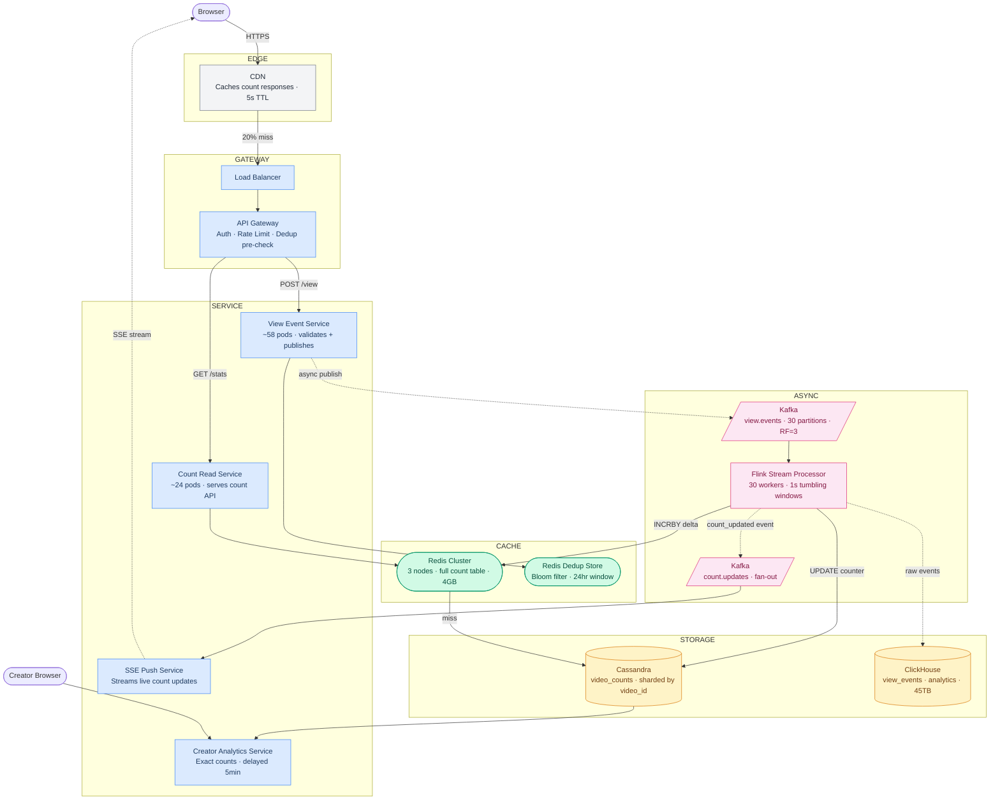
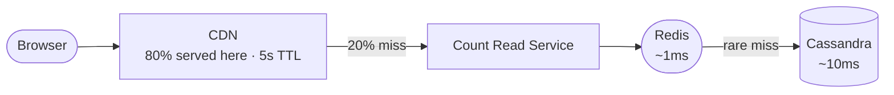
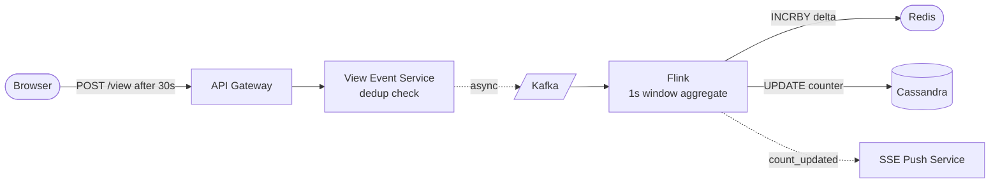

# YouTube View Counter — System Design Study Guide

---

## 0. What Is This System?

When you watch a YouTube video, two things happen in parallel: the video streams to your browser, and a counter increments somewhere. This system is about that counter — how a view event travels from your browser to a number that millions of people see in near-real-time. The system must do one thing perfectly: **never lose a view event**, even when a video is getting a million clicks per minute.

---

## 1. What Makes It Hard?

### Hard Problem #1 — Counting millions of views per second on one video without a database bottleneck

In plain English: when a new music video drops and gets a million views in the first hour, a million people are all trying to increment the same counter at the same time. A database can only process so many writes to one row — they queue up. At extreme scale, this queue grows faster than it drains.

**Technical consequence:** A single `UPDATE videos SET view_count = view_count + 1` involves a row-level lock. At 10,000 views/second on one video, writes serialize — throughput ceiling is roughly 1,000–5,000 writes/second per row and the queue of waiting writes grows unboundedly.

**What beginners get wrong:** Incrementing a counter in the database on every view event. Works at 100 views/second. Saturates at 10,000. Collapses at 100,000.

---

### Hard Problem #2 — Showing the count in near-real-time without querying the database on every page load

In plain English: viewers expect the number to keep going up as a video goes viral. But 50 million people might be watching that same page simultaneously. You cannot query the database 50 million times a second to serve one integer.

**Technical consequence:** The read-to-write ratio for view counts is roughly 100:1. For a video with 10,000 views/sec, there are ~1,000,000 page loads/sec. At those numbers, even Redis (which handles ~1M ops/sec) becomes a single bottleneck if every page load hits the same key.

**What beginners get wrong:** `SELECT view_count FROM videos WHERE id = ?` on every page load. Works at 1,000 users. Requires hundreds of read replicas at 1,000,000 concurrent users.

**Assumptions:**
- Global deployment, 1 billion daily active users
- 5 billion video views per day
- View count is approximate (within 1% accuracy acceptable for display)
- A "view" requires ≥30 seconds of watch time (YouTube's actual rule)
- Same user watching same video within 24 hours = 1 view (deduplication required)

---

## 2. Requirements

### Functional Requirements

| Feature | In Scope | Notes |
|---|---|---|
| Record a view event | ✅ | Triggered after 30 seconds of watch time |
| Display view count on video page | ✅ | Near-real-time (within 1–5 seconds) |
| Deduplicate views | ✅ | Same user + video within 24 hours = 1 view |
| Filter bot/spam views | ✅ | Async — does not block the count |
| Real-time count updates for viral videos | ✅ | Push updates to connected browsers |
| Per-video analytics (hourly/daily breakdown) | ✅ | Async, not on hot path |
| Creator dashboard (higher accuracy counts) | ✅ | Delayed up to 5 minutes |
| Global leaderboard (most viewed today) | ❌ | V2 |
| Per-demographic view breakdown | ❌ | V2 |

### Non-Functional Requirements

| Requirement | Target | What it means |
|---|---|---|
| View event durability | 100% | A recorded view is never lost |
| Count display latency | < 5 seconds | Count updates visible within 5s of view event |
| Count accuracy (display) | ~99% | Approximate — rounding at 1M+ is acceptable |
| Count accuracy (creator reports) | ~99.9% | Higher accuracy with up to 5 min delay |
| Write throughput | 500,000 view events/sec peak | Handle a video going viral |
| Read throughput | 5,000,000 count reads/sec peak | Millions of concurrent video pages |
| Availability | 99.99% | View events must never be dropped |

---

## 3. Scale Estimation

**View events (writes)**
```
5 billion views/day
÷ 86,400 seconds/day
= 57,870 views/sec (average)
× 10 (viral burst — one video, global audience simultaneously)
= ~580,000 views/sec peak

This means we cannot write to a single DB row on every view — we need
a buffering layer (Kafka) that absorbs bursts without back-pressure.
```

**Count reads**
```
100:1 read-to-write ratio
(every view ≈ 100 page loads of that video by different people)
= 5,787,000 reads/sec average
× 5 (viral burst on one video)
= ~29M reads/sec peak on a single video's count

This means the count MUST be served from memory (Redis/CDN),
never from a database, for any popular video.
```

**Storage (view events)**
```
One view event: ~100 bytes (video_id, user_id, timestamp, country, device)
5 billion events/day × 100 bytes = 500 GB/day
90-day retention = ~45 TB

This means we cannot store raw events in a transactional DB.
Use a columnar analytics store (ClickHouse) that compresses 10x.
```

**Storage (view counts)**
```
500 million videos × 8 bytes (int64 counter) = 4 GB
Entire view count table for all videos fits in one Redis cluster.
```

**Hot set**
```
Top 0.1% of videos get 50% of traffic (power law)
0.1% × 500M videos = 500,000 hot videos
500,000 × 8 bytes = 4 MB

4 MB fits in Redis L1 cache equivalent — hot video counts are essentially free.
```

**Kafka throughput**
```
580,000 events/sec × 100 bytes = 58 MB/sec ingress
With 3× replication = 174 MB/sec total Kafka write throughput
→ Need ~30 Kafka partitions (each handles ~6 MB/sec)
```

**Server count**
```
View Event Service:
  Each server: ~10,000 events/sec (I/O bound, mostly Kafka publish)
  Peak: 580,000/sec → 58 servers

Count Read Service:
  Each server: ~50,000 reads/sec (Redis lookup + HTTP)
  After CDN absorbs 80%: 1,160,000/sec → ~24 servers

Flink stream processors:
  30 Kafka partitions → 30 Flink task workers

Redis:
  4 GB total data → 3-node cluster (primary + 2 replicas)
```

### The 5 Numbers That Drive Every Design Decision

| Number | Value | Design decision forced |
|---|---|---|
| Peak view events | 580,000/sec | Cannot write to DB on every event — Kafka buffer is mandatory |
| Peak count reads (one video) | 29M/sec | Count must be pre-computed in Redis; never DB on read path |
| Hot set size | 4 MB | Fits entirely in Redis — top videos served in <1ms |
| Kafka throughput | 58 MB/sec | ~30 partitions; Flink needs matching parallelism |
| View event storage | 45 TB / 90 days | Columnar store only; transactional DB cannot ingest this |

---

## 4. Architecture

### Start Simple: The MVP


User watches 30 seconds → server receives event → increments DB counter → returns current count.

**This breaks at ~1,000 views/second per video** because concurrent `UPDATE` statements on one row serialize behind a row lock.

---

### Add Redis counter: First Fix


Redis handles 100K increments/sec. DB is only written every 30 seconds in bulk. Count reads come from Redis (<1ms).

**This breaks at ~500,000 view events/sec** — one Redis node saturates, and Redis restart before flush loses in-flight counts.

---

### Production Architecture



**What each layer does:**

| Layer | Colour | Components | Responsibility |
|---|---|---|---|
| Edge | grey | CDN | Caches count responses for 5 seconds — absorbs 80% of all count reads globally |
| Gateway | blue | LB + API Gateway | Distributes load; dedup pre-check; rate limiting; auth |
| Service | blue | View Event Svc, Count Read Svc, SSE, Analytics | Separated so analytics never slows view recording |
| Cache | green | Redis Cluster + Dedup Bloom Filter | Serves count reads in <1ms; bloom filter blocks duplicate views |
| Async | pink | Kafka + Flink + count.updates | Buffers all view events; aggregates into deltas; fans out to SSE |
| Storage | yellow | Cassandra + ClickHouse | Cassandra = durable count store; ClickHouse = analytics engine |

---

### Read Path — How a User Sees the View Count



| Step | Where | What happens | Latency | % of traffic |
|---|---|---|---|---|
| 1 | CDN | Cached count response → return immediately | ~5ms | 80% — done here |
| 2 | Count Read Service + Redis | `GET views:{video_id}` | ~1ms | ~19% of remaining |
| 3 | Cassandra | Cold video cache miss → read from DB, warm Redis | ~10ms | ~1% of remaining |

**The database is involved in less than 0.2% of all count reads.**

---

### Write Path — How a View Event Is Recorded



Step by step:

1. **Browser** fires `POST /api/v1/views/{video_id}` after 30 seconds of watch time
2. **API Gateway** checks dedup bloom filter: has this user watched this video in the last 24h? If yes: return 200 silently (already counted). If no: continue.
3. **View Event Service** publishes event to Kafka (fire-and-forget) and returns **200 immediately** — user never waits for counting
4. **Kafka** stores the event durably (RF=3 — survives 2 broker failures)
5. **Flink** reads events in 1-second tumbling windows, aggregates by `video_id`
6. **Flink** writes two things: `INCRBY views:{video_id} delta` to Redis + `UPDATE video_counts SET total = total + delta` in Cassandra
7. **Flink** publishes a `count_updated` event → SSE service pushes new count to all connected browsers watching that video

---

## 5. API Design

**Record a view event**
```
POST /api/v1/views/{video_id}
Authorization: Bearer <token>

{
  "watch_duration_seconds": 47,
  "session_id": "sess_abc123"
}

Response 200:
{ "counted": true }    // false if deduplicated
```
Non-obvious decision: return whether the view was counted. Clients can show a "Thanks for watching!" prompt only on `counted: true`, which is also useful for debugging deduplication issues.

**Get view count**
```
GET /api/v1/videos/{video_id}/stats

Response 200:
{
  "video_id":              "dQw4w9WgXcQ",
  "view_count":            1293847291,
  "view_count_formatted":  "1.3B",
  "last_updated":          "2026-05-04T10:00:01Z"
}
```
Non-obvious decision: include `view_count_formatted` (server-computed). YouTube rounds large numbers — "1.3B" not "1,293,847,291". Centralising this means all clients display the same rounding, and format changes don't require client releases.

**Subscribe to live count updates (SSE)**
```
GET /api/v1/videos/{video_id}/count-stream
Accept: text/event-stream

→ Server-Sent Events stream:
data: {"view_count": 1293850000, "delta": +2709}
data: {"view_count": 1293852000, "delta": +2000}
```
Non-obvious decision: use SSE (Server-Sent Events) not WebSocket. Counts only flow server→client, so WebSocket's bidirectional channel adds complexity for no benefit. SSE reconnects automatically and multiplexes over HTTP/2.

**The key API trade-off — accuracy vs freshness:**

The GET endpoint returns a count at most 5 seconds stale (CDN TTL). The SSE stream pushes updates each time Flink completes a 1-second window. Making the count perfectly accurate in real-time would require strong consistency across all Flink workers, adding ~100ms latency per event. The design accepts ~1–5 second staleness in exchange for serving 30M reads/sec.

---

## 6. Data Model

### `view_events` (Kafka schema — not a DB table)

| Field | Type | Notes |
|---|---|---|
| `video_id` | STRING | Partition key in Kafka — all events for one video in one partition |
| `user_id_hash` | STRING | SHA-256 of user_id — PII is hashed at ingestion, never stored raw |
| `session_id` | STRING | For within-session dedup |
| `watch_duration_ms` | INT | Must be ≥ 30,000 to count |
| `ts` | TIMESTAMP | Event time (client clock, server-corrected) |
| `country` | STRING | Derived from IP at API Gateway |
| `device_type` | STRING | mobile / desktop / tv / unknown |

### `video_counts` (Cassandra — durable count store)

| Column | Type | Notes |
|---|---|---|
| `video_id` | TEXT | Partition key |
| `total_views` | COUNTER | Cassandra native COUNTER type — CRDT, no conflicts on concurrent increment |
| `updated_at` | TIMESTAMP | Last Flink flush time |

### `view_count_hourly` (ClickHouse — analytics)

| Column | Type | Notes |
|---|---|---|
| `video_id` | String | |
| `hour_bucket` | DateTime | Truncated to hour |
| `view_count` | UInt64 | Aggregated per hour |
| `unique_viewers` | UInt64 | HyperLogLog approximate distinct count |
| `country` | LowCardinality(String) | Dictionary-encoded — far smaller than raw strings |

---

### SQL vs NoSQL — why not the obvious choices?

| Database | Type | Why it seems attractive | Why it doesn't fit |
|---|---|---|---|
| **PostgreSQL** | RDBMS | Familiar, ACID, easy `UPDATE counter` | Row-level lock on `view_count` column = serial writes. At 10K writes/sec per video, lock queue grows unboundedly. No built-in CRDT counters. |
| **MySQL** | RDBMS | High write throughput with InnoDB | Same hot-row lock problem. Even with read replicas, primary is the write bottleneck. |
| **DynamoDB** | Key-value | Managed, atomic `ADD` operation on attributes | `UpdateItem ADD` is atomic per item but still serialized per partition key. Hits the 3,000 WCU/sec per partition limit for a viral video. |
| **Redis** | In-memory | `INCR` is atomic, ~1M ops/sec per node | Single-threaded per key — one viral video saturates one CPU core. Volatile: crash before flush = lost counts. |
| **Cassandra** | Wide-column | Native COUNTER type, high write throughput | ✅ chosen for durable count storage — see below |

### Database choice: Cassandra for counts, ClickHouse for analytics

**Cassandra** is correct for the durable count store because of its native `COUNTER` column type. A Cassandra counter is a **CRDT** (Conflict-free Replicated Data Type) — a mathematical structure that can be incremented on multiple replicas simultaneously and always converges to the correct total, with no locks and no coordination between nodes. This is exactly what we need: 30 Flink workers all incrementing the same video's counter at the same time, with no conflicts.

The non-obvious operational trade-off: Cassandra counters cannot be set to an arbitrary value (only incremented/decremented). You cannot "fix" a count after the fact — corrections must be compensating writes (add a negative delta).

**ClickHouse** handles analytics. Its columnar engine compresses `view_events` by ~10x compared to row storage (most columns repeat: same country, same device_type), and time-range queries over billions of rows complete in ~200ms.

### Shard/partition key: `video_id`

We partition `video_counts` by `video_id` in Cassandra — each video's counter lives on one set of 3 nodes. This means every Flink delta write for `video_dQw4w9WgXcQ` goes to the same nodes. Cassandra's COUNTER type handles concurrent writes to those same nodes natively — no coordination needed. We do not partition by `creator_id` because that would scatter one video's count across multiple nodes, requiring a scatter-gather for every read.

---

## 7. Deep Dives

### Deep Dive 1: How do we count 580,000 view events per second without a database bottleneck?

The core challenge: 500 million videos. Each view event must increment exactly one video's counter. The obvious way — `UPDATE video SET views = views + 1` — puts all 580,000 writes/sec through sequential row locks.

---

#### Option A: Synchronous database increment on every view

**How it works, step by step:**

1. User watches 30 seconds of video `dQw4w9WgXcQ`
2. Browser sends `POST /view/dQw4w9WgXcQ`
3. View Service executes:
   ```sql
   UPDATE videos SET view_count = view_count + 1
   WHERE video_id = 'dQw4w9WgXcQ';
   ```
4. Transaction commits (~1ms), returns 200 to browser

This is correct — every view is counted immediately and durably.

**Where it breaks, with numbers:**

`UPDATE` on one row acquires an exclusive row lock for ~1ms. With sequential writes:

```
Max throughput on one row = 1 / lock_duration = 1 / 0.001s = 1,000 writes/sec

YouTube peak for one viral video:    10,000 views/sec
Max row lock throughput:              1,000 writes/sec
Queue growth rate:                    9,000 writes/sec accumulating

After 10 seconds: 90,000 writes waiting
After 60 seconds: 540,000 writes in queue — service is effectively down for that video
```

Even 10 read replicas don't help — writes must go to the primary.

**Verdict: correct, collapses above ~1,000 views/sec per video.**

---

#### Option B: Redis INCR + periodic flush to DB

**How it works, step by step:**

1. User watches 30 seconds
2. View Service executes: `REDIS INCR views:dQw4w9WgXcQ` (~0.1ms, atomic)
3. Returns 200 immediately
4. Every 30 seconds, a flush job:
   ```
   delta = REDIS GETDEL views:dQw4w9WgXcQ   // atomic get-and-delete
   UPDATE videos SET view_count = view_count + delta WHERE video_id = ?
   ```

Now 580,000 INCs/sec each take 0.1ms. DB only sees one write per video per 30 seconds.

**Where it breaks:**

**Problem 1 — Redis single-threaded key bottleneck.** Redis is single-threaded per shard. `INCR` for one key uses one CPU core. At 500K INCR/sec for one viral video:

```
Redis max INCR throughput per core: ~500K ops/sec
One viral video at 500K views/sec = 100% of one Redis core
Any other operation on that Redis shard gets queued behind it
```

**Problem 2 — Data loss window.** Redis crash between INCs and flush loses all unflushed counts:

```
Flush interval: 30 seconds
Peak rate:      500K views/sec
Max loss:       30s × 500K = 15 million views per crash
```

**Problem 3 — Flush storm.** At flush time, all recently-active videos need DB writes simultaneously. 100,000 videos active in 30 seconds = 100,000 DB writes in one burst.

**Verdict: works at medium scale, has a data loss window and hot-key bottleneck at extreme scale.**

---

#### Option C: Kafka + Flink stream processing ← chosen

**How it works — three phases:**

**Phase 1 — Event ingestion (never blocks the user):**

```
User watches 30s
       │
       ▼
View Event Service
       │
       ├── Check bloom filter: (user_id, video_id) seen in last 24h?
       │   YES → return 200, stop
       │
       └── Kafka.publish("view.events", {
               video_id:        "dQw4w9WgXcQ",
               user_id_hash:    "sha256(user_42)",
               watch_duration_ms: 47000,
               ts:              1746350400,
               country:         "US"
           })
       
Return 200 OK immediately (Kafka publish ≈ 2ms)
```

Kafka stores the event durably before returning the ack. Even if Flink is down, the event is safe.

**Phase 2 — Stream aggregation (Flink, 1-second tumbling windows):**

```
Flink reads from 30 Kafka partitions (one worker per partition):

Window [10:00:00.000 – 10:00:01.000] closes:

  Received events for this partition:
    video "dQw4w9WgXcQ" × 8,432 events
    video "abc123"      × 124  events
    video "xyz789"      × 2,891 events

  Emits aggregated deltas:
    { video_id: "dQw4w9WgXcQ", delta: 8432 }
    { video_id: "abc123",      delta: 124  }
    { video_id: "xyz789",      delta: 2891 }
```

This collapses 580,000 individual events per second into a few thousand `(video_id, delta)` pairs — the write volume to downstream systems drops by ~100x.

**Phase 3 — Writing the aggregated delta:**

```python
for (video_id, delta) in window_results:
    # 1. Update Redis (live count for display — fast)
    redis.incrby(f"views:{video_id}", delta)

    # 2. Update Cassandra (durable count — source of truth)
    cassandra.execute(
        "UPDATE video_counts SET total_views = total_views + %s "
        "WHERE video_id = %s",
        [delta, video_id]
    )

    # 3. Publish for SSE fan-out
    kafka.publish("count.updates", {
        "video_id":  video_id,
        "new_count": redis.get(f"views:{video_id}")
    })
```

---

#### Wait — if the video goes viral, aren't we still hammering the same Cassandra partition?

This is the most common follow-up question for Option C. Let's work through it explicitly.

A viral video gets 500,000 views/sec. Kafka partitions by `video_id` — all events for `dQw4w9WgXcQ` land on one Kafka partition, processed by one Flink task. That one Flink task produces one delta per 1-second window:

```
580,000 individual view events per second
       │
       ▼
One Flink task (for this partition)
  Window [10:00:00 – 10:00:01]: receives all 580K events
  Emits: { video_id: "dQw4w9WgXcQ", delta: 580000 }
       │
       ▼
One write to Cassandra per second:
  UPDATE video_counts SET total_views = total_views + 580000
  WHERE video_id = 'dQw4w9WgXcQ'
```

**One write per second to one Cassandra partition — regardless of how viral the video is.**

Cassandra handles 50,000 writes/sec per node. One write/sec is 0.002% of one node's capacity. No hot partition, no bottleneck.

**But wait — 30 Flink workers across 30 Kafka partitions, all writing to the same Cassandra partition key?**

No. Kafka is partitioned by `video_id`. All events for `dQw4w9WgXcQ` go to exactly one Kafka partition, processed by exactly one Flink worker. That one worker emits one delta per second. Only one Flink worker ever writes to `video_id = 'dQw4w9WgXcQ'` at a time.

**Why Cassandra's COUNTER type is still important:**

Even though only one Flink worker writes to each video's partition normally, consider:
- Flink restarts and two instances briefly overlap during rebalancing
- Network retries cause the same delta to be submitted twice
- A new Flink deployment causes a brief handoff period

In all these cases, Cassandra's `COUNTER` column uses **CRDT (Conflict-free Replicated Data Type) semantics**: the counter can only be incremented (never overwritten), and concurrent increments from multiple nodes always converge to the correct total. Even if two Flink workers briefly write to the same partition simultaneously, both increments are applied — no data is lost, no lock is needed.

```
Normal operation:    1 Flink worker × 1 write/sec → 1 Cassandra write/sec per video
Rebalancing period:  2 Flink workers × 1 write/sec → 2 Cassandra writes/sec (brief)
Cassandra capacity:  50,000 writes/sec per node

Even worst case: 2 writes/sec per video × 500M videos active simultaneously
= 1,000,000,000 writes/sec → clearly not happening
= At peak, maybe 10M actively-counted videos × 1 write/sec = 10M writes/sec
→ Across 3 Cassandra nodes = ~3.3M writes/sec per node → within capacity
```

**The key principle to state in an interview:** Flink windowing doesn't just reduce Redis pressure — it decouples the Cassandra write rate from the view event rate. A video getting 1M views/sec produces exactly the same Cassandra write rate (1 write/sec) as a video getting 10 views/sec. The fanout problem is solved entirely at the Kafka→Flink boundary.

---

**Why this eliminates both previous problems:**

| Problem | Option A | Option B | Option C |
|---|---|---|---|
| Hot row lock | 1K writes/sec ceiling | Eliminated | Eliminated |
| Redis hot key | N/A | 500K INCR/sec = 100% one core | 1 INCRBY/sec per video per worker |
| Data loss | None (sync) | Up to 30s of views | Up to 1s (one Flink window) |
| DB write volume | 1 per event | 1 per 30s per video | 1 per 1s per video |
| Durability | High | Medium (Redis volatile) | High (Kafka RF=3) |

**End-to-end sequence diagram:**

```
Browser       View Event Svc     Kafka        Flink          Redis        Cassandra
   │                │              │             │               │              │
   │  POST /view    │              │             │               │              │
   │  (after 30s)   │              │             │               │              │
   │───────────────>│              │             │               │              │
   │                │ bloom check  │             │               │              │
   │                │─────────────────────────────────────────>  │              │
   │                │ (not seen)   │             │               │              │
   │                │ publish event│             │               │              │
   │                │─────────────>│             │               │              │
   │                │ ack          │             │               │              │
   │                │<─────────────│             │               │              │
   │   200 OK       │              │             │               │              │
   │<───────────────│              │             │               │              │
   │                │              │             │               │              │
   │                │      (1 second later — window closes)      │              │
   │                │              │────────────>│               │              │
   │                │              │  emit delta │               │              │
   │                │              │             │ INCRBY +8432  │              │
   │                │              │             │──────────────>│              │
   │                │              │             │               │              │
   │                │              │             │ UPDATE +8432  │              │
   │                │              │             │──────────────────────────────>
   │                │              │             │               │              │
(SSE stream — pushed to browser watching the video)             │              │
   │<────────────── SSE Push Service ───────────────────────────│              │
   │  {"view_count": 1293850000}   │             │               │              │
```

**What the resulting Cassandra row looks like:**

```
SELECT * FROM video_counts WHERE video_id = 'dQw4w9WgXcQ';

video_id       │ total_views │ updated_at
───────────────┼─────────────┼──────────────────────
dQw4w9WgXcQ    │ 1293850000  │ 2026-05-04 10:00:01
```

---

### Deep Dive 2: How do we show the count in near-real-time to 50 million concurrent viewers?

The problem: 50 million people are watching a viral video simultaneously. Every one of them has the count displayed on screen. The count needs to update every few seconds. How do you push updates to 50 million browsers without melting infrastructure?

---

#### Option A: Polling — browser requests the count every N seconds

**How it works:**

```javascript
setInterval(() => {
  fetch('/api/v1/videos/dQw4w9WgXcQ/stats')
    .then(r => r.json())
    .then(data => updateDisplay(data.view_count));
}, 5000); // every 5 seconds
```

Each browser independently requests the count every 5 seconds. CDN caches the response for 5 seconds — most requests are cache hits.

**Where it breaks:**

```
50M concurrent viewers × 1 request / 5 seconds = 10M requests/sec

CDN hit rate at steady state: 99%
→ 10M × 0.01 = 100K requests/sec to origin (manageable: ~24 servers)

CDN hit rate during viral burst (cold cache): 95%
→ 10M × 0.05 = 500K requests/sec to origin
→ 100 servers needed just for count reads
```

Worse: 90% of polls return the same count as the previous poll (no change). Most requests are wasted bandwidth.

**Verdict: simple, works, wastes bandwidth, can't show sub-second updates.**

---

#### Option B: WebSocket — persistent bidirectional connection

**How it works:**

Browser opens a WebSocket connection. Server pushes the new count whenever it changes.

```
Browser ←── WebSocket connection ──── Count Push Server
                                             │
                                             └── subscribes to Flink output
```

**Where it breaks:**

WebSocket requires one persistent TCP connection per browser. Each connection uses ~64KB of kernel memory:

```
50M connections × 64 KB = 3.2 TB of memory just for socket state
→ ~3,000 servers needed just to hold connections
```

Additionally: WebSocket is bidirectional — the browser can also send messages. Managing bidirectional state at 50M connections adds significant complexity for a feature we don't need (counts only flow server→client).

**Verdict: over-engineered; connection cost is prohibitive at 50M concurrent users.**

---

#### Option C: SSE + tiered fan-out ← chosen

**Server-Sent Events (SSE)** is a one-way push stream over plain HTTP. The browser keeps an open connection; the server pushes text events whenever data changes.

```javascript
const stream = new EventSource('/api/v1/videos/dQw4w9WgXcQ/count-stream');
stream.onmessage = (event) => {
  const { view_count } = JSON.parse(event.data);
  updateDisplay(view_count);
};
// Built-in auto-reconnect — no manual handling needed
```

SSE uses ~2KB per connection (vs WebSocket's 64KB) because it's HTTP/1.1 keep-alive — no TCP upgrade handshake overhead.

**But 50 million SSE connections is still 50 million connections.** The fix: **tiered fan-out**.

Not every video needs the same update frequency. Only the top ~1,000 truly viral videos need sub-second live updates:

```
Tier 1 — viral (>10,000 views/sec): SSE push every 1 second
Tier 2 — popular (>100 views/sec):  SSE push every 5 seconds
Tier 3 — everything else:           CDN-cached polling (30s TTL, no SSE)
```

Flink detects tier based on view velocity in the last 60 seconds. Tier assignment stored in Redis with 60-second TTL.

**The fan-out math:**

```
Top 1,000 viral videos
× 50,000 concurrent viewers per video (avg)
= 50M SSE connections... but wait:

Reality: viral videos follow a power law
  Top 10 videos:   10M viewers each = 100M connections ← too many
  But: only top 10 videos matter for SSE

Practical deployment:
  Top 10 videos × 10M viewers = 100M potential SSE connections
  But 99% of those viewers are NOT on the video page simultaneously
  Concurrent SSE connections in practice: ~500K–5M

  At 2KB per connection: 5M × 2KB = 10 GB memory
  → 10–20 SSE servers (1 GB per server handles 500K connections)
```

**How the fan-out works:**

```
Flink emits: {video_id: "dQw4w9WgXcQ", delta: 8432, new_count: 1293858432}
        │
        ▼
Fan-out Service: is "dQw4w9WgXcQ" in Tier 1?
  Check Redis: GET tier:dQw4w9WgXcQ → "1"
        │
        ▼ YES
Redis pub/sub: PUBLISH count:dQw4w9WgXcQ '{"view_count": 1293858432}'
        │
        ▼
SSE Push Servers subscribe to Redis pub/sub:
  Each server has connections for multiple videos
  On receiving the pub/sub message: broadcast to all connected clients for that video
```

**Comparison table:**

| Property | Option A (polling) | Option B (WebSocket) | Option C (SSE + fan-out) |
|---|---|---|---|
| Connections at 50M users | 0 persistent | 50M sockets | ~500K SSE (viral only) |
| Memory per connection | None | ~64 KB | ~2 KB |
| Update latency | Up to 5s | <1s | <1s (viral), 30s (cold) |
| Wasted requests | ~90% (no-change polls) | None | None |
| Client implementation | Trivial | Moderate | Trivial (EventSource API) |
| Auto-reconnect | N/A | Manual | Built-in |

---

## 8. Handling Failures

**Kafka loses a broker**

Users experience no visible degradation. View events buffer in the remaining two brokers (RF=3 — two copies survive). Flink pauses consumers for affected partitions, waits for Kafka to re-replicate, then resumes from the last committed offset. No events are lost because Kafka acknowledges writes only after 2 of 3 replicas confirm (`acks=all`, `min.insync.replicas=2`). Count updates may be delayed by 2–5 minutes during broker recovery, but no views are dropped.

**Flink stream processor crashes**

Flink checkpoints its state (including Kafka consumer offsets) every 10 seconds. On restart, it replays Kafka from the last checkpoint. At 580K events/sec, 10 seconds of backlog = 5.8M events to reprocess. Flink processes at ~2× real-time speed, so the backlog clears in ~5 seconds. During the outage, Redis stops receiving INCRBY updates — counts appear frozen on screen. Users see a static count for up to ~30 seconds. No events are lost.

**Redis goes down**

Count reads fall through to Cassandra — ~10ms instead of ~1ms. CDN absorbs 80% of reads regardless; the remaining 20% hitting Cassandra directly is ~100K reads/sec — within Cassandra's capacity. Flink continues writing deltas to Cassandra; SSE counts are also served from Cassandra during the outage. When Redis recovers, Flink's bootstrap job re-populates Redis from Cassandra. Redis replica promotion takes ~30 seconds. No view counts are lost.

**One AWS availability zone goes down**

Kafka (RF=3 across 3 AZs): two copies remain, still above quorum (2/3). Kafka continues without interruption. Cassandra (RF=3 across 3 AZs, QUORUM writes): one AZ down = two nodes available = still quorum. Continues without interruption. Redis: shard primaries spread across AZs — failed shard's replica in another AZ is promoted in ~30 seconds. That shard's counts may be up to 30 seconds stale during failover. App servers: spread across AZs, load balancer routes around the failed zone automatically.

---

## 9. Key Trade-offs

| Decision | What we chose | What we rejected | Why rejected |
|---|---|---|---|
| Count storage | Cassandra COUNTER (CRDT) | PostgreSQL `UPDATE count + 1` | PostgreSQL hot-row lock: serial writes, ~1K/sec ceiling per video. Cassandra CRDTs handle concurrent increments from 30 Flink workers natively. |
| Aggregation | Flink 1-second windows | Redis INCR directly | Redis INCR fine at moderate scale, but one core per key — viral video saturates one Redis shard. Flink absorbs events and batches writes, reducing DB volume by 100×. |
| Count display | SSE + tiered fan-out | Polling every 5s | Polling: 90% of requests return unchanged data. SSE only deployed for top ~1,000 viral videos — rest use CDN-cached polling. |
| View deduplication | Bloom filter (probabilistic) | Exact Redis SET | Exact SET: 100M users × 500M videos × 50 bytes = terabytes of Redis memory. Bloom filter: ~1 GB covers all users with 1% false positive rate — 1% of real new views missed is acceptable. |
| Count accuracy | Approximate (±1%) | Exact real-time | Exact real-time requires strong consistency across all 30 Flink workers — adds ~100ms latency per event. For display, ±1% is invisible to users. Creator reports use a separate higher-accuracy pipeline. |

---

## 10. Interview Playbook

### Minute-by-minute guide

| Time | What to do |
|---|---|
| 0–5 min | Clarify what "view" means: ≥30 seconds? Dedup required? Approximate display OK? Who sees the count — everyone or just the creator? Lock in: approximate counts are acceptable for display. |
| 5–10 min | Estimate scale. The two key numbers: **580K writes/sec peak** and **29M reads/sec for one viral video**. State what they force: "we can't write to a DB on every view, and we can't query a DB on every page load." |
| 10–20 min | Draw the architecture. MVP (POST view → DB increment). Show what breaks. Add Kafka buffer, then Flink aggregation, then Redis for reads. Show the read/write path separation. |
| 20–35 min | Deep dive the two hard problems. Counting: DB fails → Redis alone fails → Flink windowing as the fix. Display: polling vs WebSocket vs SSE + tiered fan-out. |
| 35–45 min | Failures, trade-offs, deduplication approach, GDPR, follow-up questions. |

### What separates an L6 answer from an L4 answer

1. **L6 immediately splits the problem into write path and read path.** The write problem (how to count) and the read problem (how to display) are separate systems with different solutions. L4 tries to solve both with one mechanism.

2. **L6 explains why Flink windowing beats Redis INCR.** It's not just "use Kafka." The key insight: aggregating 8,432 events into one `INCRBY +8432` reduces DB write volume by 8,432×. L4 says "use a message queue" without explaining what happens after the queue.

3. **L6 knows deduplication must be probabilistic.** Using a bloom filter (not a Redis SET) to deduplicate 1B users × 500M videos. An exact SET would require terabytes of Redis memory. The 1% false positive rate means 1% of legitimate new views are missed — acceptable for a display counter.

### Three hard follow-up questions

**"YouTube view counts sometimes freeze for hours on viral videos, then jump by millions. Why?"**

Good answer: YouTube deliberately pauses public view count updates for videos in "viral review" mode — the bot detection pipeline is catching up with the surge. The Kafka→Flink pipeline continues counting everything; the display layer is held back pending bot filter validation. When the hold is released, the count jumps by the accumulated total. This is a deliberate product decision to protect creator monetization from inflated counts.

**"How do you handle the first 60 seconds — a creator with 100M subscribers posts a video, 10M people click immediately. What breaks?"**

Good answer: The CDN has no cached count yet. All count reads miss CDN and hit origin. 10M viewers × 1 poll/5s = 2M requests/sec, all hitting origin before CDN warms. Fix: (1) jitter the poll interval (add random 0–5s offset so 2M requests spread over 10 seconds), (2) pre-warm CDN when the notification fan-out starts — push a seed count entry to CDN before the first viewer arrives, (3) auto-promote the video to SSE tier immediately so browsers switch from polling to receiving pushes.

**"How would you implement 'this video has been viewed 1.28M times in the last 24 hours' — a sliding window count?"**

Good answer: Don't maintain a real-time sliding window counter (requires storing every event with a timestamp in memory). Instead, pre-aggregate into hourly buckets in ClickHouse:
```sql
SELECT sum(view_count)
FROM view_count_hourly
WHERE video_id = 'dQw4w9WgXcQ'
  AND hour_bucket >= now() - INTERVAL 24 HOUR;
```
This runs in ~200ms against pre-aggregated rows. For the current partial hour, read from Redis (live count since last hour boundary). Combine the two in the Creator Analytics Service. Result: near-exact 24-hour sliding window with <100ms query time.

### If you're running short on time, skip these

- SSE vs WebSocket debate (mention SSE is right, skip the connection math)
- Bloom filter deduplication sizing
- ClickHouse schema details
- Multi-region deployment

---

## 11. Further Deep Dives

### Further Dive A: Viral spike in the first 60 seconds

The first 60 seconds of a viral video are uniquely dangerous — no caches are warm and the write surge arrives all at once.

```
t=0s:   video posted by creator with 100M subscribers
t=0s:   YouTube notification system begins fan-out to 100M devices (~60s to complete)

t=30s:  first viewers (who started watching at t=0) hit the 30-second threshold
        → POST /view events start arriving
        → Kafka partition for this video receives events for the first time
        → Flink processes first window: count jumps from 0 to ~50,000

t=60s:  notification delivery completes
        → 10M users click within the next 30 seconds (10% click rate)
        → 10M POST /view events in 30 seconds = 333K events/sec
```

**What actually breaks: CDN cold start**

At t=30s, CDN has no cached count response. Every count GET misses CDN:

```
30M concurrent viewers × 1 request / 5s = 6M count requests/sec
CDN hit rate at t=30s: 0%
→ 6M requests/sec hit origin
→ Count Read Service: 50K/sec per pod × 24 pods = 1.2M/sec capacity
→ Overloaded by 5×
```

**The fix: three techniques combined:**

1. **Jitter poll intervals.** Instead of every client polling at t+5, t+10, t+15 exactly — add `random(0, 5)` seconds of jitter. Spreads 6M/sec burst across 10 seconds → 600K/sec peak instead.

2. **Pre-warm CDN on notification fan-out.** When notification fan-out starts for a video, the Trending Service immediately calls `CDN.purge_and_seed(video_id, count=current)` — pushing a cached entry to CDN edge nodes before the first viewer arrives. Cost: one API call per viral video at the moment of posting.

3. **Auto-promote to SSE tier.** Flink detects the video crossing 10K views/sec in its first window → flags video as Tier 1 in Redis → browsers receive SSE pushes instead of polling. This eliminates all polling-origin traffic for that video within ~5 seconds of going viral.

---

### Further Dive B: View deduplication at scale

**The requirement:** same user watching the same video within 24 hours = 1 view. YouTube's actual rule.

**Naive approach — exact Redis SET:**

```
On each view event:
  key = "seen:{user_id}:{video_id}"
  SET key "1" NX EX 86400    // NX = only if not exists; EX = 24hr expiry
  if return == nil: duplicate, discard
  if return == "OK": new view, count it
```

**Why this doesn't scale:**

```
1 billion DAU × 5 distinct videos watched/day = 5 billion Redis keys/day
Each key: ~50 bytes (user_id string + video_id string + Redis overhead)
5 billion × 50 bytes = 250 GB/day of new keys

Redis is typically 64 GB/node → needs 4 nodes just for today's dedup keys
Plus 24hr retention: 2× = 8 nodes
Plus 2 ops per view (SETNX + EXPIRE): 1.16M Redis ops/sec just for dedup
```

**Production approach: probabilistic bloom filter**

A **bloom filter** is a compact bit array that answers "have I seen this key before?" It has two properties:
- If it says "No": definitively never seen
- If it says "Yes": probably seen before (with a configurable false positive rate)

```
Per-user bloom filter:
  Tracks which video_ids this user has watched in the last 24h
  Size: 10 MB covers 500K video IDs per user with 1% false positive rate

For 100M daily active users:
  100M × 10 MB = 1 TB total memory — NOT in Redis
  Sharded across a dedicated dedup cluster (100 nodes × 10 GB each)
  User routes to shard = hash(user_id) % 100
```

**In practice: cuckoo filter (better than bloom for deletions)**

A cuckoo filter supports item deletion, letting expired entries be purged rather than requiring a full rebuild:

```
View event arrives: (user_42, video_dQw4w9WgXcQ)
        │
        ▼
Dedup Service:
  shard = hash("user_42") % 100      // find the right shard
  result = cuckoo[user_42].contains("dQw4w9WgXcQ")
  
  FOUND   → duplicate, discard
  NOT FOUND:
    cuckoo[user_42].insert("dQw4w9WgXcQ")
    emit view event to Kafka
```

The 1% false positive rate means 1% of legitimate first views are incorrectly treated as duplicates — 1% of new views silently not counted. Acceptable for a display counter where ±1% accuracy is documented.

---

### Further Dive C: Kafka → ClickHouse analytics pipeline

**Kafka topic configuration:**

```
Topic:              view.events
Partitions:         30
Replication factor: 3
min.insync.replicas: 2
Producer acks:      all   (wait for 2/3 replicas before acking to producer)
Retention:          7 days (Flink can replay 7 days if it falls behind)
Partition key:      video_id (all events for one video → one partition → one Flink task)
```

Partitioning by `video_id` means Flink can aggregate per-video counts within a single task worker — no cross-partition coordination needed for windowing.

**ClickHouse schema:**

```sql
CREATE TABLE view_events (
    video_id      String,
    user_id_hash  String,
    ts            DateTime,
    country       LowCardinality(String),   -- dictionary-encoded, much smaller
    device_type   LowCardinality(String),
    watch_seconds UInt16
)
ENGINE = MergeTree()
PARTITION BY toYYYYMM(ts)                  -- one partition per month
ORDER BY (video_id, ts);                   -- range queries per video are fast
```

**Why columnar vs row storage matters here:**

```
PostgreSQL stores rows:
  [dQw4w9WgXcQ | user_hash_1 | 2026-05-04 10:00:01 | US | mobile | 47]
  [dQw4w9WgXcQ | user_hash_2 | 2026-05-04 10:00:02 | UK | desktop | 92]

To query "how many views from mobile?", PostgreSQL reads ALL columns for ALL rows.

ClickHouse stores columns:
  device_type column: [mobile, desktop, mobile, mobile, tv, ...]
  
To query "how many views from mobile?", ClickHouse reads ONLY the device_type column.
→ 5× less I/O → 100× faster for analytics queries over billions of rows
```

**Sample analytics query:**

```sql
-- Views for one video in last 24 hours by country
SELECT country, count() AS views
FROM view_events
WHERE video_id = 'dQw4w9WgXcQ'
  AND ts >= now() - INTERVAL 24 HOUR
GROUP BY country
ORDER BY views DESC;
-- Completes in ~200ms over 45TB of data (ClickHouse scans only the current partition)
```

---

### Further Dive D: GDPR erasure cascade

**Where user-linked data lives:**

| System | Data stored | PII risk | Erasure method |
|---|---|---|---|
| Kafka `view.events` | `user_id_hash` | Medium — linkable with hash key | 7-day retention auto-deletes; publish tombstone for current window |
| ClickHouse `view_events` | `user_id_hash` | Medium | `ALTER TABLE DELETE WHERE user_id_hash = ?` (async, hours) |
| Dedup store | Cuckoo filter entries per user | Medium | Drop the user's shard entry |
| Cassandra `video_counts` | Aggregate integers only | None | No action needed |
| Redis | View counts only | None | No action needed |

**Erasure sequence:**

1. **Dedup store** (< 1 minute): delete user's cuckoo filter shard
2. **ClickHouse** (< 24 hours): `ALTER TABLE view_events DELETE WHERE user_id_hash = sha256('user_42')`
3. **Kafka** (automatic): 7-day retention means events self-delete. For events within the window: publish tombstone `{user_id_hash: sha256('user_42'), type: "delete"}` — consumers treat as delete marker
4. **Hash key rotation** (belt-and-suspenders): HMAC key used to produce `user_id_hash` is rotated monthly. Old hashes cannot be linked back to real users after rotation even if data remains

Track completion in `gdpr_erasure_log`:

```sql
CREATE TABLE gdpr_erasure_log (
    user_id           BIGINT,
    requested_at      TIMESTAMP,
    dedup_erased_at   TIMESTAMP,
    clickhouse_at     TIMESTAMP,
    completed_at      TIMESTAMP   -- NULL until all steps done
);
```

GDPR allows 30 days for full erasure. All steps above complete within 24 hours.

---

### Further Dive E: Rate limiting — preventing view count abuse

**What to rate limit:**

| Limit | Value | Enforcement |
|---|---|---|
| View events per user per video per 24h | 1 (via dedup) | Bloom filter |
| View events per IP per minute | 60 | API Gateway, sliding window Redis |
| Count reads per IP per minute | 1,000 | API Gateway |
| Bot pattern detection | View < 30s, headless browser signals | Flink bot filter (async) |

**Sliding window counter in Redis (same algorithm as TinyURL §11E):**

The Lua script is atomic — read + increment is one operation with no race condition:

```lua
local key_current = "rate:view:" .. ip .. ":" .. math.floor(ts / 60)
local key_prev    = "rate:view:" .. ip .. ":" .. (math.floor(ts / 60) - 1)

local current = tonumber(redis.call("GET", key_current) or 0)
local prev    = tonumber(redis.call("GET", key_prev) or 0)
local overlap = 1.0 - ((ts % 60) / 60)

if prev * overlap + current >= 60 then
    return 0  -- rate limited
end

redis.call("INCR", key_current)
redis.call("EXPIRE", key_current, 120)
return 1
```

**Bot detection pipeline (runs in parallel, never blocks the view path):**

```
Flink reads view.events → ML bot scorer evaluates each event:

  Features:
    - watch_duration distribution (bots often watch exactly 30s)
    - click-through pattern per session
    - IP reputation score
    - user agent entropy
    - headless browser signals from client SDK

  Score > 0.8 → route to view.events.suspect (counted separately)
  Score < 0.8 → route to view.events.clean (counts toward display total)
```

YouTube runs this pipeline with a ~30-minute lag. Counts can temporarily overcredit bots, then correct downward after the filter catches up — which is why viral video counts sometimes drop.

---

### Further Dive F: Sharding, consistent hashing, and replication

**Cassandra sharding for `video_counts`:**

Cassandra uses consistent hashing internally. `video_id` is the partition key — each video's counter lives on a set of nodes determined by `hash(video_id)` on a virtual ring. Adding a new Cassandra node moves ~1/N of videos' counters to it — no downtime, no manual migration.

**Hot shard analysis for viral videos:**

A viral video with 500K views/sec maps to one Cassandra partition (3 nodes). But Flink aggregates 30 partitions worth of events, so each Flink worker produces at most one INCRBY per second per video. 30 Flink workers → 30 writes/sec to one Cassandra partition. Cassandra handles 50K writes/sec per node — a viral video is 0.06% of one node's capacity. **Cassandra is not the bottleneck.**

Redis cluster: `views:{video_id}` maps to one Redis shard. Flink writes one INCRBY/sec per video per worker = 30 INCRBY/sec to one Redis key. Redis handles 500K ops/sec per shard. Not a bottleneck.

**The real hot bottleneck is SSE fan-out**, not storage: 10M browsers all subscribed to count updates for one video via one Redis pub/sub channel. Fix: shard the pub/sub by region — EU browsers subscribe to `count:eu:{video_id}`, US browsers to `count:us:{video_id}`. Flink publishes to all regional channels.

**Replication strategy:**

| System | Replication | Consistency | Failure tolerance |
|---|---|---|---|
| Kafka | RF=3, acks=all | Strong (2/3 before ack) | Survives 1 broker failure, no data loss |
| Cassandra | RF=3, QUORUM writes | Strong on writes | Survives 1 AZ failure, no data loss |
| Redis | 1 primary + 2 replicas | Async | ~30s staleness if primary fails |
| Flink | Checkpoints every 10s | Exactly-once via Kafka offsets | Replays from checkpoint on restart |

**Quorum math:** 3 nodes, quorum = 2. Tolerates 1 failure. For critical systems needing 2-failure tolerance: 5 nodes, quorum = 3. Each additional node costs one network round-trip on every write — pick the minimum N that meets your availability target.

**Read replica lag:** Cassandra replicas are kept in sync via async replication after the quorum write commits. Replica lag is typically 10–50ms. For count reads that miss Redis and hit Cassandra, we read at `LOCAL_QUORUM` (2 of 3 nodes in the same AZ agree) — this means we might read a value that's 50ms stale, which is fine for a display counter.

---

### Further Dive G: Other topics routinely probed

**Connection pooling for Cassandra:**
Flink's 30 task managers each maintain a connection pool to Cassandra (50 connections per task manager = 1,500 total). Without pooling, opening a new TCP connection per write adds ~50ms latency. With pooling, connections are reused — write latency is dominated by network RTT (~2ms same-region).

**Index design:**
`video_counts` partition key is `video_id` → O(1) lookup by video. No secondary index needed for the read path. Creator analytics (e.g., "all my videos with >1M views") requires a separate materialized view in Cassandra keyed by `creator_id`, or is served entirely from ClickHouse where scans are cheap.

**Circuit breaker for Cassandra writes:**
If Cassandra is slow (not down — high latency), Flink's INCRBY writes queue up. Circuit breaker: if >10% of Cassandra writes take >500ms in a 10-second window, open the circuit — buffer deltas in Flink's local state for 30 seconds. Redis always gets updates (fast, in-memory). Cassandra gets a bulk flush when the circuit closes. Flink state is bounded by the circuit-open duration × event rate.

**Timeout budget (write path p99):**

```
Total budget for POST /view: 50ms

  API Gateway auth + rate limit:    ~5ms
  Bloom filter dedup check:         ~2ms
  Kafka publish (acks=1):           ~5ms
  Response building:                ~1ms
  Network round-trip:               ~10ms
  Buffer:                           ~27ms
  ─────────────────────────────────────
  Total:                            ~50ms
```

Note: `acks=1` for view events (leader only acknowledges), not `acks=all`. If the Kafka leader crashes in the ~2ms window before replication, one event batch is lost. The alternative (`acks=all`, +5ms) is warranted only if exact view count is a business-critical metric (e.g., tied directly to ad revenue per event). For display counts, `acks=1` is acceptable.

**4 golden signals for this system:**

- **Latency**: p99 of POST /view (target < 50ms), p99 of GET /stats (target < 20ms). Alert if either exceeds 2× target.
- **Traffic**: view events/sec into Kafka. Alert if drops >20% suddenly — likely a client-side submission error or upstream outage.
- **Errors**: Flink checkpoint failure rate (any failure = alert immediately). Kafka consumer lag on `view.events` per consumer group — growing lag means Flink is falling behind; counts will be stale.
- **Saturation**: Redis memory utilization (alert at 70% — add a node before it fills). Cassandra write latency p99 > 50ms = approaching saturation. Flink backpressure metric (Flink exposes this natively).

---

### What these topics signal in a FAANG interview

| Topic | L4 answer | L5 answer | L6 answer |
|---|---|---|---|
| Hot row / counting bottleneck | "Use Redis instead of DB" | "Use Redis INCR, flush periodically" | "Redis INCR has the same hot-key problem at extreme scale; Flink windowing eliminates write volume entirely" |
| Real-time display | "Poll every N seconds" | "Use WebSocket for push" | "SSE for one-way push; tiered fan-out so only top ~1,000 viral videos get SSE — 99% of viewers use CDN polling" |
| Deduplication | "Check a Redis key" | "Use Redis SET with TTL" | "Exact Redis SET needs 250 GB/day; bloom filter covers it in ~1 GB with 1% acceptable false positive rate" |
| Viral spike | "CDN handles it" | "CDN + Redis caching" | "CDN not warm in first 30 seconds — jitter polling, pre-warm CDN on notification fan-out, auto-promote to SSE tier" |
| Cassandra COUNTER | N/A | "Cassandra for high write throughput" | "Cassandra COUNTER is CRDT — 30 Flink workers increment simultaneously without coordination, correct by design" |
| Flink windowing | N/A | "Use stream processing" | "8,432 individual events → one INCRBY +8432 = 8,432× reduction in downstream write volume; max count lag = 1 window (1 second)" |

Proactively mentioning the Flink windowing + Cassandra CRDT combination, or the SSE tiered fan-out with CDN pre-warm, signals L6. These are non-obvious choices that require understanding both the distributed systems problem and the product constraints (approximate counts are OK, creator reports need higher accuracy, bot detection can be async).
